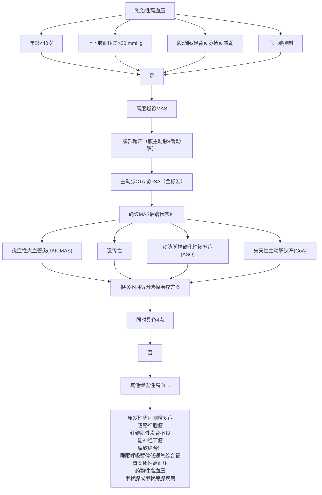

·指南与共识·

# 中主动脉综合征致高血压诊断与治疗多学科专家共识（2026）

北京高血压防治协会 (特殊类型高血压精准诊治专业委员会)，中国医师协会血管外科分会腹主动脉疾病学组，北京市中西医结合高血压防控专业委员会

摘要：中主动脉综合征（MAS）是一种少见的血管性疾病，是由先天发育异常或后天因素导致的降主动脉下段及腹主动脉上段（即中段主动脉）的节段性狭窄，常累及内脏动脉及肾动脉，导致高血压、间歇性跛行及心力衰竭等表现的临床综合征。MAS占主动脉疾病的 0.5%～2.0%，常发生在儿童青少年和青年人。由于其影响因素复杂，国内医师对 MAS导致高血压的认识不足，给诊断和及时治疗带来了一定的困难，未经治疗的患者约 80%在 40 岁前死于心力衰竭、脑出血或主动脉破裂等并发症。该病的诊治常需要多学科合作与个性化。为提高临床医师对该疾病的诊治能力，本共识由心血管内科、血管外科、风湿免疫科、儿科和医学影像科专家共同撰写制定，系统阐述了 MAS的概念、病理生理机制、分类、临床特点，对 MAS 导致高血压的诊断、评估及治疗提出了推荐意见，旨在规范 MAS的诊断标准和治疗策略。强调早期识别和多学科协作的重要性，提出根据病因、狭窄类型和年龄等特点选择个体化治疗方案。本共识明确提出了围手术期管理要点和长期随访方案，旨在改善临床医师对MAS 导致高血压的重视程度以及提高其诊治能力。

关键词：　中主动脉综合征；    高血压；    诊断；    治疗；    共识

# Multidisciplinary expert consensus on the diagnosis and treatment of hypertension caused by middle aortic syndrome (2026)

Beijing Hypertension Association (Committee for Precision Diagnosis and Treatment of Special Types of Hypertension), Abdominal Aortic Disease Group, Society of Vascular Surgery, Chinese Medical Doctor Association,  Beijing Committee for Hypertension Prevention and Control with Integrated Traditional Chinese and Western Medicine

Abstract: Middle  aortic  syndrome  (MAS)  is  a  rare  vascular  disease  characterized  by  segmental  narrowing  of  the  distal descending  aorta  and  the  upper  abdominal  aorta  (i.e.,  the  middle  section  of  the  aorta)  due  to  congenital  developmental abnormalities  or  acquired  factors.  It  often  involves  visceral  arteries  and  renal  arteries,  leading  to  a  clinical  syndrome manifested by hypertension, intermittent claudication, and heart failure. MAS accounts for 0.5% to 2.0% of aortic diseases and commonly occurs in children, adolescents, and young adults. Due to its complex influencing factors, domestic physicians have  insufficient  understanding  of  hypertension  caused  by  MAS,  which  poses  certain  difficulties  in  diagnosis  and  timely treatment. Approximately 80% of untreated patients die from complications such as heart failure, cerebral hemorrhage, or aortic rupture before the age of 40. The diagnosis and treatment of this disease often require multidisciplinary cooperation and  individualized  approaches.  To  improve  clinical  physicians'  ability  to  diagnose  and  treat  this  condition,  this  consensus was  jointly  drafted  by  experts  from  cardiology,  vascular  surgery,  rheumatology  and  immunology,  pediatrics,  and  medical imaging.  It  systematically  elaborates  on  the  concept,  pathophysiological  mechanisms,  classification,  and  clinical characteristics of MAS, and provides recommendations for the diagnosis, evaluation, and treatment of hypertension caused by  MAS,  aiming  to  standardize  diagnostic  criteria  and  treatment  strategies.  Emphasis  is  placed  on  early  recognition  and multidisciplinary  collaboration,  with  individualized  treatment  strategies  proposed  based  on  etiology,  type  of  stenosis,  and age.  This  consensus  clearly  outlines  perioperative  management  key  points  and  long-term  follow-up  plans,  aiming  to  raise clinical physicians' awareness of hypertension caused by MAS and enhance their diagnostic and therapeutic capabilities.

Keywords: Middle aortic syndrome;    hypertension;    diagnosis;    treatment;    consensus常累及内脏动脉及肾动脉，导致高血压、心力衰竭及间歇性跛行等表现的临床综合征。1963年由 Sen等[1]首次报道。根据 2024 年中国心血管健康与疾病报告[2]，我国 2023年收治的常见继发性高血压住院患者中，肾血管性高血压占 11.0%，主动脉缩窄/狭窄占 8.5%，两者既有重叠又有交叉。MAS占所有主动脉疾病的0.5%～2.0%。一项尚未发表的单中心研究结果显示，在近 20年收治的主动脉疾病患者中，主动脉狭窄/闭塞者约占 6%；在主动脉狭窄患者中，MAS 约占 8%，MAS合并肾动脉狭窄约占 5%。2023年欧洲心脏病学会（European Society of Cardiology，ESC）高血压管理指南显示，在 18岁以下的高血压患者中，MAS是继发性高血压的一个常见病因，若不干预预后极差。尽管外科技术和介入治疗手段不断进步，MAS的诊疗仍面临诸多挑战，可能与病因机制复杂、临床表现多样、治疗方案选择缺乏统一标准等有关。《中主动脉综合征致高血压诊断与治疗多学科专家共识（2026）》由北京高血压防治协会（特殊类型高血压精准诊治专业委员会）、中国医师协会血管外科分会腹主动脉疾病学组、北京市中西医结合高血压防控专业委员会共同发起，旨在整合国内外现有循证医学证据和临床实践经验，为 MAS的规范化诊疗提供指导建议。本共识的推荐类别和证据级别定义见表 1。

表 1 本共识推荐强度的分级  
Table 1 Classification of recommendation 

<table><tr><td>推荐类别</td><td>定义</td><td>建议使用的表述</td></tr><tr><td>I类</td><td>证据和/或总体一致认为,该治疗方法有益、有用或有效</td><td>推荐/有指征</td></tr><tr><td>II类</td><td>关于该治疗或方法的用途/疗效,证据不一致和/或观点有分歧</td><td></td></tr><tr><td>IIa类</td><td>证据/观点倾向于有用/有效</td><td>应该考虑</td></tr><tr><td>IIb类</td><td>证据/观点不足以确立有用/有效</td><td>可以考虑</td></tr><tr><td>III类</td><td>证据和/或专家一致认为,该治疗或方法无用/无效,在某些情况下可能有害</td><td>不推荐</td></tr></table>

# 1 病因、发病机制及分型

# 1.1 病因及发病机制

1.1.1 先天性因素 约 60%的 MAS病例为先天性发育异常所致。这类病例在青少年患者中尤为常见。主要理论假说包括：

（1）胚胎期主动脉发育障碍：两条背侧主动脉在胚胎发育过程中过度融合或部分闭锁，导致主动脉中段管腔狭窄[3]。  
（2）血管形成因子异常：风疹等病毒感染可能抑制血管壁平滑肌细胞的有丝分裂，造成胎儿期或婴儿早期主动脉发育中止[3]。  
（3）遗传/综合征相关 MAS：占 30%～40%，常见基因为神经纤维蛋白 1（neurofibromin 1，NF1）、Jagged 经典 Notch 配体 1（Jagged canonical notch ligand 1，JAG1）、弹 性 蛋 白 （Elastin， ELN） 、 GATA 结 合 蛋 白 6（GATAbinding  protein  6， GATA6） 、 环 指 蛋 白 213（ring  fingerprotein  213，RNF213）等 。 其 他 如 威 廉 姆 斯 综 合 征（Williams  syndrome） 、 阿 拉 基 尔 综 合 征 （Alagillesyndrome）、结节性硬化、特纳综合征（Turner syndrome）等[4]。此类患者常伴有特征性皮肤咖啡斑和神经纤维瘤表现[3]。

1.1.2 获得性因素 约 40%的 MAS病例与后天性血管病变相关，主要见于青少年和成年患者。

（1）大动脉炎：Takayasu 动脉炎（Takayasu’s arteritis，

TAK）是 MAS的重要病因，尤其是在亚洲人群中。大动脉炎是一种病因不明的慢性炎症性疾病，主要累及主动脉及其主要分支，进行性炎症过程导致主动脉壁全层炎症反应，最终引起管腔狭窄和闭塞[5]。大动脉炎在局部症状及体征出现前常有全身炎症表现（如发热、盗汗、乏力、体重减轻、关节痛）、炎症活动期炎症指 标 [红 细 胞 沉 降 率 （erythrocyte  sedimentation  rate，ESR）、C-反应蛋白（C-reactive protein，CRP）、免疫球蛋白 、 白 细 胞 介 素 -6、 肿 瘤 坏 死 因 子 -α（tumor necrosisfactor-alpha，TNF-ɑ）等 ] 升高。血管影像可见管壁增厚、 水肿（“双环征”）、晚期管腔狭窄/扩张。血管壁全层增厚伴钙化[6] 。组织活检是金标准（但常难获取）。在中国成年人单中心队列（n=143）中，MAS 病因中TAK占 76.9%（110/143）[7]。系统综述亦指出炎症（TAK）是成人 MAS的重要病因，尤其是在亚洲人群中[8]。在儿科/青少年 MAS相关文献中，炎症性病因占 15%～18%[3]。

（2）其他自身免疫性疾病：如巨细胞动脉炎、白塞综合征、系统性红斑狼疮、硬皮病等可累及主动脉，导致非特异性动脉炎或结节性动脉炎[8]。  
（3）非炎症性获得性因素：包括动脉粥样硬化、外科术后纤维化、肿瘤/放疗相关损伤、感染等。

1.2 分型 可根据解剖位置、病理特点和病因进行分型。

1.2.1 解剖学分型（图 1） （1）肾动脉上：狭窄位于腹腔干和肠系膜上动脉开口上方，占 25%～30%。高血压更为顽固，如不能早期诊治，容易发生心力衰竭。如果累及腹腔干和肠系膜上动脉，病程短，未建立侧支循环，可出现消化道症状[9]。  
（2）肾动脉水平：狭窄位于肾动脉水平（腹腔干和肠系膜上动脉开口下方），占 50%～60%。多合并肾动脉狭窄，导致顽固性高血压。双侧肾动脉严重狭窄，易发生肾功能损害[9]。  
（3）肾动脉下：狭窄位于肾动脉开口下方，占10%～15%。以下肢缺血症状为主要表现，高血压严重程度相对较轻[9]。

  
(1) 肾动脉上

  
(2) 肾动脉水平

  
(3) 肾动脉下  
图 1 中主动脉综合征解剖学分型  
Figure 1 Anatomical classification of middle aortic syndrome

1.2.2 病理分型[9] （1）弥漫型：主动脉长段变细/渐 变性狭窄，常累及多分支，范围通常＞3 cm，多合并内 脏动脉弥漫性狭窄。

（2）节段型：局灶短段狭窄，常呈膜性或漏斗状，长度通常＜3 cm，不同研究对“长/短段”的长度界定不一，受累长度中位数为 4～5 cm。

1.2.3 病因分型 按病因可分为四型。

（1）发育异常/特发型（developmental/idiopathic）：儿童更常见；常累及肾下段。  
（2）遗传/综合征相关型（genetic/syndromic）：多见于儿童及青少年，家系研究可检出单基因家系；常伴多血管床受累与肾上段狭窄。  
（3）炎症/自身免疫型（inflammatory-autoimmune）。  
（4）其他非炎症性获得型：动脉粥样硬化、手术后或放疗后血管损伤、腹部肿瘤压迫等。

# 2 临床表现

MAS 典型临床表现为难以控制的高血压、餐后腹痛和间歇性跛行三联征[3]。约 90%的患者仅表现为高血压，未早期诊断和治疗可导致心力衰竭、肾功能衰竭和脑卒中等严重并发症[10]。如果合并射血分数减低型心力衰竭，血压可正常。

2.1 症状 MAS的症状见表2。

表 2 中主动脉综合征的临床表现[11-13]  
Table 2 Clinical features of middle aortic syndrome[11-13] 

<table><tr><td>临床表现类型</td><td>具体症状</td><td>发生频率</td><td>主要病理基础</td></tr><tr><td rowspan="2">高血压相关症状</td><td>头痛、头晕、视力模糊、复视、抽搐</td><td>85%~95%</td><td>主动脉近心端狭窄可导致脑血管过度灌注</td></tr><tr><td>呼吸困难、心悸、胸闷</td><td>40%~60%</td><td>高血压性心脏病、心力衰竭</td></tr><tr><td rowspan="2">下肢缺血症状</td><td>活动后下肢乏力、间歇性跛行</td><td>70%~80%</td><td>下肢低灌注</td></tr><tr><td>下肢发凉、感觉异常</td><td>50%~65%</td><td>周围神经缺血</td></tr><tr><td rowspan="2">内脏缺血症状</td><td>餐后腹胀腹痛、厌食、体重下降</td><td>30%~40%</td><td>肠系膜动脉狭窄</td></tr><tr><td>少尿、肾功能异常</td><td>25%~35%</td><td>肾动脉狭窄</td></tr><tr><td>其他症状</td><td>生长迟缓、发育延迟</td><td>儿童患者60%以上</td><td>全身性低灌注状态</td></tr></table>

# 2.2 体征

2.2.1 血压特征性改变 上肢高血压，下肢低血压，上肢和下肢血压差值 ≥ 20 mmHg（1 mmHg = 0.133 kPa），是 MAS 最具诊断价值的体征[3]。如累及双侧锁骨下动脉，血压可在正常范围。

血管杂音：约 80%患者在胸背部及腹部可闻及收缩期血管杂音，向近心端或腹部放射[14]。多发性大动脉炎可在颈部其他大血管闻及血管杂音。

2.2.2 外周动脉搏动异常 股动脉、腘动脉及足背动脉搏动减弱或消失，而上肢动脉搏动增强[15]。  
2.2.3 继发性发育障碍 儿童患者常见身高体重低于同龄标准的 3%，伴肌肉发育不良[15]。青少年起病的高血压可能是 MAS 最常见且有时是唯一的临床表现。

# 3 诊断与评估

3.1 诊断标准 MAS的诊断标准见表3。

# 3.2 诊断依据

3.2.1 详细病史和体格检查 病史：高血压发生年龄、严重程度、控制情况、家族史。

体格检查：四肢血压测量，计算踝臂指数（anklebrachial index，ABI）（正常值 1.00～1.30），听诊血管杂音（胸、腹、背、颈、锁骨上窝）。

全身症状：发热、体重减轻、关节痛等（大动脉炎活动期时）。

靶器官损害（心、脑、肾、眼）和缺血症状（跛行、腹痛）。

寻找其他系统性疾病线索（皮肤病变如神经纤维

瘤 1 型咖啡斑、Williams 面容特征）。

表 3 中主动脉综合征的诊断标准[5]  
Table 3 Diagnostic criteria for middle aortic syndrome[5] 

<table><tr><td>主要标准:</td></tr><tr><td>• 影像学检查证实胸腹主动脉中段狭窄(内径减少 $\geqslant 50\%$ )</td></tr><tr><td>• 上肢收缩压 $\geqslant 140$ mmHg(成人)或 $\geqslant$ 同年龄同性别血压值的第95百分位数( $P_{95}$ )(儿童),且下肢收缩压较上肢低20 mmHg以上次要标准:</td></tr><tr><td>• 肾动脉和/或其他内脏动脉狭窄 $\geqslant 50\%$ </td></tr><tr><td>• 高血压( $\geqslant 3$ 种降压药控制不佳)</td></tr><tr><td>• 活动后下肢乏力或间歇性跛行</td></tr><tr><td>• 不明原因生长迟缓(儿童)</td></tr><tr><td>• 胸腹部血管收缩期杂音</td></tr><tr><td>诊断要求:</td></tr><tr><td>满足所有主要标准+至少2项次要标准</td></tr></table>

3.2.2 实验室检查 常规：血常规、尿常规（蛋白尿、血尿）、肾功能[肌酐、尿素氮、估算的肾小球滤过率（estimated  glomerular  filtration  rate， eGFR） 、 尿 蛋 白 定量]、肝功能、电解质。

炎症及免疫指标：ESR、CRP、免疫球蛋白、白细胞介素-6、 TNF-ɑ等炎症指标，自身抗体[抗核抗体（antinuclear  antibody， ANA） 、 抗 内 皮 细 胞 抗 体 （anti-endothelial cell antibody，AECA）、抗中性粒细胞胞浆抗体（anti-neutrophil cytoplasmic antibody，ANCA 等 ]。如果可疑受累血管合并血栓形成，应化验各项磷脂抗体，包括心磷脂抗体、抗 β2-糖蛋白Ⅰ抗体 （anti-beta-2-glyco-protein Ⅰ antibodies，抗 β -GPⅠ抗体）和狼疮抗凝物。

肾素-血管紧张素-醛固酮系统：血浆肾素活性（plasma  renin  activity， PRA） 或 血 浆 肾 素 浓 度 （plasmarenin concentration，PRC）（肾血管性高血压常升高），血管紧张素Ⅱ（angiotensin Ⅱ）、醛固酮（鉴别原发性醛固酮增多症）。

建议同时排除其他继发性高血压：甲状腺功能测定、皮质醇（必要时）、儿茶酚胺代谢物（怀疑嗜铬细胞瘤时）。

3.2.3 遗传学评估 对疑似综合征/遗传型 MAS（多血管床受累、典型综合征表型/家族史、合并先天畸形）者，建议在表型指引下优先选择定向基因面板或全外显子组测序（whole exome sequencing，WES）。

3.2.4 影像学检查[16] （1） 多普勒超声：为首选筛查工具，可评估狭窄部位、程度及血流动力学参数。典型表现为狭窄处高速湍流[收缩期峰值流速（peak systolicvelocity，PSV）＞200 cm/s]，狭窄远端主动脉呈小慢波改变。

（2） 计 算 机 断 层 扫 描 血 管 成 像 （computed  tomo-graphy angiography，CTA）：CTA 是诊断 MAS 的主要影

像学检查方法，其显示钙化敏感，但存在电离辐射。CTA检查需包括动脉期和延迟期扫描。CTA可清晰显示狭窄位置、长度、程度及侧支循环状况，三维重建有助于制定手术方案。

（3） 磁 共 振 血 管 成 像 （magnetic  resonance  angio-graphy，MRA）：MRA 不存在电离辐射，对软组织分辨率高，适用于患者随访。  
（4） 数 字 减 影 血 管 造 影 （digital subtraction angio-graphy，DSA）：DSA 为诊断金标准，但为侵入性检查，多在计划介入治疗时应用。可精确测量跨狭窄压力阶差 $\mathrm { ( > 2 0 ~ m m H g }$ 具有血流动力学意义），可同时行血流储备分数（fractional flow reserve，FFR）/瞬时无波形比值 （instantaneous  wave-free  ratio， iFR） 或 血 管 内 超 声（intravascular ultrasound，IVUS）评估，进一步精准指导诊断和治疗，决定治疗决策。  
（5） X光平片及 CT平扫：排除血管壁钙化，对MAS 诊断意义不大。  
（6）18 氟-脱氧葡萄糖正电子发射断层成像/CT（18F-fluorodeoxyglucose  positron  emission  tomography/computed tomography，18F-FDG PET/CT）：对怀疑大血管炎活动的患者，选择性采用18F-FDG PET/CT 进行病因与活动度评估。

MAS 诊断思路见图2。

# 4 治疗策略

MAS 的治疗目标是控制高血压，恢复主动脉正常管腔，避免早期出现严重心、脑、肾并发症，重建内脏及下肢血流灌注，提高生存率，减少早期死亡率。治疗方案包括药物治疗、血管内介入治疗和手术治疗。具体治疗方式应根据年龄、病因、狭窄类型及合并症个体化制定。

4.1 药物治疗 药物治疗是所有 MAS患者的基础治疗，但单纯药物治疗不能纠正解剖狭窄，仅作为术前过渡或无法手术患者的姑息治疗。

4.1.1 降压治疗 儿童患者血压控制在同年龄同性别血压值的第 90 百分位数 $( P _ { 9 0 } )$ 以下；成人患者血压目标 $< 1 4 0 / 9 0 ~ \mathrm { m m H g } ($ （合并糖尿病或慢性肾脏病时，血压 $< 1 3 0 / 8 0 \mathrm { m m H g } )$ [9]。

降压药选择：首选肾素-血管紧张素系统抑制剂[血管紧张素转换酶抑制药（angiotensin-converting enzymeinhibitor， ACEI） /血 管 紧 张 素 受 体 阻 滞 药 （angiotensinreceptor  blocker， ARB） ] 联 合 钙 通 道 阻 滞 药 （calciumchannel blocker，CCB）。严重双侧肾动脉狭窄患者避免使用 ACEI/ARB，如需使用，应严密监测血压、肾功能和血钾。β 受体阻滞剂可协同控制心率和血压[9]，合并心力衰竭的 MAS 患者，在使用 β 受体阻滞剂时需从小剂量起始，根据心率、心功能分级逐步调整剂量，避

免诱发急性心力衰竭。

flowchart

注：CTA 为 CT 血管成像；DSA 为数字减影血管造影；TAK 为 Takayasu 动脉炎。

图 2 中主动脉综合征（MAS）的诊断思路

Figure 2 Diagnostic approach of middle aortic syndrome (MAS)

4.1.2 大动脉炎（TAK 等）所致 MAS 的药物治疗 糖皮质激素和免疫抑制剂的治疗是大动脉炎治疗的基础，是确保手术和介入治疗成功的关键。治疗的目标在于抑制血管炎症、控制相关症状、预防并发症，并改善患者的预后。在疾病活动期，应优先控制基础疾病，等待侧支循环建立后再考虑手术，避免进行急诊手术或在急性期进行手术。

抗炎治疗是基础且优先考虑，药物治疗分为诱导缓解和维持治疗两个阶段。

在活动期，主要采用糖皮质激素联合免疫抑制剂治疗（例如甲氨蝶呤、硫唑嘌呤、吗替麦考酚酯等）；对于难治性或复发性病例，可使用生物制剂（如托珠单抗）。治疗的目标是控制炎症、减少血管壁水肿和降低再狭窄的风险。

4.2 血运重建治疗 对于主动脉狭窄超过 60%或伴有高血压/进行性器官缺血的患者，应尽早考虑介入或外科重建手术。介入治疗主要采用“球囊扩张 + 支架植入”的方式，适用于局限性狭窄（＜3 cm）、无严重钙

化且无法耐受外科手术的患者。然而，其主要风险包括支架内血栓形成和较高的再狭窄率。

外科重建通过构建“人工血管桥”或“自体血管桥”，绕过狭窄或闭塞的主动脉中段，恢复血流。这种方法适用于长段狭窄（＞3 cm）、严重钙化病变或介入治疗失败的患者。

（1）儿童患者通常将手术时间推迟至 5岁以上，以促进血管发育[10]。但在以下紧急情况下需提前进行手术：①药物无法控制的恶性高血压（收缩压持续超过同年龄同性别血压的 $P _ { 9 9 } + 5 \mathrm { m m H g } )$ ；②肾功能进行性恶化[eGFR 每月下降 $\geq 5 \mathrm { m L } / ( \mathrm { m i n } \cdot 1 . 7 3 \mathrm { m } ^ { 2 } ) \stackrel { - } { _ { - } }$ ]；③内脏动脉缺血导致反复腹痛、肠缺血；④下肢严重缺血出现间歇性跛行或足部溃疡。

（2）大动脉炎（如 TAK）患者：建议在炎症静止期进行择期重建手术；若炎症活动迹象仍然存在，围手术期应给予足量糖皮质激素覆盖[4]。

策略选择：在解剖条件允许的情况下，外科旁路/重建的长期通畅率优于单纯球囊扩张；以支架为主的腔内治疗虽然安全性与有效性尚可，但再狭窄更为常见，需预期进行再次干预。最终的治疗方案应根据病变的长度/部位、炎症状态以及治疗中心的经验来决定。

扩张幅度：由于 TAK病变的纤维化和脆弱性，治

疗时应以降低跨狭窄压差为目标，避免过度扩张，以减少夹层、穿孔、假性动脉瘤等并发症的发生。

MAS 的治疗策略见表 4。

表 4 中主动脉综合征的治疗策略  
Table 4 Treatment strategies for middle aortic syndrome 

<table><tr><td>治疗方式</td><td>适应证</td><td>禁忌证</td><td>优势</td><td>局限性</td></tr><tr><td>药物治疗</td><td>所有患者的基础治疗手术过渡期无法耐受手术者</td><td>无绝对禁忌证</td><td>无创广泛适用</td><td>无法解除解剖狭窄长期效果有限</td></tr><tr><td>血管内介入</td><td>局灶性狭窄(&lt;3 cm)无严重钙化外科高危患者</td><td>长段弥漫狭窄严重钙化对比剂过敏</td><td>微创可重复操作儿童可随生长扩张支架</td><td>再狭窄率较高(20%~40%)支架断裂风险儿童需专用支架</td></tr><tr><td>外科手术</td><td>长段狭窄(&gt;3 cm)严重钙化介入失败年轻患者</td><td>严重心肺功能障碍活动性感染终末期疾病</td><td>持久效果好解决复杂病变自体血管重建可生长</td><td>手术创伤大死亡率较高(约6.9%)人工血管需二次手术</td></tr></table>

# 5 围术期管理与随访

5.1 血压管理[16] 术前准备：术前至少 2 周强化血压控制（收缩压＜140 mmHg）；术中控制：血管开放前收缩压维持在 100～120 mmHg；术后管理：术后 24～72 h高血压患者由静脉过渡到口服降压药，收缩压维持在120～140 mmHg。口服降压药物常需要长期维持治疗。  
5.2 抗血小板及抗凝策略[4] 介入治疗术后阿司匹林联合氯吡格雷双抗治疗 3～6个月，后改为单药长期维持，为预防血栓形成可加用新型口服抗凝药或华法林[国际标准化比值（international normalized ratio，INR）2.0～2.5][4]。

外科旁路移植术后需长期抗血小板治疗，是否加用抗凝药需个体化评估。

5.3 长期随访方案 影像学随访：介入或术后 3、6、12个月行 CTA或 MRA评估主动脉通畅情况，之后每年 1 次 [17]。 肾 功 能 正 常 患 者 优 先 选 择 CTA， 每 年1 次；肾功能不全[eGFR＜30 mL/（min·1.73 m2）] 或对对比剂过敏患者，选择 MRA，根据患者个体情况差异化选择检查方式。

血压监测：每月测量四肢血压，评估控制达标率[16]。

脏器功能评估：每 3～6个月评估肾功能（eGFR、尿蛋白）及心功能（超声心动图）[17]。

# 6 总结与展望

MAS 是一种少见但预后严重的主动脉病变，以主动脉中段狭窄和高血压为特征。多在儿童青少年期起病，若未及时诊治，约 80%在 40岁前死于心力衰竭、脑出血或主动脉破裂。10～30 岁是死亡高峰期，平均死亡年龄为 31岁[3]。因此，早期识别和干预，选择最佳治疗方案，对于改善患者的预后和生活质量十分重要。目前的治疗主要包括药物干预、介入治疗及外科治疗。积极发现病因并对可治性病因进行干预亦有重要临床意义。随着对 MAS机制的认识和深入研究，新的治疗方法可能会为患者带来福音。

本共识强调多学科协作在诊疗中的核心地位，推荐根据年龄和狭窄特点选择个体化治疗方案：儿童患者优先药物控制血压过渡至择期介入或手术治疗；成人患者推荐以解剖学纠正为主的干预策略。

近年来，MAS治疗领域取得重要进展：可扩张支架的应用使儿童患者避免了多次手术；自体血管重建技 术 [如 肠 系 膜 动 脉 生 长 改 善 循 环 （mesenteric arterygrowth improves circulation，MAGIC）术式 ] 显著改善了长期通畅率；经皮血管成形术为高危患者提供了微创治疗选择。然而，诸多挑战依然存在，包括病因诊断手段有限、儿童专用器械缺乏、再狭窄防治困难等。

利益冲突声明 作者声明没有利益冲突

# 专家组成员（按姓氏汉语拼音顺序）：

陈红（北京大学人民医院）

陈琦玲（北京大学人民医院）

程瑾（北京大学人民医院）

党爱民（中国医学科学院阜外医院）

郭伟（中国人民解放军总医院）

胡青峰（首都医科大学附属北京安贞医院）

华琦（首都医科大学附属宣武医院）

黄薇（北京右安门医院）

姜娟（北京大学人民医院）

姜一农（大连医科大学附属第一医院）

李勇（复旦大学附属华山医院）

李中建（郑州大学第二附属医院）

李忠佑（北京大学人民医院）

刘力生（中国医学科学院阜外医院）

马志毅（清华大学附属北京清华长庚医院）

米杰（首都医科大学附属北京儿童医院）

孙宁玲（北京大学人民医院）

田江华（北京大学校医院）

田庄（中国医学科学院北京协和医院）

王宏宇（北京大学首钢医院）

王鸿懿（北京大学人民医院）

吴寸草（北京大学人民医院）

吴海英（中国医学科学院阜外医院）

吴兆苏（首都医科大学附属北京安贞医院）

喜杨（北京大学人民医院）

谢良地（福建医科大学附属第一医院）

杨进刚（中国医学科学院阜外医院）

杨力（北京大学人民医院）

余静（兰州大学第二医院）

袁洪（中南大学湘雅三医院）

袁如玉（天津医科大学第二医院）

张新军（四川大学华西医院）

张宇清（中国医学科学院阜外医院）

# 执笔专家名单（按姓氏汉语拼音排序）：

陈琦玲（北京大学人民医院）

程文立（首都医科大学附属北京安贞医院）

刘健（北京大学人民医院）

骆雷鸣（中国人民解放军总医院）

王增武（中国医学科学院阜外医院）

张慧敏（中国医学科学院阜外医院）

张萌（内蒙古心脑血管医院）

张韬（北京大学人民医院）

张学武（北京大学人民医院）

赵轩（内蒙古心脑血管医院）

邹玉宝（中国医学科学院阜外医院）

# 共识声明：

本共识基于现有循证医学证据和专家临床经验制定，旨在提供医疗决策参考，不具备强制性法律效力。临床医师在应用时应结合患者具体情况和医疗资源可及性进行个体化诊疗。北京高血压防治协会（特殊类型高血压精准诊治专业委员会）、中国医师协会血管外科分会腹主动脉疾病学组、北京市中西医结合高血压防控专业委员会共同对共识内容拥有版权和解释权。

# 参考文献

Sen  PK,  Kinare  SG,  Engineer  SD,  et  al. The  middle  aortic[1]syndrome[J]. Br Heart J，1963，25（5）：610-618.  
国家心血管病中心, 中国心血管健康与疾病报告编写组, 胡盛寿.[2]中国心血管健康与疾病报告 2024 概要[J]. 中国循环杂志，2025，40（6）：521-559.  
Musajee M, Gasparini M, Stewart DJ, et al. Middle aortic syndrome in[3] children and adolescents[J]. Glob Cardiol Sci Pract，2022，2022（3）： e202220.   
Fan  L,  Zhang  H,  Cai  J,  et  al. Middle  aortic  syndrome  because  of[4]pediatric  Takayasu  arteritis  admitted  as  acute  heart  failure:  clinicalcourse  and  therapeutic  strategies[J]. J  Hypertens， 2018， 36（10） ：2118-2119.  
Whipple  MO,  Craswell  J. Mid-aortic  syndrome  presenting  in[5]adulthood: a case report and review of the literature[J]. J Vasc Nurs，2024，42（3）：213-215.  
Alsaifi M, Al Mahruqi H, Stephen E, et al. Middle aortic syndrome: a[6] rare cause of hypertension[J]. Oman Med J，2023，38（2）：e493.   
Meng  X,  Xue  J,  Cai  J,  et  al. A  single-center  cohort  of  mid-aortic[7] syndrome among adults in China: etiology, presentation and imaging features[J]. Am J Med Sci，2023，365（5）：420-428.   
Yang A, Nayeemuddin M, Prasad B. Takayasu's arteritis and primary[8] antiphospholipid  syndrome  presenting  as  hypertensive  urgency[J]. BMJ Case Rep，2016，2016：bcr2015211752.   
Opoka-Winiarska  V,  Tomaszek  MB,  Sobiesiak  A,  et  al. The[9] importance  of  FDG  PET/CT  in  the  diagnostic  process  of  the  middle aortic syndrome in a 15-year-old boy patient with suspected systemic vasculitis  and  final  diagnosis  of  Williams-Beuren  syndrome[J]. Rheumatol Int，2020，40（8）：1309-1316.   
Chaudhary  R,  Tiwari  T,  Sharma  R,  et  al. Midaortic  syndrome  in  a[10]middle-age female[J]. BMJ Case Rep，2021，14（11）：e246530.  
McEvoy  JW,  McCarthy  CP,  Bruno  RM,  et  al. 2024  ESC  guidelines[11]for  the  management  of  elevated  blood  pressure  and  hypertension[J].Eur Heart J，2024，45（38）：3912-4018.  
Pytlos J, Michalczewska A, Majcher P, et al. Renal artery stenosis and[12]mid-aortic  syndrome  in  children:  a  review[J]. J  Clin  Med， 2024，13（22）：6778.  
Kreutz R, Brunström M, Burnier M, et al. 2024 European Society of[13]Hypertension  clinical  practice  guidelines  for  the  management  ofarterial hypertension[J]. Eur J Intern Med，2024，126：1-15.  
Connolly JE, Wilson SE, Lawrence PL, et al. Middle aortic syndrome:[14] distal  thoracic  and  abdominal  coarctation,  a  disorder  with  multiple etiologies[J]. J Am Coll Surg，2002，194（6）：774-781.   
Mancusi C, Basile C, Fucile I, et al. Aortic remodeling in patients with[15] arterial  hypertension:  pathophysiological  mechanisms,  therapeutic interventions and preventive strategies-a position paper from the Heart and  Hypertension  Working  Group  of  the  Italian  Society  of  Hypertension[J]. High Blood Press Cardiovasc Prev，2025，32（3）：255-273.   
Luu  HY,  Pulcrano  ME,  Hua  HT. Surgical  management  of  middle[16]aortic syndrome in an adult[J]. J Vasc Surg Cases Innov Tech，2020，6（1）：38-40.  
Lazea C, Al-Khzouz C, Sufana C, et al. Diagnosis and management of[17] genetic causes of middle aortic syndrome in children: a comprehensive literature review[J]. Ther Clin Risk Manag，2022，18：233-248.

收稿日期：2025-11-10 修回日期：2025-11-18

录用日期：2025-11-27 责任编辑：张刘锋