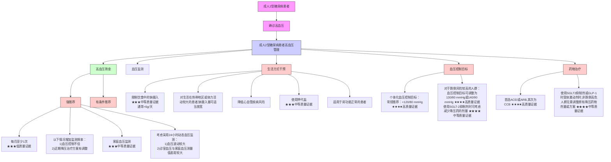

·指南与共识·

# 成人 2 型糖尿病的高血压管理中国专家共识

中华医学会糖尿病学分会糖尿病与肥胖学组，中国高血压联盟

【摘要】  高血压与 2 型糖尿病（T2DM）均为心血管和肾脏疾病重要的危险因素，且共患率高。T2DM 患者的高血压筛查、监测、管理等问题对改善患者预后具有重要作用。基于此背景，中华医学会糖尿病学分会糖尿病与肥胖学组和中国高血压联盟组织多学科专家制订该共识，共识通过在线调查和讨论，经文献检索、证据总结和专家评议，基于 GRADE 方法及 GRADE 证据向决策（EtD）转化框架，遴选出 7 个关键临床问题，并给出 12 条推荐意见。推荐内容涵盖了未诊断高血压的 T2DM 患者进行高血压筛查的方式和频率，已诊断高血压的 T2DM 患者的血压监测方式和频率、血压控制目标、生活方式管理以及药物使用建议等。该共识可供从事 T2DM 及高血压诊疗的内分泌代谢病专科、心血管病专科及全科医师参考，旨在提升我国 T2DM 患者高血压筛查、监测和治疗的整体管理能力，从而降低因高血压带来的心血管和肾脏疾病相关致死和致残风险，并减轻 T2DM 患者的治疗负担。

【关键词】  2型糖尿病；高血压；高血压筛查；血压监测；降压治疗

# Chinese expert consensus on the management of hypertension in adults with type 2 diabetes

Diabetes and Obesity Research Group of Chinese Diabetes Society (CDS), Chinese Hypertension League (CHL)

Corresponding author: ZHU Zhiming, Email: hnpcms@sina.com; LI Sheyu, Email: lisheyu@gmail.com

高血压与2型糖尿病（T2DM）同为心血管和肾脏疾病的重要危险因素。45%～80% 的 T2DM患者同时罹患高血压[1,2]，这些患者发生动脉粥样硬化性心血管疾病（ASCVD）及慢性肾脏病（CKD）的风险均显著增加，生活质量下降更快，而预期寿命更短。因此，成年 T2DM 患者在首次诊断 T2DM时，无论是否存在高血压，都需要进行个体化的、更仔细的血压检查。相对于非糖尿病患者，T2DM患者血压管理的特殊性仍存在一定争议。目前我国尚未发布针对 T2DM 的血压管理指南或专家共识。本共识聚焦临床医师最关心的问题，汇总国内外最佳循证医学证据，通过问题遴选、证据采集和共识问卷等过程，总结出 7 个值得关注的临床问题并提供可参考的推荐和实践要点，旨在提高我国T2DM 患者高血压的筛查、监测和治疗的整体管理水平，可供从事 T2DM 及高血压诊疗的内分泌代谢病、心血管病专科医师以及从事慢病管理的全科医师阅读参考。

本共识依托中华医学会糖尿病学分会糖尿病与肥胖学组，同时邀请致力于为 T2DM 人群提供卫生保健服务的心血管、内分泌、健康管理、全科医学临床医师建立多学科专家委员会共同制订。本共识由四川大学华西医院 MAGIC 中国中心提供方法学支持，在推荐评定形成和评估评分（GRADE）方法的基础上依据卫生保健实践指南的报告条目（RIGHT）制订并编写全文[3]。

共识制订核心团队系统回顾现有 T2DM 及高血压领域临床实践指南、专家共识及其他相关文献，结合临床实际，通过草案专家、临床专家在线问卷，最终确定共识临床问题及从患者视角出发的决策终点的重要性终点事件（1～9 分）。根据确定的临床问题分别制订检索策略，检索 CNKI、WanFang Data 和 PubMed 数据库，语种限制为中文或英文，检索时间为建库至 2024 年 6 月。并采用最小推荐形成原则（LTR）[4] 对文献标题/摘要及全文进行 2 轮背靠背筛选。综合文献资料，使用我国多中心糖尿病队列华西糖尿病电子病历数据联盟（WECODe）及汇集队列方程风险计算器估算了不同人群基线风险（表 1）[5,6]。针对共识中的每一个临床问题，在使用 GRADE 方法评估证据质量（高质量、中等质量、低质量和极低质量）的基础上，核心团队总结了在 GRADE 证据到决策（GRADE-EtD）框架下促进决策的证据和事实[7]。通过现场或线上讨论的形式，专家组成员就每个关键临床问题给出推荐意见，并至少给出一个候选答案。通过在线Delphi 问卷的形式进行 2 轮投票，对 2/3 赞同或无异议，且无强反对观点的意见判断为共识达成。遵循 GRADE 方法，本共识的推荐强度分为强推荐、有条件推荐（即弱推荐）、有条件反对（即弱反对）及强反对[8]（表 2）。共识制订核心团队撰写包括共识制订方法、推荐内容和汇总证据等内容的文稿，由所有专家组成员修订后发布最终版本。所有参与共识制订的成员均进行利益冲突声明。

表 1    不同人群5年内终点事件风险

<table><tr><td rowspan="2">终点事件</td><td colspan="3">5年内风险(/1000人)</td></tr><tr><td>未合并心肾疾病,危险因素少</td><td>未合并心肾疾病,危险因素多</td><td>合并心肾疾病</td></tr><tr><td>任何原因所致死亡</td><td>20.29</td><td>45.30</td><td>189.04</td></tr><tr><td>非致死性心肌梗死</td><td>3.34</td><td>7.81</td><td>51.75</td></tr><tr><td>非致死性卒中</td><td>38.62</td><td>89.45</td><td>355.55</td></tr><tr><td>因心力衰竭住院</td><td>8.18</td><td>14.40</td><td>299.40</td></tr><tr><td>终末期肾病</td><td>4.79</td><td>5.40</td><td>75.59</td></tr></table>

# 问题一：未诊断高血压的 T2DM 成人如何进行高血压筛查？

1. 推荐意见：所有未诊断高血压的 T2DM 患者在就诊时均应进行血压测量（中等质量证据，强推荐）；当诊室血压测量结果不足以确立或排除高血压诊断时，可考虑选用动态血压监测（中等质量证据，有条件推荐）。建议每 3～6 个月至少进行1 次血压监测（中等质量证据，有条件推荐）。当患者合并心血管危险因素较多或合并心血管疾病时，可适当增加血压监测频率（中等质量证据，有条件推荐）。  
2. 实践要点：T2DM 患者发生高血压的风险升高[1,9]。血压测量作为一种常规无创低成本的检查方法，应在就诊前或就诊时常规开展，有利于早识别和早治疗高血压，并在一定程度上减少未来的心血管事件及终末期肾病（ESKD）风险。总体而言，诊室血压测量的风险很小，但应注意有“白大衣高血压”的可能性，因此对于诊室血压测量值异常升高的患者可考虑休息后复测。若复测后高血压诊断仍存疑，可考虑借助动态血压监测明确诊断。目前，适用于家庭血压监测可穿戴设备的测量准确性缺少可靠和确切的数据支持，不适用于高血压诊断，但经校准可作为血压监测的一种补充手段。鉴

于 T2DM 患者发生高血压的风险高于非糖尿病人群，且有较高的心肾疾病风险，有必要采取更频繁的血压监测策略。对于没有诊断高血压的 T2DM患者，应每 3～6 个月至少进行 1 次诊室血压监测。当合并心血管疾病或合并的危险因素较多时，可在此基础上进一步增加血压监测频率，必要时开展家庭血压监测（图1）。

3. 解读/证据：高血压筛查是心血管危险因素管理的重要组成部分。高血压筛查可使高血压治疗率增加 10%［95%CI（2%，20%）］，因心血管疾病住院风险减少 9%［95%CI（3%，14%）］或事件数减少 3.02/1 000 人·年（中等质量证据）[10]。中国老年健康影响因素跟踪调查（CLHLS）在对纳入人群进行基线筛查时就发现超过 70% 既往未被诊断高血压的老年人都有高血压，在筛查后 2 年的随访中，这些老年人的收缩压降低了 8.3mmHg［95%CI（3.1，13.6）］[11]。尽管有观点认为频繁的血压监测可能会增加过度诊断以及白大衣高血压（即诊室测量血压升高，而家庭测量血压正常）的风险，但有研究发现白大衣高血压人群的全因死亡风险较正常血压人群仍明显升高［HR=1.33，95%CI（1.07，1.67）］（低质量证据）[12]，因此降压治疗对于这类人群可能是一种保护，而由高血压筛查造成过度治疗的可能性较低。相比而言，高血压筛查中更应警惕漏诊。与正常人群相比，在筛查中被漏诊的高血压患者发生心血管事件的风险翻倍［HR=2.00，95%CI（1.58，2.52）］（高质量证据）[13]。但被误诊高血压的患者（如白大衣高血压）接受降压治疗后，并不增加全因死亡的风险［RR=1.11，95%CI（0.89，1.46）］（低质量证据）[12]。

由于大多数情况下，高血压筛查在人群层面并不会影响生活质量或造成心理压力[10]。在人群中开展高血压筛查的风险不高于最低风险，而筛查的获益也随个体高血压风险增加而递增，因此在高血压高风险人群中应更积极开展高血压筛查。T2DM患者中高血压患病率约为 66%，是非糖尿病患者的2.95 倍[14]，因此对于大多数未诊断高血压的 T2DM患者而言，常规开展高血压筛查有利于心血管疾病风险和慢性肾脏病的管控。考虑到高血压筛查中漏诊的风险远大于误诊，因此选择筛查方式时更应关注血压测量的敏感度。不同高血压筛查和血压监测方式的技术参数总结如表 3，临床医师可根据实际情况进行选择。

表 2    成人 T2DM 高血压管理临床问题及共识推荐意见表

<table><tr><td>临床问题</td><td>推荐内容</td><td>证据质量</td><td>推荐强度</td><td>实践要点</td></tr><tr><td rowspan="4">未诊断高血压的T2DM成人如何进行高血压筛查?</td><td>所有未诊断高血压的T2DM患者在就诊时均应进行血压测量</td><td>中等</td><td>强推荐</td><td rowspan="4">血压测量作为一种常规无创低成本的检查方法,应在就诊前或就诊时常规开展,有利于早识别和早治疗高血压,并在一定程度上减少未来的心血管事件及终末期肾病风险。总体而言,诊室血压测量的风险很小,但应注意有“白大衣高血压”的可能性,因此对于诊室血压测量值异常升高的患者可考虑休息后复测。若复测后高血压诊断仍存疑,可考虑借助动态血压监测明确诊断。目前,适用于家庭血压监测的可穿戴设备测量准确性缺少可靠和确切的数据支持,不适用于高血压诊断,但经校准可作为血压监测的一种补充手段。鉴于T2DM患者发生高血压的风险高于非糖尿病人群,且有较高的心肾疾病风险,有必要采取更频繁的血压监测策略。对于没有诊断高血压的T2DM患者,应每3~6个月至少进行1次诊室血压监测。当合并心血管疾病或合并的危险因素较多时,可在此基础上进一步增加血压监测频率,必要时开展家庭血压监测</td></tr><tr><td>当诊室血压测量结果不足以确立或排除高血压诊断时,可考虑选用动态血压监测</td><td>中等</td><td>有条件推荐</td></tr><tr><td>建议每3~6个月至少进行1次血压监测</td><td>中等</td><td>有条件推荐</td></tr><tr><td>当患者合并心血管危险因素较多或合并心血管疾病时,可适当增加血压监测频率</td><td>中等</td><td>有条件推荐</td></tr><tr><td>成人T2DM合并高血压患者,血压监测优选何种方式?</td><td>对于成人T2DM合并高血压的患者,建议开展家庭血压监测</td><td>中等</td><td>有条件推荐</td><td>家庭血压监测应注意选用通过国际标准方案认证的上臂式电子血压计,注意交代患者记录监测结果,就诊时可与诊室血压监测结果进行对比。考虑到使用的复杂程度,通常不建议选择医用水银柱血压计进行家庭血压监测。对于血压波动较大,且诊室血压与家庭血压测量值差距较大的患者,可考虑采用24h动态血压监测</td></tr><tr><td>成人T2DM合并高血压患者血压监测频率如何选择?</td><td>合并高血压的T2DM患者每月至少进行1次血压监测,首选家庭血压监测</td><td>低</td><td>强推荐</td><td>增加血压监测频率有助于血压控制达标,对于血压控制不佳的患者至少每月进行1次血压监测,推荐使用家庭血压监测。对于近期调整过降压治疗方案的患者,可适当增加血压监测频率。复诊周期可根据实际情况灵活增减,间隔不长于半年</td></tr><tr><td rowspan="2">成人T2DM合并高血压患者血压控制目标如何设定?</td><td>成人T2DM合并高血压患者应采用个体化血压控制目标,大多数人适合&lt;120/80 mmHg的血压控制目标</td><td>高</td><td>有条件推荐</td><td rowspan="2">有高质量证据表明将收缩压降至120mmHg能有效减少心血管事件及死亡风险,但却使跌倒等低血压相关事件的数量倍增。对于大多数糖尿病合并高血压的患者而言,跌倒等低血压相关事件的基线风险较低。如进一步降低血压不会显著增加治疗负担,则可考虑采用&lt;120/80mmHg的血压强化控制标准。但对于有一定跌倒风险,特别是基线脉压差较大的患者(如≥65岁),可适当放宽血压控制目标至130/80mmHg或140/90mmHg。对大多数患者而言,在确保跌倒风险可控、舒张压不低于50mmHg、常规降压药物可实现的前提下可采用血压强化控制目标。有条件的患者可参考既往无高血压和其他心血管疾病时的血压水平制订个体化的血压目标</td></tr><tr><td>对于心血管疾病风险较低,低血压、晕厥风险较高的患者,收缩压控制目标可放宽至130mmHg或140mmHg</td><td>高</td><td>有条件推荐</td></tr><tr><td rowspan="2">T2DM合并高血压患者如何在T2DM标准治疗的基础上通过生活方式干预降低心血管疾病风险?</td><td>所有T2DM合并高血压患者均应通过健康教育限制饮食中的钠摄入</td><td>中等</td><td>强推荐</td><td rowspan="2">合并高血压的T2DM患者在实施糖尿病生活方式管理的基础上,应限制钠盐摄入(通常&lt;6g/d)和进行高血压相关的健康教育,有助于控制血压和降低死亡和心血管事件、终末期肾病风险。对于生活在热带地区或体力活动较大的患者钠摄入可适当放宽。对肾功能正常的患者,钾代盐有助于控制钠的摄入,但应尊重患者及家属的口味偏好</td></tr><tr><td>可考虑使用钾代盐</td><td>中等</td><td>有条件推荐</td></tr><tr><td>成人T2DM合并高血压患者优先选择哪类高血压药物?</td><td>成人T2DM合并高血压患者进行降压治疗首选ACEI或ARB类药物,其次为CCB类</td><td>高</td><td>强推荐</td><td>在合并高血压的T2DM患者中,首选ARB或ACEI类药物进行降压,可降低死亡风险和肾脏终点事件风险,其次为CCB类药物。在选用降压药物时需要综合考虑患者个体情况和药物不良反应</td></tr><tr><td>成人T2DM合并高血压患者应用SGLT2i或GLP-1RA时,是否需调整已有降压药物剂量或方案?</td><td>合并高血压的成人T2DM患者应用SGLT2i或GLP-1RA时,无须调整原有降压药物剂量或方案</td><td>中等</td><td>强推荐</td><td>成人T2DM合并高血压患者应用SGLT2i时,通常无须对原有降压药物作剂量调整。但对于跌倒风险较高的人群,可考虑减少降压药的剂量。成人T2DM合并高血压患者应用GLP-1RA,无须对原有降压药物作剂量调整</td></tr></table>

T2DM：2型糖尿病；SGLT2i：钠-葡萄糖共转运蛋白2抑制剂；GLP-1RA：胰高糖素样肽-1受体激动剂；ACEI：血管紧张素转换酶抑制剂；ARB：血管紧张素Ⅱ受体拮抗剂；CCB：钙通道阻滞剂。

24 h 动态血压监测是目前诊断高血压最准确的方法之一。但该检查消耗资源较多，不适宜常规开展和在基层推广，通常仅在常规方法诊断存在困难的情况下使用。诊室血压测量则更加常用和便捷，适合几乎所有 T2DM 患者。与动态血压监测相比，诊室血压测量诊断高血压的敏感度为 74%，特异度为 79%[15]（表 3）。复诊时常规进行血压测量并与以往就诊情况对比有助于提升高血压筛查的准确性。一项美国的高血压筛查研究发现 58%～96% 患者在重复进行诊室血压测量后确诊为高血压，有 35%～95% 患者经动态血压监测或家庭血压监测确诊为高血压[16]。尽管常规开展血压测量可能会延长医疗服务时间，但医疗机构可采用预诊、增设医助等方式优化就诊流程，譬如在诊室就诊人数较多时积极组织护理人员及医生助理协助开展血压测量，改善血压测量带来的医疗资源消耗和服务能力降低等，从而保障医患沟通时间，提升医疗效率，使临床医师在有限时间服务更多患者。与动态血压监测相比，家庭血压监测的敏感度为 71%，特异度为 82%，与诊室血压测量相当[15]（表 3）。当前

flowchart

图 1    成人2型糖尿病的高血压管理中国专家共识推荐总结  
ACEI：血管紧张素转换酶抑制剂；ARB：血管紧张素Ⅱ受体拮抗剂；CCB：钙通道阻滞剂；SGLT2i：钠-葡萄糖共转运蛋白 2 抑制剂；GLP-1RA：胰高糖素样肽-1受体激动剂。

表 3    高血压筛查方式对比

<table><tr><td>观察指标</td><td>诊室血压监测[15]</td><td>家庭血压监测[15]</td><td>动态血压监测[15]</td><td>穿戴式血压监测[17]</td></tr><tr><td>敏感度(95%CI)</td><td>74%(65%,82%)</td><td>71%(61%,80%)</td><td>74%(66%,80%)</td><td rowspan="3">与动态血压监测测得的收缩压和舒张压数据差异在10 mmHg以内的比值分别为58.7%和75.0%</td></tr><tr><td>特异度(95%CI)</td><td>79%(69%,87%)</td><td>82%(77%,87%)</td><td>83%(76%,89%)</td></tr><tr><td>诊断比值比(95%CI)</td><td>11.11%(6.82%,14.20%)</td><td>11.60%(8.98%,15.13%)</td><td>13.73%(8.55%,22.03%)</td></tr><tr><td>费用</td><td>免费</td><td>购买设备(200元左右)</td><td>检查费用(约200元/次)</td><td>购买设备(2000元左右)</td></tr><tr><td>地点</td><td>医疗机构使用</td><td>家庭使用</td><td>医疗机构就诊使用</td><td>时间地点不限</td></tr><tr><td>其他</td><td>目前最常用</td><td>不会增加心理压力,可能提高生活质量</td><td>佩戴带来不适,影响睡眠和生活质量</td><td>准确性未知</td></tr><tr><td>漏诊率</td><td>26.0%</td><td>29.0%</td><td>26.0%</td><td>无数据</td></tr><tr><td>阳性预测值</td><td>9.7%</td><td>10.8%</td><td>9.7%</td><td>无数据</td></tr><tr><td>误诊率</td><td>21.0%</td><td>18.0%</td><td>17.0%</td><td>无数据</td></tr><tr><td>阴性预测值</td><td>7.8%</td><td>6.7%</td><td>6.3%</td><td>无数据</td></tr></table>

家庭血压监测设备在技术上持续更新，购买成本更低，无高血压患者的家庭也可以考虑配备家用电子血压计用于高血压筛查。近年出现的可穿戴式血压测量设备在便捷性和舒适性上进一步提升，能在多种使用场景中更密集地监测血压波动，对高血压的检出率也更高，但此类设备的价格相对普通家用电子血压计更为昂贵，而且其在临床实际应用的相关证据较为有限，准确性仍有待提高[17]，故不作为常规建议。

考虑到医疗服务成本，美国预防服务工作组（USPSTF）[10] 和英国国家卫生与临床优化研究所（NICE）[18] 等欧美地区的高血压诊疗指南通常推荐T2DM 人群每年进行 1 次高血压筛查。我国的高血压筛查成本（包括医护人员时间）相对较低，而

T2DM 患者高血压发生风险较高，因未能及时诊断和治疗造成的疾病负担更是不容小觑。鉴于我国T2DM 患者每年的门诊常规访视通常不少于 4 次，因此对于我国大多数 T2DM 患者，至少每 3～6 个月就应进行 1 次高血压筛查。对于心血管事件风险更高的 T2DM 患者，可在此基础上适当增加筛查频率。此外考虑到血压的季节变化，即夏季血压值相对较低，要注意避免每年均在夏季进行高血压筛查[19]。

# 问题二：成人 T2DM 合并高血压患者，血压监测优选何种方式？

1. 推荐意见：对于成人 T2DM 合并高血压的患者，建议开展家庭血压监测（中等质量证据，有条件推荐）。  
2. 实践要点：家庭血压监测应注意选用通过国际标准方案认证的上臂式电子血压计，注意交代患者记录监测结果，就诊时可与诊室血压监测结果进行对比。考虑到使用的复杂程度，通常不建议选择医用水银柱血压计进行家庭血压监测。对于血压波动较大，且诊室血压与家庭血压测量值差距较大的患者，可考虑采用 24 h 动态血压监测。  
3. 解读/证据：血压控制情况是高血压患者心血管疾病风险防控的关键指标。高血压患者无论是否合并 T2DM 均需常规监测血压。目前高血压治疗策略中对药物方案和剂量的调整都依赖于正确有效的血压监测[20]。血压监测有助于对患者的生活方式及用药方案进行及时调整，并提高患者依从性，有助于血压控制，进而减少高血压相关心血管及肾脏不良事件。有 Meta 分析结果显示，进行血压监测的患者收缩压水平可显著下降 3.12 mmHg［95%CI（1.46，4.78）］（高质量证据）[21]。目前的血压监测方式主要包括家庭血压监测、诊室血压监测、24 h 动态血压监测和可穿戴设备血压监测（表 3）。根据生活质量评分量表（SF-12 或 SF-36 问卷）的结果，使用家庭血压监测有助于改善生活质量的整体评分［2.78，95%CI（1.15，4.41）］[22]。日本的一项研究提示，家庭血压监测相比诊室血压监测能更好地控制血压（收缩压/舒张压：‒4.7/‒1.3 mmHg，中等质量证据），从而能够更快速和有效地调整治疗方案[23]。也有研究认为动态血压监测和家庭血压监测在血压控制效果上并没有明显差异（收缩压/舒张压：动态血压监测组‒17.9/‒12.3 mmHg，家庭血压监测组‒17.3/‒10.8 mmHg，低质量证据）[24]。虽然动态血压监测在反映真实血压水平上的准确性优于家庭血压监测，但使用过动

态血压监测的人群中约 55% 报告轻度到明显的不适，约有 30% 的患者认为动态血压监测严重影响其日常生活[25]。考虑到动态血压监测更消耗医疗资源，而诊室血压监测可能出现白大衣高血压，建议常规血压监测中 T2DM 合并高血压患者优先采用家庭血压监测。家庭血压监测中存在的准确性问题可通过与诊室血压监测的对比来评估，并根据具体情况考虑是否需要校准。

# 问题三：成人 T2DM 合并高血压患者血压监测频率如何选择？

1. 推荐意见：合并高血压的 T2DM 患者每月至少进行 1 次血压监测，首选家庭血压监测（低质量证据，强推荐）。  
2. 实践要点：增加血压监测频率有助于血压控制达标，对于血压控制不佳的患者至少每月进行 1 次血压监测，推荐使用家庭血压监测。对于近期调整过降压治疗方案的患者，可适当增加血压监测频率。复诊周期可根据实际情况灵活增减，间隔不长于半年。  
3. 解读/证据：规律就诊和适当增加血压监测频率都有助于血压达标。有研究发现每月至少就诊 1 次的患者血压控制达标平均只需 1.5 个月，平均降压水平 28.7 mmHg/月，而就诊间隔在 1 个月以上的患者血压控制达标平均需要 12.2 个月，平均降压速度仅为 2.6 mmHg/月[26]。

与常规治疗相比，在高血压治疗过程中进行自我血压监测能使诊室收缩压在 1 年内平均降低3.2 mmHg［95%CI（‒4.9，‒1.6）］。但仅进行血压自我监测的降压效果并不显著［‒1.0 mmHg，95%CI（‒3.3，1.2）］，配合包括医师指导下的药物剂量调整、健康教育等在内的多种联合干预手段能够更显著地降低收缩压［‒6.1 mmHg，95%CI（‒9.0，‒3.2）］[27]。考虑到血压的正常波动节律，现有的将家庭血压监测作为血压监测手段的高质量随机对照试验中较常采用的是早、晚两个时段各检测 2～3 次[23,28,29]。我国的高血压防治指南推荐对血压已达标患者进行一级管理，每 3 个月随访 1 次，对血压未达标患者进行二级管理，每2～4周随访1次[30]。

# 问题四：成人 T2DM 合并高血压患者血压控制目标如何设定？

1. 推荐意见：成人 T2DM 合并高血压患者应采用个体化血压控制目标，大多数人适合<120/80 mmHg 的血压控制目标（高质量证据，有条件推荐），而对于心血管疾病风险较低，低血压、晕厥风险较高的患者收缩压的控制目标可放宽至 130 mmHg或 140 mmHg（高质量证据，有条件推荐）。

2. 实践要点：有高质量证据表明将收缩压降至 120 mmHg 能有效减少心血管事件及死亡风险，但却使跌倒等低血压相关事件的数量倍增。对于大多数糖尿病合并高血压的患者而言，跌倒等低血压相关事件的基线风险较低。如进一步降低血压不会显著增加治疗负担，则可考虑采用<120/80 mmHg 的血压强化控制标准。但对于有一定跌倒风险，特别是基线脉压差较大的患者（如≥65岁），可适当放宽血压控制目标至 130/80 mmHg或 140/90 mmHg。对大多数患者而言，在确保跌倒风险可控、舒张压不低于 50 mmHg、常规降压药物可实现的前提下可采用血压强化控制目标。有条件的患者可参考既往无高血压和（或）其他心血管疾病时的血压水平制订个体化的血压目标。

3. 解读/证据：血压的控制水平与心血管及肾脏终点事件的风险密切相关，为了有效降低相关事件风险，选择合适的降压目标并持续保持健康的血压水平是高血压长期管理中不可或缺的一环。采用生活方式干预或药物治疗将血压控制到 140/90 mmHg 以下（标准降压目标）能使 T2DM 患者的死亡风险降低 13%［95%CI（4%，22%）］，冠心病风险降低 11%［95%CI（5%，17%）］，卒中风险降低 27%［95%CI（17%，36%）］，蛋白尿风险降低 17%［95%CI（13%，21%）］（高质量证据）[31]。与标准降压目标相比，T2DM 患者采用 130/80 mmHg 以下的强化降压目标可使全因死亡风险进一步降低18%［95%CI（4%，30%）］，心肌梗死风险降低 14%［95%CI（4%，23%）］，卒中风险降低 28%［95%CI（12%，40%）］（高质量证据）[32]。虽然强化降压能够进一步降低蛋白尿进展风险［RR=0.91，95%CI（0.84，0.98）］，但并没有降低 ESKD 风险［RR=1.00，95%CI（0.75，1.33）］（高质量证据）[32]。此外，近期我国的“强化收缩压降低治疗对减少血管事件风险的影响（ESPRIT）”研究证实，将收缩压控制在 120 mmHg以下相比 140 mmHg 以下的标准降压目标能够更显著降低心血管死亡风险［HR=0.61，95%CI（0.44，0.84）］（高质量证据）[33]。但应注意采用更低的血压控制目标可能增加跌倒、晕厥等风险，并可能进一步导致骨折等严重不良事件。ESPRIT 研究提示，将收缩压控制在 120 mmHg 以下时，发生低血压或晕厥的风险均成倍增加［低血压 HR=2.33，95%CI（0.60，9.02）；晕厥 HR=3.00，95%CI（1.35，6.68）］（高质量证据），但绝对风险较低（均<1%）（中等质量证据）[33]。对于存在跌倒高风险的患者，应该谨慎考虑收缩压控制目标。我国的开滦队列研究也表明，对糖尿病患者而言，血压偏低（<120/80 mmHg）可能会使全因死亡风险显著增加［H R=1.46，95%CI（1.10，1.93）］（中等质量证据）[34]，尤其是在老年人群和有基础心血管疾病的人群中[35,36]。

此外，强化降压可能因药物剂量及品种增加而增加药物不良反应（低血压、晕厥、心动过缓或心律失常、高钾血症、血管神经性水肿和肾衰竭等）的发生风险［RR=2.58，95%CI（1.70，3.91）］（低质量证据）[37]。在临床研究过程中，强化降压治疗组的受试者也更容易提前退出研究［RR=8.16，95%CI（2.06，32.28）］（极低质量证据）[38]（表 4）。

# 问题五：T2DM 合并高血压患者如何在 T2DM标准治疗的基础上通过生活方式干预降低心血管疾病风险？

1. 推荐意见：所有 T2DM 合并高血压患者均应通过健康教育限制饮食中的钠摄入（中等质量证据，强推荐），可考虑使用钾代盐（中等质量证据，有条件推荐）。

2. 实践要点：合并高血压的 T2DM 患者在实施糖尿病生活方式管理的基础上，应限制钠盐摄入（通常<6 g/d）和进行高血压相关的健康教育，有助于控制血压，降低死亡和心血管事件、ESKD 风险。对于生活在热带地区或体力活动较大的患者，钠摄入可适当放宽。对肾功能正常的患者，钾代盐有助于控制钠的摄入，但应尊重患者及家属的口味偏好。

3. 解读/证据：钠盐的摄入与血压及心血管事件密切相关。高钠盐摄入使卒中风险增加 24%［95%CI（8%，43%）］，冠心病所致死亡风险增加32%［95%CI（13%，53%）］（低质量证据）[39]。此外T2DM 患者多存在盐敏感性增加，较高的钠盐摄入水平不仅与 T2DM 发生风险增加相关[40,41]，也会增加 T2DM 患者心血管事件的发生风险[42]。减少钠盐摄入（少于 5 g/d）对正常血压人群的血压没有显著影响，但能够显著降低糖尿病患者的血压水平（中等质量证据），并能够降低尿白蛋白水平[39]（高质量证据），但与肾小球滤过率、糖化血红蛋白和体重等指标没有显著关联[43]（中等质量证据）。但有报道称糖尿病肾脏病患者在使用血管紧张素转换酶抑制剂（ACEI）的基础上采取低盐饮食以及低盐饮食联合氢氯噻嗪时分别有 11% 和 27% 的受试者出现体位性低血压（极低质量证据）[44]。因此在限制钠盐摄入时应根据患者个体情况进行个性化调整，确保在有效控制血压的同时避免低血压等事

表 4    不同降压目标对结局风险的影响

<table><tr><td>结局事件</td><td>不进行降压治疗</td><td>标准降压目标(&lt;140/90 mmHg)</td><td>强化降压目标(&lt;130/80 mmHg)</td><td>强化降压目标(&lt;120/80 mmHg)</td></tr><tr><td>任何原因所致死亡</td><td>18.35/1 000人·年</td><td>死亡风险降低 $13\%^{[31]}$ </td><td>死亡风险较标准降压减少 $18\%^{[32]}$ </td><td>死亡风险较标准降压减少 $21\%^{[33]}$ </td></tr><tr><td>非致死心梗</td><td>6.9/1 000人·年</td><td>心梗风险降低 $14\%^{[32]}$ </td><td>心梗风险较标准降压减少 $14\%^{[32]}$ </td><td>心梗风险较标准降压减少 $10\%^{[33]}$ </td></tr><tr><td>非致死卒中</td><td>9.5/1 000人·年</td><td>卒中风险降低 $28\%^{[32]}$ </td><td>卒中风险较标准降压减少 $28\%^{[32]}$ </td><td>卒中风险较标准降压减少 $14\%^{[33]}$ </td></tr><tr><td>因心衰住院</td><td>5.1/1 000人·年</td><td>不降低心衰风险 $^{[31]}$ </td><td>不额外降低风险 $^{[32]}$ </td><td>不额外降低风险 $^{[33]}$ </td></tr><tr><td>ESKD</td><td>1.0/1 000人·年</td><td>蛋白尿风险降低 $17\%^{[32]}$ </td><td>不额外降低风险 $^{[32]}$ </td><td>不额外降低风险 $^{[33]}$ </td></tr><tr><td>AKI</td><td></td><td>不增加风险 $^{[32]}$ </td><td>可能增加高钾血症风险 $^{[37]}$ </td><td>可能增加AKI风险 $^{[33]}$ </td></tr><tr><td>跌倒</td><td></td><td>无数据</td><td>可能增加低血压、晕厥、心动过缓或心律失常风险 $^{[37]}$ </td><td>增加3倍晕厥风险 $^{[33]}$ 可能增加低血压、电解质紊乱和跌倒风险 $^{[33]}$ </td></tr><tr><td>其他</td><td></td><td></td><td colspan="2">服药剂量和种类增加,可能会抵消降压治疗的潜在获益 $^{[35,36]}$ </td></tr></table>

ESKD：终末期肾病；AKI：急性肾损伤。表格背景灰色代表显著降低风险，深灰色代表可能增加风险，浅灰色代表无明显获益，白色代表无相关数据。

表 5    生活方式干预对终点事件的影响

<table><tr><td>终点事件</td><td>减少钠摄入</td><td>使用钾代盐</td><td>健康教育和咨询</td></tr><tr><td>任何原因所致死亡</td><td>直接观测中未发现显著差异[39]</td><td>高ASCVD风险老年人全因死亡风险降低12%[49]</td><td>无数据</td></tr><tr><td>非致死心梗</td><td>增加盐摄入使心血管事件风险升高[39]</td><td>直接观测中未发现显著差异[47-49]</td><td>减少心梗入院人数[45]</td></tr><tr><td>非致死卒中</td><td>增加盐摄入使卒中风险升高[39]</td><td>高ASCVD风险老年人卒中风险降低14%[46]</td><td>无数据</td></tr><tr><td>因心衰住院</td><td>无数据</td><td>无数据</td><td>减少心梗入院人数[45]</td></tr><tr><td>ESKD</td><td>可能降低尿白蛋白[39]</td><td>无数据</td><td>无数据</td></tr><tr><td>AKI</td><td>无数据</td><td>直接观测中未发现显著差异[47-49]</td><td>无数据</td></tr><tr><td>跌倒</td><td>可能增加体位性低血压风险[44]</td><td>无数据</td><td>无数据</td></tr><tr><td>血压水平</td><td>收缩压降低7.35 mmHg,舒张压降低3.04 mmHg[39]</td><td>收缩压降低3.49 mmHg,舒张压降低1.09 mmHg[47,48]</td><td>收缩压降低5.34 mmHg,舒张压降低3.23 mmHg[46]</td></tr></table>

ESKD：终末期肾病；AKI：急性肾损伤；ASCVD：动脉粥样硬化性心血管疾病。表格背景灰色代表显著降低风险，浅灰色代表无明显获益，白色代表无相关数据。

件带来的不良影响[45,46]。

我国的饮食、运动与心血管健康—养老机构老年人减盐策略（DECIDE-Salt）研究结果表明[47]，使用低钠高钾替代盐（62.5% 氯化钠+25% 氯化钾）能够使没有高血压的老年人收缩压降低 7.1 mmHg［95%CI（‒10.5，‒3.8）］，同时使心血管事件风险降低 60%［95%CI（4%，62%）］，高血压风险降低60%［95%CI（8%，61%）（中等质量证据）］[47,48]。我国低钠盐与脑卒中关系研究（SSaSS）中，替代盐（75% 氯化钠+25% 氯化钾）使高 ASCVD 风险老年人（有卒中病史或≥60 岁且血压控制不佳）的全因死亡风险降低 12%［95%CI（5%，18%）］，卒中风险降低 14%［95%CI（4%，23%）］（中等质量证据）[49]。对于肾功能正常的患者暂无证据表明替代盐会对肾功能、血脂或儿茶酚胺浓度等造成显著影响[50]。但当前在肾功能不全患者中使用钾代盐缺乏高质量证据和应用经验，因此在这类人群中推广钾代盐需谨慎评估安全性和有效性（表5）。

问题六：成人 T2DM 合并高血压患者优先选

# 择哪类高血压药物？

1. 推荐意见：成人 T2DM 合并高血压患者进行降压治疗首选 ACEI 或血管紧张素Ⅱ受体拮抗剂（ARB）类药物，其次为钙通道阻滞剂（CCB）类（高质量证据，强推荐）。  
2. 实践要点：在合并高血压的 T2DM 患者中，降压药物首选 ARB 或 ACEI 类，可降低死亡风险和肾脏终点事件风险，其次为CCB类。在选用降压药物时需要综合考虑患者个体情况和药物不良反应。  
3. 解读/证据：糖尿病患者相比非糖尿病患者心血管事件风险增加，因此对合并高血压的糖尿病患者进行降压治疗时更需要综合考虑降压药物的获益。

与其他类型降压药相比，糖尿病合并高血压的患者使用 ARB 可使全因死亡风险降低 19%［95%CI（1%，34%）］，心力衰竭风险降低 30%［95%CI（18%，41%）］，但心血管死亡［RR=1.21，95%CI（0.81，1.80）］和主要心血管事件［RR=0.94，95%CI（0.85，1.01）］风险没有显著差异（中等质量证据）[51]。

表 6    降压药物终点事件风险对比

<table><tr><td>终点事件</td><td>ARB</td><td>ACEI</td><td>CCB</td></tr><tr><td>任何原因所致死亡</td><td>死亡风险降低 $19\%^{[51]}$ </td><td>死亡风险降低 $13\%^{[51]}$ </td><td>没有降低风险 $^{[31,55,56]}$ </td></tr><tr><td>非致死心梗</td><td>没有降低风险 $^{[51]}$ </td><td>心梗风险降低 $21\%^{[51]}$ </td><td>没有降低风险 $^{[31,55,56]}$ </td></tr><tr><td>非致死卒中</td><td>没有降低风险 $^{[51]}$ </td><td>没有降低风险 $^{[51]}$ </td><td>卒中风险降低 $11\%^{[31,55,56]}$ </td></tr><tr><td>因心衰住院</td><td>心衰风险降低 $30\%^{[51]}$ </td><td>心衰风险降低 $19\%^{[51]}$ </td><td>心衰风险增加 $32\%^{[31,55,56]}$ </td></tr><tr><td>ESKD</td><td>CKD患者发生ESKD比例降低 $23\%^{[53]}$ </td><td>没有降低风险 $^{[54]}$ </td><td>没有降低风险 $^{[31,55,56]}$ </td></tr><tr><td>AKI</td><td>不增加AKI或高钾血症风险 $^{[31]}$ </td><td>不增加AKI或高钾血症风险 $^{[31]}$ </td><td>不增加高钾血症风险 $^{[31,53]}$ </td></tr><tr><td>跌倒</td><td>不增加晕厥风险 $^{[31]}$ </td><td>不增加晕厥风险 $^{[31]}$ </td><td>无数据</td></tr><tr><td>其他</td><td></td><td>增加咳嗽风险 $^{[51]}$ </td><td></td></tr></table>

ESKD：终末期肾病；AKI：急性肾损伤；ARB：血管紧张素Ⅱ受体拮抗剂；CKD：慢性肾脏病；ACEI：血管紧张素转化酶抑制剂；  
CCB：钙通道阻滞剂。表格背景灰色代表显著降低风险，深灰色代表可能增加风险，浅灰色代表无明显获益，白色代表无相关数据。

虽然 ARB 未能显著降低此类患者的蛋白尿风险［RR=0.90，95%CI（0.68，1.19）］（高质量证据），但可能有益于预防高危患者发生肾脏疾病[52]。对于合并 CKD 的糖尿病患者，现有的降压药物在降低全因死亡方面均无明显优势，但使用 ARB 的患者发生 ESKD 的比例较安慰剂组减少 23%［95%CI（8%，35%）］（中等质量证据）[53]。ACEI 可以使糖尿病合并高血压患者的全因死亡风险降低 13%［95%CI（2%，22%）］，心肌梗死风险降低 21%［95%CI（5%，35%）］（中等质量证据）[ 5 1 ]，心衰风险降低 19%［95%CI（7%，29%）］（高质量证据）[51]。尽管 ACEI与安慰剂或不接受治疗相比可使糖尿病患者蛋白尿风险降低 29%［95%CI（11%，44%）］（高质量证据）[ 5 2 ]，血清肌酐水平翻倍患者比例较安慰剂低42%［95%CI（10%，68%）］，但仍未能降低 ESKD 风险［HR=0.71，95%CI（0.39，1.28）］（低质量证据）[ 5 4 ]。虽然 C CB 在降低卒中风险方面优于ACEI 和 ARB［RR=0.89，95%CI（0.80，0.99）］，但在降低全因死亡和心血管事件风险方面并没有带来显著获益，且轻度增加心衰风险［RR=1.32，95%CI（1.19，1.47）］（高质量证据），而与安慰剂相比亦未能降低 ESKD 风险［HR=1.04，95%CI（0.77，1.41）］（中等质量证据）[31,55,56]。考虑到我国大多数 T2DM患者发生卒中的风险远高于心力衰竭，使用 CCB对于我国大多数 T2DM 合并高血压的患者而言获益大于风险。另外在血压药物选择时应充分考虑不同患者的价值观与偏好之间的差异，在确保疗效的同时提升治疗依从性和长期效果[57,58]。

虽然一部分使用 ACEI 或 ARB 的患者会有轻度的血肌酐升高，但 ACEI 和 ARB 与安慰剂或其他降压药相比不会增加急性肾损伤和晕厥风险[31]。另外，合并 CKD 的糖尿病患者使用 ACEI、ARB 和CCB 时与安慰剂相比均不会增加高钾血症风险。但使用 ARB 的患者与使用 CCB 的患者相比发生高钾血症的风险会增加 3.5 倍［95%CI（1.06，11.6）］（中等质量证据）（表 6）[53]。因此使用 ARB 时应注意监测血钾水平，尤其是在肾功能不全或同时使用其他可能升高血钾的药物时，以预防潜在的高钾血症及其相关并发症。

# 问题七：成人 T2DM 合并高血压患者应用钠-葡萄糖共转运蛋白 2 抑制剂（SGLT2i）或胰高糖素样肽-1 受体激动剂（GLP-1RA）时，是否需调整已有降压药物剂量或方案？

1. 推荐意见：合并高血压的成人 T2DM 患者应用 SGLT2i 或 GLP-1RA 时，无须调整原有降压药物剂量或方案（中等质量证据，强推荐）。  
2. 实践要点：成人 T2DM 合并高血压患者应用 SGLT2i 时，通常无须对原有降压药物作剂量调整。但对于跌倒风险较高的人群，可考虑减少降压药的剂量。成人 T2DM 合并高血压患者应用 GLP-1RA，无须对原有降压药物作剂量调整。  
3. 解读/证据：SGLT2i 的利钠和渗透性利尿作用能够降低血管内和细胞外容量，进而保护心血管和肾脏，目前已广泛用于临床，并被国内外指南推荐[59]。SGLT2i 可以降低 T2DM 患者全因死亡、主要心血管事件、心衰住院和 ESKD 风险[60,61]。在血压调节方面，SGLT2i 可使收缩压和舒张压分别平均降低 3.84 mmHg 和 1.03 mmHg[62]。尽管低血容量相关不良事件风险增加 28%［95%CI（11%，46%）］（中等质量证据）[62]，但其中大多表现为头晕不适，而跌倒、骨折等对远期预后的影响更大的不良事件发生数量较少，绝对发生风险较小[ 6 1 , 6 3 , 6 4 ]。GLP-1RA 在 T2DM 患者中同样显示出良好的心肾保护作用[65]。同时，与安慰剂相比，GLP-1RA 使糖尿病和非糖尿病人群的收缩压和舒张压分别平均降低1.73 mmHg 和 0.20 mmHg[66]。目前暂无证据表明使用 GLP-1RA 有导致低血容量的风险。因此，T2DM合并高血压患者，在启用 SGLT2i 和 GLP-1RA 时无

表 7    SGLT2i 和 GLP-1RA 在高血压治疗中的证据

<table><tr><td>临床结局</td><td>SGLT2i</td><td>GLP-1RA</td></tr><tr><td>降压作用</td><td>收缩压平均降低3.84 mmHg,舒张压平均降低1.03 mmHg[62]</td><td>收缩压平均降低1.73 mmHg,舒张压平均降低0.20 mmHg[66]</td></tr><tr><td>AKI</td><td>急性肾损伤风险降低20%[64]</td><td>无数据</td></tr><tr><td>跌倒</td><td>低血容量或低血压风险增加22%~28%[62]</td><td>无数据</td></tr><tr><td>其他</td><td>尿路感染患者比例增加1倍;生殖道感染患者比例增加3倍[62]</td><td></td></tr></table>

SGLT2i：钠-葡萄糖共转运蛋白2抑制剂；GLP-1RA：胰高糖素样肽-1受体激动剂；AKI：急性肾损伤。表格背景灰色代表显著降低风险，深灰色代表可能增加风险，白色代表无相关数据。

须调整已有降压药物剂量（表 7）。但应继续注意监测血压，如出现低血压或低血容量表现，可考虑在尽可能保留有心肾获益的药物基础上优化降压治疗方案。

综上，血压管理在 T2DM 患者心肾风险的综合管控中占据重要地位。本共识针对成人 T2DM 患者的高血压筛查和高血压管理等关键临床问题，进行了系统性的证据梳理和专家意见汇总，给出了具有指导意义的推荐意见。尽管如此，部分临床决策问题仍缺乏中到高质量证据支持，亟待更多的临床研究进行证据补充。为此本共识核心团队也将密切关注最新的高质量研究成果，并计划在未来2～3 年内对本共识进行更新，以确保其内容与学科前沿进展保持同步。

本共识英文版已于 2024 年发表于 J Evid BasedMed；中文版由《中华糖尿病杂志》和《中国循证医学杂志》于 2025 年 6 月同步发表。国际临床实践指南注册号：PREPARE-2024CN135。

# 执笔者

潘晓晖（四川大学华西医院内分泌代谢科），何洪波（陆军军医大学大坪医院高血压内分泌科）

# 专家组成员（按姓氏拼音排序）

包玉倩（上海交通大学医学院附属第六人民医院内分泌代谢科），毕艳（南京大学医学院附属鼓楼医院内分泌科），陈鲁原（广东省人民医院心内科 广东省心血管病研究所），陈晓平（四川大学华西医院心脏内科），房辉（河北医科大学附属唐山市工人医院内分泌科），冯文焕（南京大学医学院附属鼓楼医院内分泌科），高凌（武汉大学人民医院内分泌科），郭立新（北京医院内分泌科 国家老年医学中心中国医学科学院老年医学研究院），郭艺芳（河北省人民医院老年心血管内科），韩雅玲（北部战区总医院心内科 全军心血管病研究所），何洪波（陆军军医大学大坪医院高血压内分泌科 重庆市高血压研究所），华琦（首都医科大学宣武医院心内科），李南方（新疆维吾尔自治区人民医院高血压诊疗研究中心），李燕（上海交通大学医学院附属瑞金医院心内科 上海市高血压研究所），李勇（复旦大学华山医院心

内科），李全民（火箭军特色医学中心内分泌科），李舍予（四川大学华西医院内分泌代谢科），栗夏连（郑州大学第一附属医院内分泌科），刘靖（北京大学人民医院心血管内科），马慧娟（河北医科大学第一医院内分泌科），牟建军（西安交通大学第一附属医院心血管内科），农开磊（四川大学华西医院内分泌代谢科），潘晓晖（四川大学华西医院内分泌代谢科），商黔惠（遵义医科大学附属医院心血管内科），沈云峰（中山大学附属第八医院内分泌科），施仲伟（上海交通大学医学院附属瑞金医院心脏科），孙芳（陆军军医大学大坪医院高血压内分泌科），孙宁玲（北京大学人民医院心血管内科），陶军（中山大学附属第一医院心内科），王继光（上海交通大学医学院附属瑞金医院高血压科 上海市高血压研究所），王新玲（新疆维吾尔自治区人民医院内分泌科），吴静（中南大学湘雅医院内分泌科），肖新华（南华大学附属第一医院内分泌代谢科），谢良地（福建医科大学附属第一医院心血管内科），徐静（西安交通大学第二附属医院内分泌科），徐静（陆军军医大学新桥医院内分泌科），叶红英（复旦大学附属华山医院内分泌科），于冬妮（北京医院内分泌科），袁洪（中南大学湘雅三医院心内科），张健（湖北省中医院脑病科），张惠杰（南方医科大学南方医院内分泌科），张利莉（重庆医科大学附属第二医院内分泌代谢病科），张宇清（中国医学科学院阜外医院心血管内科），周嘉强（浙江大学医学院附属邵逸夫医院内分泌代谢科），周新丽（山东第一医科大学附属省立医院内分泌代谢病科），朱大龙（南京大学医学院附属鼓楼医院内分泌科），朱铁虹（天津医科大学总医院内分泌代谢科），祝之明（陆军军医大学大坪医院高血压内分泌科重庆市高血压研究所）

声明 所有作者声明无利益冲突。

志谢　格罗宁根大学石清阳在数据分析、方法学建立和实施方面提供的帮助；中国循证医学中心沈妍交在文献收集、资料汇总和证据整理方面提供的帮助；四川大学华西医院谢欣然在图表绘制和修订方面提供的帮助。

# 参考文献

Jia G, Sowers JR. Hypertension in diabetes: an update of basic1 mechanisms and clinical disease. Hypertension, 2021, 78(5): 1197- 1205.   
2 Li Y, Teng D, Shi X, et al. Prevalence of diabetes recorded in

using 2018 diagnostic criteria from the AmericanChina's mainland Diabetes Association: national cross sectional study. BMJ, 2020, 369: m997.   
Chen Y, Yang K, Marušic A, et al. A reporting tool for practice3 guidelines in health care: the RIGHT statement. Ann Intern Med, 2017, 166(2): 128-132.   
Li S, Zong Z, Sun X, et al. New evidence-based clinical practice4 guideline timely supports hospital infection control of coronavirus disease 2019. Precis Clin Med, 2020, 3(1): 1-2.   
Zhou YL, Zhang YG, Zhang R, et al. Population diversity of5 cardiovascular outcome trials and real-world patients with diabetes in a Chinese tertiary hospital. Chin Med J, 2021, 134(11): 1317- 1323.   
Lindbohm JV, Sipilä PN, Mars NJ, et al. 5-year versus risk-6 category-specific screening intervals for cardiovascular disease prevention: a cohort study. Lancet Public Health, 2019, 4(4): e189- e199.   
Moberg J, Oxman AD, Rosenbaum S, et al. The GRADE evidence7 to decision (EtD) framework for health system and public health decisions. Health Res Policy Syst, 2018, 16(1): 45.   
Guyatt GH, Oxman AD, Vist GE, et al. GRADE: an emerging8 consensus on rating quality of evidence and strength of recommendations. BMJ, 2008, 336(7650): 924-926.   
Liu W, Wang W, Sun F, et al. Machine learning-assisted analysis of9 sublingual microcirculatory dysfunction for early cardiovascular risk evaluation and cardiovascular-kidney-metabolic syndrome stage in patients with type 2 diabetes mellitus. Diabetes Metab Res Rev, 2024, 40(6): e3835.   
Guirguis-Blake JM, Evans CV, Webber EM, et al. Screening for10 hypertension in adults: updated evidence report and systematic review for the US Preventive Services Task Force. JAMA, 2021, 325(16): 1657-1669.   
Chen S, Sudharsanan N, Huang F, et al. Impact of community11 based screening for hypertension on blood pressure after two years: regression discontinuity analysis in a national cohort of older adults in China. BMJ, 2019, 366: l4064.   
Cohen JB, Lotito MJ, Trivedi UK, et al. Cardiovascular events and12 mortality in white coat hypertension: a systematic review and meta-analysis. Ann Intern Med, 2019, 170(12): 853-862.   
Takeno K, Mita T, Nakayama S, et al. Masked hypertension,13 endothelial dysfunction, and arterial stiffness in type 2 diabetes mellitus: a pilot study. Am J Hypertens, 2012, 25(2): 165-170.   
Lu J, Lu Y, Wang X, et al. Prevalence, awareness, treatment, and14 control of hypertension in China: data from 1. 7 million adults in a population-based screening study (China PEACE Million Persons Project). Lancet, 2017, 390(10112): 2549-2558.   
Karnjanapiboonwong A, Anothaisintawee T, Chaikledkaew U, et15 al. Diagnostic performance of clinic and home blood pressure measurements compared with ambulatory blood pressure: a systematic review and meta-analysis. BMC Cardiovasc Disord, 2020, 20(1): 491.   
Piper MA, Evans CV, Burda BU, et al. Diagnostic and predictive16 accuracy of blood pressure screening methods with consideration of rescreening intervals: a systematic review for the U. S. Preventive Services Task Force. Ann Intern Med, 2015, 162(3): 192-204.

Kario K, Shimbo D, Tomitani N, et al. The first study comparing a17 wearable watch-type blood pressure monitor with a conventional ambulatory blood pressure monitor on in-office and out-of-office settings. J Clin Hypertens (Greenwich), 2020, 22(2): 135-141.   
Jones NR, McCormack T, Constanti M, et al. Diagnosis and18 management of hypertension in adults: NICE guideline update 2019. Br J Gen Pract, 2020, 70(691): 90-91.   
中国心脏联盟心血管疾病预防与康复专业委员会. 高血压患者19血压季节性变化临床管理中国专家共识. 中华高血压杂志,2022, 30(9): 813-817.  
Al-Makki A, DiPette D, Whelton PK, et al. Hypertension20 pharmacological treatment in adults: a World Health Organization guideline executive summary. Hypertension, 2022, 79(1): 293-301.   
Sheppard JP, Tucker KL, Davison WJ, et al. Self-monitoring of21 blood pressure in patients with hypertension-related multimorbidity: systematic review and individual patient data metaanalysis. Am J Hypertens, 2020, 33(3): 243-251.   
Omboni S, Gazzola T, Carabelli G, et al. Clinical usefulness and22 cost effectiveness of home blood pressure telemonitoring: metaanalysis of randomized controlled studies. J Hypertens, 2013, 31(3): 455-467.   
McManus RJ, Mant J, Franssen M, et al. Efficacy of self-monitored23 blood pressure, with or without telemonitoring, for titration of antihypertensive medication (TASMINH4): an unmasked randomised controlled trial. Lancet, 2018, 391(10124): 949-959.   
Niiranen TJ, Kantola IM, Vesalainen R, et al. A comparison of24 home measurement and ambulatory monitoring of blood pressure in the adjustment of antihypertensive treatment. Am J Hypertens, 2006, 19(5): 468-474.   
Nasothimiou EG, Karpettas N, Dafni MG, et al. Patients'25 preference for ambulatory versus home blood pressure monitoring. J Hum Hypertens, 2014, 28(4): 224-229.   
Turchin A, Goldberg SI, Shubina M, et al. Encounter frequency26 and blood pressure in hypertensive patients with diabetes mellitus. Hypertension, 2010, 56(1): 68-74.   
Tucker KL, Sheppard JP, Stevens R, et al. Self-monitoring of blood27 pressure in hypertension: a systematic review and individual patient data meta-analysis. PLoS Med, 2017, 14(9): e1002389.   
Verberk WJ, Kroon AA, Lenders JW, et al. Self-measurement of28 blood pressure at home reduces the need for antihypertensive drugs: a randomized, controlled trial. Hypertension, 2007, 50(6): 1019-1025.   
Staessen JA, Den Hond E, Celis H, et al. Antihypertensive29 treatment based on blood pressure measurement at home or in the physician's office: a randomized controlled trial. JAMA, 2004, 291(8): 955-964.   
中国高血压防治指南修订委员会, 高血压联盟, 中华医学会心血30管病学分会中国医师协会高血压专业委员会, 等.中国高血压防治指南 (2018 年修订版). 中国心血管杂志, 2019, 24(1): 24-56.  
Emdin CA, Rahimi K, Neal B, et al. Blood pressure lowering in31 type 2 diabetes: a systematic review and meta-analysis. JAMA, 2015, 313(6): 603-615.   
Wang J, Chen Y, Xu W, et al. Effects of intensive blood pressure32 lowering on mortality and cardiovascular and renal outcomes in type 2 diabetic patients: a meta-analysis. PLoS One, 2019, 14(4):

e0215362.  
Liu J, Li Y, Ge J, et al. Lowering systolic blood pressure to less than33 120 mm Hg versus less than 140 mm Hg in patients with high cardiovascular risk with and without diabetes or previous stroke: an open-label, blinded-outcome, randomised trial. Lancet, 2024, 404(10449): 245-255.   
Wu Z, Jin C, Vaidya A, et al. Longitudinal patterns of blood34 pressure, incident cardiovascular events, and all-cause mortality in normotensive diabetic people. Hypertension, 2016, 68(1): 71-77.   
Bangalore S, Messerli FH, Wun CC, et al. J-curve revisited: an35 analysis of blood pressure and cardiovascular events in the Treating to New Targets (TNT) trial. Eur Heart J, 2010, 31(23): 2897-2908.   
Messerli FH, Mancia G, Conti CR, et al. Dogma disputed: can36 aggressively lowering blood pressure in hypertensive patients with coronary artery disease be dangerous. Ann Intern Med, 2006, 144(12): 884-893.   
Arguedas JA, Leiva V, Wright JM. Blood pressure targets for37 hypertension in people with diabetes mellitus. Cochrane Database Syst Rev, 2013, 2013(10): CD008277.   
Saiz LC, Gorricho J, Garjón J, et al. Blood pressure targets for the38 treatment of people with hypertension and cardiovascular disease. Cochrane Database Syst Rev, 2022, 11(11): CD010315.   
Aburto NJ, Ziolkovska A, Hooper L, et al. Effect of lower sodium39 intake on health: systematic review and meta-analyses. BMJ, 2013, 346: f1326.   
Hu G, Jousilahti P, Peltonen M, et al. Urinary sodium and40 potassium excretion and the risk of type 2 diabetes: a prospective study in Finland. Diabetologia, 2005, 48(8): 1477-1483.   
Ming L, Wang D, Zhu Y. Association of sodium intake with41 diabetes in adults without hypertension: evidence from the National Health and Nutrition Examination Survey 2009-2018. Front Public Health, 2023, 11: 1118364.   
Horikawa C, Yoshimura Y, Kamada C, et al. Dietary sodium intake42 and incidence of diabetes complications in Japanese patients with type 2 diabetes: analysis of the Japan Diabetes Complications Study (JDCS). J Clin Endocrinol Metab, 2014, 99(10): 3635-3643.   
Hodson EM, Cooper TE. Altered dietary salt intake for preventing43 diabetic kidney disease and its progression. Cochrane Database Syst Rev, 2023, (1): CD006763.   
Kwakernaak AJ, Krikken JA, Binnenmars SH, et al. Effects of44 sodium restriction and hydrochlorothiazide on RAAS blockade efficacy in diabetic nephropathy: a randomised clinical trial. Lancet Diabetes Endocrinol, 2014, 2(5): 385-395.   
Kaczorowski J, Chambers LW, Dolovich L, et al. Improving45 cardiovascular health at population level: 39 community cluster randomised trial of Cardiovascular Health Awareness Program (CHAP). BMJ, 2011, 342: d442.   
Xia T, Zhao F, Nianogo RA. Interventions in hypertension:46 systematic review and meta-analysis of natural and quasiexperiments. Clin Hypertens, 2022, 28(1): 13.   
Yuan Y, Jin A, Neal B, et al. Salt substitution and salt-supply47 restriction for lowering blood pressure in elderly care facilities: a cluster-randomized trial. Nat Med, 2023, 29(4): 973-981.   
48 Zhang X, Yuan Y, Li C, et al. Effect of a salt substitute on incidence

of hypertension and hypotension among normotensive adults. J Am Coll Cardiol, 2024, 83(7): 711-722.   
Neal B, Wu Y, Feng X, et al. Effect of salt substitution on49 cardiovascular events and death. N Engl J Med, 2021, 385(12): 1067-1077.   
Aburto NJ, Hanson S, Gutierrez H, et al. Effect of increased50 potassium intake on cardiovascular risk factors and disease: systematic review and meta-analyses. BMJ, 2013, 346: f1378.   
Cheng J, Zhang W, Zhang X, et al. Effect of angiotensin-converting51 enzyme inhibitors and angiotensin Ⅱ receptor blockers on allcause mortality, cardiovascular deaths, and cardiovascular events in patients with diabetes mellitus: a meta-analysis. JAMA Intern Med, 2014, 174(5): 773-785.   
Lv J, Perkovic V, Foote CV, et al. Antihypertensive agents for52 preventing diabetic kidney disease. Cochrane Database Syst Rev, 2012, (12): CD004136.   
Palmer SC, Mavridis D, Navarese E, et al. Comparative efficacy and53 safety of blood pressure-lowering agents in adults with diabetes and kidney disease: a network meta-analysis. Lancet, 2015, 385(9982): 2047-2056.   
Wu HY, Huang JW, Lin HJ, et al. Comparative effectiveness of54 renin-angiotensin system blockers and other antihypertensive drugs in patients with diabetes: systematic review and bayesian network meta-analysis. BMJ, 2013, 347: f6008.   
Bangalore S, Fakheri R, Toklu B, et al. Diabetes mellitus as a55 compelling indication for use of renin angiotensin system blockers: systematic review and meta-analysis of randomized trials. BMJ, 2016, 352: i1525.   
Jeffers BW, Robbins J, Bhambri R, et al. A systematic review on the56 efficacy of amlodipine in the treatment of patients with hypertension with concomitant diabetes mellitus and/or renal dysfunction, when compared with other classes of antihypertensive medication. Am J Ther, 2015, 22(5): 322-341.   
李胜含, 杜和越, 安康, 等.心血管疾病一级和二级预防患者用药57习惯的价值观与偏好: 一项探索式混合方法研究. 中国全科医学, 2024, 27(27): 3336-3343.  
González-González JG, Díaz González-Colmenero A, Millán-58 Alanís JM, et al. Values, preferences and burden of treatment for the initiation of GLP-1 receptor agonists and SGLT-2 inhibitors in adult patients with type 2 diabetes: a systematic review. BMJ Open, 2021, 11(7): e049130.   
Li S, Vandvik PO, Lytvyn L, et al. SGLT-2 inhibitors or GLP-159 receptor agonists for adults with type 2 diabetes: a clinical practice guideline. BMJ, 2021, 373: n1091.   
Marilly E, Cottin J, Cabrera N, et al. SGLT2 inhibitors in type 260 diabetes: a systematic review and meta-analysis of cardiovascular outcome trials balancing their risks and benefits. Diabetologia, 2022, 65(12): 2000-2010.   
Shi Q, Nong K, Vandvik PO, et al. Benefits and harms of drug61 treatment for type 2 diabetes: systematic review and network metaanalysis of randomised controlled trials. BMJ, 2023, 381: e074068.   
Zhang XL, Zhu QQ, Chen YH, et al. Cardiovascular safety, long-62 term noncardiovascular safety, and efficacy of sodium-glucose cotransporter 2 inhibitors in patients with type 2 diabetes mellitus: a systemic review and meta-analysis with trial sequential analysis. J

Am Heart Assoc, 2018, 7(2): e007165.   
Shen Y, Shi Q, Zou X, et al. Time-dependent risk of fracture in63 adults with type 2 diabetes receiving anti-diabetic drug: a one-stage network meta-analysis. Diabetes Metab Res Rev, 2024, 40(2): e3780.   
Zheng C, Lin M, Chen Y, et al. Effects of sodium-glucose64 cotransporter type 2 inhibitors on cardiovascular, renal, and safety outcomes in patients with cardiovascular disease: a meta-analysis of randomized controlled trials. Cardiovasc Diabetol, 2021, 20(1): 83.   
65 Giugliano D, Scappaticcio L, Longo M, et al. GLP-1 receptor

agonists and cardiorenal outcomes in type 2 diabetes: an updated meta-analysis of eight CVOTs. Cardiovasc Diabetol, 2021, 20(1): 189.   
Sun F, Wu S, Guo S, et al. Impact of GLP-1 receptor agonists on66 blood pressure, heart rate and hypertension among patients with type 2 diabetes: a systematic review and network meta-analysis. Diabetes Res Clin Pract, 2015, 110(1): 26-37.

收稿日期：2025-04-17    修回日期：2025-04-28

本文编辑：熊鹰