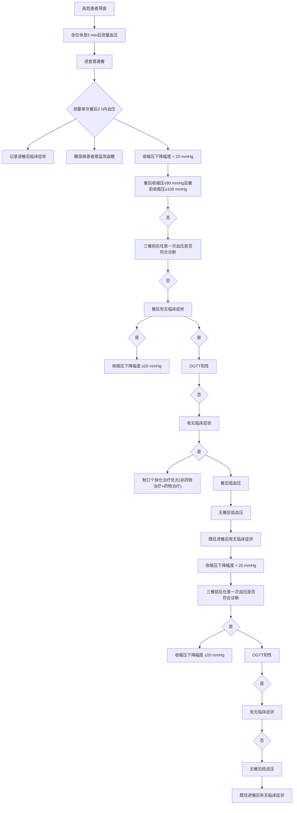

·指南与共识·

# 餐后低血压管理的中国专家共识

中国老年保健医学研究会高血压防治分会

餐后低血压( , )是与进餐相关的血压下降,是导致老年人晕厥、跌倒及心脑血管事件的重要因素之一。 在 世纪 年代就被临床医师所发现,直到 年才被正式认定为一种医学疾病[1]。 常发生于高血压、糖尿病、帕金森病患者中,在健康老年人群中也不少见。目前在临床工作中, 的诊断仍然存在不足,本共识旨在提供与 诊断和治疗相关的最新信息,以弥补指南与临床实践的空白 本共识内容包括了诊断 评估体系、管理流程及药物选择,以指导心内科医生优化的管理,最大程度改善患者预后。

# 1 PPH的流行病学

的流行病学目前无大样本人群研究 小样本人群研究显示,健康老年人及养老院老年人 患病率为 [2-4]。住院老年患者 患病率为 [5-6] 糖尿病患者 患病率为 左右[7-8];帕金森病患者 患病率为 [9-10]。国内研究显示,住院老年患者 的发生率为[11-12]

# 2 PPH的发病机制

的病因涉及多种因素 包括自主神经功能障碍 胃肠激素的变化 内脏血流增加和胃排空速率异常等 其中主要原因是与自主神经病变相关的交感神经功能障碍[13-14]

2.1 自主神经功能障碍 众所周知 摄入食物会导致内脏血液大量汇集 来满足胃肠道的动力和消化 吸收功能 内脏血管舒张会减少静脉回流 每搏量和心输出量 进而激活压力反射机制 兴奋交感神经 使去甲肾上腺素适度增加,从而增加全身外周血管阻力和心率以维持正常血压[15-16] 在健康人群中 膳食摄入不会引起血压显著变化,而在健康的老年人群中,餐后血压会轻度降低[17]。研究显示,餐后交感神经活动增加才能维持稳定的餐后血压,预防老年患者的发生[18]。 患者餐后肌肉交感神经活性(sympathetic nerve activity,MSNA)和血浆去甲肾上腺素虽有所增加,但这种增加明显低于正常人群,提示交感神经激活减弱[19]。

压力反射是心血管系统调节的重要部分,其负反馈回路可以双向调节血压 这种调整路径的有效性即压力反射敏感性,可通过心率变异性来评估。在患者中,心率变异性明显缩小,提示压力反射敏感性降低[20]。当出现压力感受器反射敏感性降低以及交感神经功能障碍时 心率和血管阻力增加不足 餐后血压下降无法获得有效代偿,即出现 ,严重者出现重要器官(脑、心脏)血流灌注减低[21-22]。研究发现,合并糖尿病的 患者,不论有无症状,心率变异性均明显降低[23] 另一项研究应用心电图 间期变异系数（coefficient of variation of R-R intervals,评估糖尿病患者的自主神经功能 结果显示心脏自主神经功能轻度障碍 和重度障碍 患者餐后 血压均明显降低其中轻度障碍组在进食后 血压恢复 重度障碍组在进食后 血压仍持续下降[24]

胃的拉伸扩张也可以调节交感神经活性[25]。在健康的年轻受试者中 使用恒压器进行近端胃扩张可以增加血压 心率和 即所谓的 胃血管反射”[26]。胃扩张通常具有升压作用,因而可以减轻餐后血压的下降[27-28] 研究表明 在健康的老年受试者中 应用同等浓度的葡萄糖饮料 摄入 饮料后的血压下降幅度小于摄入 饮料[29] 此外 在自主神经功能障碍的患者中 摄入高碳水化合物膳食前立即饮用 水 可以显著减轻餐后血压的下降[30] 。

2.2 胃肠激素变化 临床观察到静脉注射胰岛素与血压下降相关 提示餐后胰岛素的增加可能是 发生的原因之一,这可能与胰岛素具有舒张血管及干扰交感神经功能的特性有关[31] 而胃肠道在食物摄入后释放的多种内源性激素也与 相关 最明显的是胰高血糖素样肽 ( , )、葡萄糖依赖性促胰岛素多肽, )和生长抑素[32]。

是由肠道 细胞分泌的肠促胰岛素激素进食后显著增加。尽管 可被二肽基肽酶( , )迅速降解,但仍可通过“肠促胰素效应”刺激葡萄糖诱导的胰岛素分泌,抑制胰高血糖素,并减缓胃排空。在啮齿类动物中 静脉注射 可增加交感神经活性[33] 人群研究中,静脉注射 可减轻 型糖尿病患者摄入碳水化合物后的血压下降 这与胃排空减慢 肠系膜上动脉血流量减少和心率变异性增加有关[34] 调节餐后心血管功能的潜力使其成为维持餐后血压的靶点 包括 激动剂 抑制剂 二甲双胍和葡萄糖苷酶抑制剂在内的多种降糖药均可对和餐后血压产生影响,成为治疗研究热点。

也是一种肠促胰岛素激素,但 对胃排空的影响很小,且不抑制胰高血糖素分泌。据报道,可诱导增加内脏血流并增加心率 但对血压的影响不尽相同[35-36]。在接受高血糖钳夹的 型糖尿病患者中,应用 后收缩压升高 ( )( )[35]。在接受高血糖钳夹的型糖尿病患者中,应用 后平均动脉压降低[36]。 。

生长抑素在餐后低血压中的治疗作用主要归因于可以诱导内脏血管收缩,其具体机制仍不明晰。另一方面,生长抑素及其类似物可通过抑制多种肠道肽的分泌,包括胰高血糖素和 等,参与调节 [32]。

其他肠道激素,包括胰淀素、降钙素基因相关肽、神经降压素 血管活性肠肽 缓激肽和 物质 是调节餐后心血管功能的潜在靶点,然而,目前缺乏证据支持它们在 中的作用[37]。

2.3 内脏血流增加及胃排空速度异常 正常餐后内脏血容量显著增加 表现为肠系膜上动脉的血流量翻倍,同时血管阻力和外周血流量减少。餐后内脏血流量的增加取决于餐的大小和小肠营养物质的输送速率。在健康老年受试者中,与脂肪或蛋白质相比,十二指肠内直接输注葡萄糖后肠系膜上动脉血流量的增加更为明显 而口服葡萄糖后肠系膜上动脉血流量的起始速度增加更快[17]

胃排空的正常速率存在广泛的个体间差异 主要受营养物质与小肠相互作用产生的抑制性反馈调节所以体位和进餐量对胃排空率的影响很小[38] 胃排空异常延迟 胃轻瘫 经常发生在 相关疾病中 如型糖尿病和帕金森病 型糖尿病患者口服葡萄糖后平均动脉压的下降幅度与胃排空率之间明显相关当胃排空相对较快时 血压下降幅度更大[8] 在健康老年受试者中 在正常胃排空范围内 即 绕过 胃充盈程度的潜在影响 直接十二指肠内葡萄糖输注速度越快 血压下降和心率上升幅度越大 而葡萄糖浓度则对血压下降幅度没有明显影响[39]

总之,内脏血流量增加是老年人 的始动机制,交感神经活性减低、压力感受器反射敏感性下降是老年人 的病理基础 血管外周阻力下降参与了老年人 的形成。

# 3 PPH的诊断和评估

是与进餐相关的血压下降 且症状常常不典型,满足以下任意一条即可诊断为 : 相比于进餐前血压,进餐后 内收缩压下降幅度超过或者更多; 进餐后 内收缩压下降至或以下,而进餐前在 及以上;进餐后血压下降虽未达到上述标准,但超过大脑调节能力而出现心脑缺血症状 如晕厥 跌倒 头晕 心绞痛、卒中、视力障碍等。

3.1 血压评估 在三餐均可发生,早餐及午餐发生率高于晚餐。 的 患者在进餐后内出现血压下降并达到诊断标准(收缩压下降值 ), 的患者可在餐后 出现血压下降[40]。少数患者在进餐后 出现明显的血压下降[5,41]。国内研究显示,老年 患者餐后 血压开始下降, 下降到诊断标准, 达最低水平[12]。一般来说,进餐后 收缩压就可以降低, 达到高峰。不同的研究中,血压测量的时点和频率有所不同,有的在餐后 内每间隔 测量 次血压 也有的间隔 [42]、 [31]或 [20,23]测量餐后血压。还有研究探索了更为简便的方法,即在餐前和用餐完毕后 检测两次血压[40] 总体来说 餐后 内血压测量次数越少, 漏诊的可能性越大。目前,血压监测方法包括家庭血压监测(, )和动态血压监测(ry blood pressure monitoring,ABPM)。

诊室血压无法获得餐后血压的动态变化 对于 高危人群或有晕厥 跌倒病史的老年人应进行 [43] 在服用测试餐之前 餐前 坐位休息 后使用经过认证的自动血压计测量患者的基线血压和心率 进餐后每 测量 次血压和心率 持续至餐后 每次血压测量 遍 间隔取其平均值 可以减少误差 提高准确性[44-45]

动态血压用来评估日常生活状态下全天的血压水平 可以通过血压日记获取患者就餐起止时间和餐食的信息 可能是检测老年人日常生活中血压突然变化的有效检测手段 特别是在进餐后或姿势改变时 研究发现 对有跌倒和晕厥病史的老年患者进行 有 的患者能检测到[5]。当使用动态血压进行评估时,白天应每测量 次血压,夜间每 测量 次血压[5,12]。

【推荐建议】 和 是诊断 的重要检测方法。相比 , 的成本更低,且患者耐受性要更高。

3.2 危险因素评估 尽管 的病因尚未完全清楚 但已知有许多因素会影响餐后血压下降的幅度 包括年龄、饮食、药物以及与自主神经功能障碍相关的多种疾病(表 )。

表1 的危险因素

<table><tr><td>危险因素</td><td>具体因素</td></tr><tr><td rowspan="3">基线特征</td><td>高龄</td></tr><tr><td>低体重</td></tr><tr><td>餐前血压</td></tr><tr><td rowspan="3">饮食</td><td>高碳水饮食</td></tr><tr><td>热食</td></tr><tr><td>早餐</td></tr><tr><td rowspan="2">药物</td><td>多种药物联合(&gt;3种)</td></tr><tr><td>利尿剂</td></tr><tr><td rowspan="6">合并疾病</td><td>高血压</td></tr><tr><td>糖尿病</td></tr><tr><td>慢性肾脏病行血液透析</td></tr><tr><td>帕金森病</td></tr><tr><td>多系统萎缩</td></tr><tr><td>阿尔茨海默病</td></tr></table>

注: 为餐后低血压。

高龄 与年轻人相比,老年人餐后血液动力学变化更为明显。由于与年龄相关的肾上腺素能反应性下降,心率反应减弱,对于餐后内脏血流增加的心血管代偿能力减低,因而膳食刺激会在老年人中产生更大的生理压力[46]

虽然有报道称衰老与餐后血压调节受损有关[47]但也有研究表明 与年龄相关的疾病而非健康的衰老是 发生的关键[48-49]。与健康老年受试者相比,自主神经功能障碍的老年患者餐后血压难以维持,可能与交感神经活性不足和/或去甲肾上腺素释放减少相关,外周血管收缩反应减低导致全身血管阻力减少,血压降低[4]。

餐前血压 餐前收缩压水平是 的独立危险因素[11] 在接受降压治疗的社区人群中 多见于餐前收缩压 和年龄 岁的高血压患者 多因素分析显示早餐后 检出率与早餐前收缩压水平呈正相关[50] 在成人高血压患者中 血压控制良好者的 患病率为 而血压未得到控制者的 患病率为 [51]

饮食 食物的成分是影响餐后血压的重要因素。相比蛋白质或脂肪,富含碳水化合物的饮食更易使患者的血压快速下降。在健康的老年受试者中,简单碳水化合物( 葡萄糖)摄入可以导致血压显著下降,但复杂碳水化合物( 淀粉)摄入后血压下降并不明显 这可能与小肠吸收速率较慢相关[52] 不同类型单糖对血压的影响也不一致,其中果糖和木糖对餐后血压的影响明显小于葡萄糖。葡萄糖和蔗糖均会导致血压下降 但与蔗糖相比 葡萄糖摄入后血压下降更早,这可能与蔗糖必须被消化分解为葡萄糖才能触发反应有关[53-54] 。

此外,食物的温度和时间也会影响餐后血压。与冷餐 相比 温餐 餐后血压下降幅度更大有证据表明,在健康人群中,胃肠道存在特定的温敏受体和冷敏受体 而膳食温度会影响胃排空[55] 任何时候进餐都可能出现 ,但早餐更常出现显著的血压下降,这可能与较高的晨峰血压带来的血压下降幅度较大相关[56]

不同进食方式也与 相关。研究发现,接受鼻饲食物和营养液的脑梗死康复期患者,即使不用降压药 卧位状态下的 检出率仍高达 而且有的患者收缩压降低 ,因此减少每次的鼻饲量也是避免 发生的有效方法[57]。

药物 餐后血压与药物使用之间的关系尚不完全明确 有研究报道 包括利尿剂 如呋塞米 [58-59]抗精神病药(如奥氮平)[3,60]、选择性血清素再摄取药物(如氟西汀)[4,61]、血管紧张素转换酶抑制剂(如卡托普利)[58]、钙通道阻滞剂(如尼群地平)[62]、硝酸盐(硝酸甘油)和地高辛[3]在内的多种药物会增加餐后血压下降的幅度。有两项研究评估了利尿剂(呋塞米)对合并心血管疾病的老年患者餐后血压的影响 研究显示,呋塞米停用 月可减少餐后收缩压的下降幅度[58]。另一项研究中,应用呋塞米(口服 )可使餐后收缩压下降幅度增加约 [59]。其他药物如神经节阻断剂 抗帕金森病药物 左旋多巴 利血平和可乐定也可能加重 [63-64] 因此 餐前服用此类药物可能会加剧餐后血压的下降

# 3.2.5共病

神经系统疾病 荟萃分析显示 神经系统疾病与 的发生增加相关 OR CIP 其中 帕金森病 OR CI2.09～5.83，P<0.01)和多系统萎缩(OR=89.55，CI ,P )的风险更高,阿尔茨海默病 OR CI P)和糖尿病(OR , CI ,P=0.03)的风险效应值相对较小[13]。

高血压 高血压患者的 患病率增加[65],包括单纯收缩期高血压患者[66]。高血压患者的患病率高与其较高的收缩压密切相关,同时,可能也与高血压患者压力感受器功能减弱、心率变异性减低、无法有效代偿餐后内脏血流量的增加有关[66]。

慢性肾脏病尿毒症期(血液透析) 一项前瞻性对照研究观察了终末期肾病(患者在血液透析期间饮食对血压的影响与透析期间未进食患者相比 进食患者餐后 内的血压下降明显更快。也有观点认为,透析期间进食可以提高患者热量摄入和改善营养状况。但这种对热量摄入和营养状况的预期益处并不能抵消低血压风险。因此,治疗期间有低血压风险的患者应避免在血液透析期间进食[67]。

3.3 风险评估 患者发生脑血管疾病、短暂性脑缺血发作 晕厥 跌倒和冠状动脉事件风险增加[68]有晕厥或跌倒病史的住院老年患者中 存在[5]。一项针对老年高血压患者的前瞻性研究显示 的 患者有腔隙性缺血灶 且餐后收缩压下降幅度与腔隙病灶数量增加呈线性相关[69]。一项对 名社区老年人进行 年随访的前瞻性队列研究显示 是新发心血管疾病的独立危险因素[50] 一项纳入 项研究参与者 人的荟萃分析,结果显示 与脑卒中 心血管疾病 心血管疾病死亡和全因死亡风险增加相关[70]。受限于研究人群数量,更加可靠的临床证据还有待更大规模的人群研究。

【推荐建议】 对于合并多种危险因素的 高危人群 岁以上 体重指数 2 应用心血管 精神类药物超过 种 合并 种 高风险的疾病个体化的血压评估和风险评估有助于患者早期临床干预和远期预后改善

3.4 PPH的诊断流程 在临床中 对患有糖尿病 帕金森病 和心力衰竭的人群 特别是老年人应该考虑 的筛查诊断 了解这些患者有无餐后低血压症状对于正确诊断 至关重要 最常见的症状包括运动无力 头晕 轻度头痛 晕厥 跌倒 心绞痛 恶心和视觉障碍等 有的患者在进食后也可能无法行走或站立。餐后血压若大幅度下降会导致老年患者短暂性脑缺血发作 当血压恢复正常时症状通常会缓解[71-72] 有相关临床症状的患者都应接受血压监测并在每餐后仔细记录血压

诊断试验前排空膀胱 内不喝咖啡不饮酒、不剧烈活动;静坐休息 后先测量餐前坐位血压,然后进餐,再在餐后 内测量血压。已知进餐量和品类可能导致 诊断差异,富含碳水化合物食物更容易导致 而脂肪和蛋白质含量较高的食物对餐后血压的影响较小。进餐摄入的液体量一般不超过 ,如果摄入量较大,可使血压增加,检出率降低[45]。在进行 诊断时,尤其是比较不同疾病 不同临床状态的 患病率时需要统一的标准餐,可惜目前没有统一的试验餐标准,常规以普通餐代替 若单次进食普通餐后血压下降未达到诊断标准,可进一步完善三餐后血压监测,如果任一餐后血压均未达到 的诊断标准且无明显餐后缺血症状,但既往有进餐后心脑缺血症状的患者,建议进行口服葡萄糖耐量试验( , )提高 检出率。糖尿病患者谨慎应用,如进行试验,需要监测血糖变化。

另外,餐前应用降压药或其他扩血管药,如硝酸酯类药物、利尿剂等,均可能影响到餐后血压而导致诊断的增加,应尽量避免应用。有些药物则可能减少 的诊断,如抑制葡萄糖吸收的药物( 葡萄糖苷酶抑制剂阿卡波糖)、 受体激动剂(米多君),减少内脏血流量的药物(如腺苷受体拮抗剂咖啡因)等也不宜使用。进餐后的运动状态对于 的诊断也有影响,因此在餐后一般不宜进行体力活动[53]。另外,不同的体位对血压也有影响,建议餐前和餐后统一坐位测量血压

的检测个体变异较低,因此,一次完整的按照标准流程的检测通常就足以正确诊断。临床观察显示 似乎在早上更为明显 若首次进行普通餐筛查,建议早上进行诊断监测可能更有效[40]。具体诊断步骤如图 所示。

【推荐建议】 的早期诊断对于高危人群的早期干预至关重要 标准化的检测流程可以最大化提高检出率 有利于患者的早期干预和综合管理

# 4 PPH的治疗

发病机制的复杂性使得单纯药物治疗很难获得满意的治疗效果,因此,临床医生需要充分认识到非药物治疗和药物治疗相结合的重要性

4.1 非药物治疗 非药物治疗的主要策略之一是减缓胃排空,以延迟消化产物暴露于小肠。延迟排空、增加胃扩张可使交感神经活动增加 从而减少餐后血压下降 因此 少食多餐和多喝水有助于维持胃充盈和减缓胃排空[73] 餐前喝水有助于减少餐后血压的下降 在自主神经功能障碍的患者中 饮用

480mL的水可使血压增加20mmH [24,74]。与三顿大餐相比,六顿小餐可以改善自主神经功能障碍患者的 [75]。减少进食量可以使餐后血压的降低程度<20mmHg[76-77]。 。

flowchart

注 为餐后低血压 为口服葡萄糖耐量试验 阳性定义为口服葡萄糖后 内血压下降达到 的诊断标准

图1 诊断流程图

早餐结束后 开始餐后步行 轻度有氧运动 可能对老年患者有效 有研究显示在餐后运动中平均动脉压增加 但在运动停止后血压会降至运动前水平[78]。这表明餐后运动可能有助于预防和管理

研究表明 冷葡萄糖负荷可使平均动脉压增加$\left( 3 . 9 { \pm } 1 . ~ 3 \right) \mathrm { m m H g }$ 而热葡萄糖负荷使血压降低$( 8 . \mathrm { 0 { \pm } 1 . 1 ) m m H g ^ { [ 5 5 ] } }$ ] 这表明改变饮食温度可以作为控制 的一种非药物干预形式

对于高血压患者 餐前是否使用降压药对的影响也值得关注 有研究显示 老年高血压患者早餐后 服用降压药组 发生率为 明显低于早餐前服药组的 提示对于有 倾向的患者 降压药改在早餐后 服用可以减少 的发生[79] 。

因此 对于存在 的患者 应该建议其餐前饮水 减少碳水化合物的摄入 少食多餐 尝试用果糖或木糖作为葡萄糖的甜味替代剂 避免饮酒 适当饮茶咖啡 餐后适当运动 餐后间歇性步行 调整降压药的服药时间 在两餐之间服用降压药 避免服用利尿剂

对于有症状的 患者建议在饭后仰卧休息,因为站立或坐位会产生额外的降压作用[15]。对于非高血压患者,过多限制盐摄入量会减少循环血容量,从而为 创造了条件[80]。炎热的天气导致皮肤血管舒张和出汗增加,脱水也会减少循环血容量,使高危人群更容易发生 ,易感人群可以通过摄入足够的液体来预防。因此,减少 的诱因和合理的生活方式干预可以有效减轻 的症状及风险。

【推荐建议】 非药物治疗是 治疗的基础,存在不同合并症和生活习惯的患者可以给予个体化生活干预处方。

# 4.2 药物治疗

咖啡因 咖啡因是一种腺苷受体拮抗剂,可以刺激交感神经系统 咖啡因通过收缩动脉来维持血压[81]。既往研究表明咖啡因可以减缓餐后血压的下降[82-83]。但既往咖啡因对老年餐后晕厥的研究未发现获益[84-85]。因为它相对安全且容易获得,可用于有症状 患者进行试验性治疗[86]。但咖啡因应在早餐或午餐前服用,避免在晚餐前服用,以防止患者出现睡眠中断。

葡萄糖苷酶抑制剂 阿卡波糖是一种 葡萄糖苷酶抑制剂,可用于延缓胃排空。阿卡波糖的作用是抑制碳水化合物消化所需的酶,从而减缓胃的排空。此外,抑制碳水化合物消化酶可以减少胃肠肽的释放,如介导内脏血管舒张的 。在健康老年人中,阿卡波糖可减弱口服蔗糖后血压的下降和肠系膜上动脉血流量的上升[87]。荟萃分析显示,阿卡波糖可减缓 伴糖代谢异常患者餐后血压下降,避免 的发生[88]。阿卡波糖可减轻 型糖尿病患者餐后血压下降的幅度 缩短血压下降的持续时间 减少餐后血压波动[89]。现有的大多数研究都是针对无症状的 患者,对于有症状患者的研究和报道较少,能否广泛运用于有症状患者还有待进一步验证和探讨。

瓜尔胶 瓜尔胶是一种天然食品增稠剂 是由半乳糖和甘露糖组成的多糖 研究发现瓜尔胶可延缓胃肠道排空 从而缓解餐后血压下降[39,90]

生长抑素类似物 生长抑素类似物奥曲肽抑制大多数胃肠道激素的分泌,调节内脏血流。研究显示 单次皮下注射奥曲肽可以减轻老年和自主神经功能障碍患者的餐后血压下降 然而 奥曲肽和其他长效生长抑素类似物成本高 需要皮下注射 且不良反应包括腹痛和腹泻 发生率较高 因此奥曲肽只用于有严重 的患者[91]

激动剂 短效 激动剂 如艾塞那肽和利司那肽对餐后血液动力学的影响与外源性

给药相似。皮下注射利司那肽( )可显著减缓胃排空,减弱餐后肠系膜上动脉血流量的增加和餐后血压的下降[92]。长效 激动剂,如艾塞那肽长效制剂和司美格鲁肽 对餐后血液动力学的影响研究较少。近期有证据表明,艾塞那肽长效制剂和司美格鲁肽长期使用可减缓胃排空[93-94]。因此,长效激动剂也可能减少餐后血压降低。然而也有研究显示,在健康人群中, 受体激动剂不会立刻影响血压,长期应用还可轻度降低收缩压,这归因于尿钠增加和体重减轻[95-96]。虽然 激动剂为的管理提供了新的治疗策略 但有必要在更大的患者队列中进行进一步疗效验证研究。

【推荐建议】 的药物治疗需要考虑临床适应证及药物风险 避免过多药物干预造成血压波动 根据患者的临床表现和餐后血压下降程度的不同 制订个体化的治疗处方对改善 的预后至关重要。

# 5 结 语

是一个重要的临床问题 会导致晕厥和跌倒事件的发生,并增加心血管事件及死亡的风险。主要见于 型糖尿病、帕金森病和自主神经功能障碍的患者中,也可见于健康的老年人。目前, 的确切病理机制尚不十分明确 可能涉及多种因素 包括交感神经功能障碍、内脏血流增加以及胃肠激素变化等。的治疗目标是减少餐后血压下降 缓解临床症状 减少不良事件和改善风险预后

执笔者:李丽君,王曙霞,汪驰

# 参编专家(按姓氏拼音字母顺序):

程勇前(中国人民解放军总医院第五医学中心)

崔 华 中国人民解放军总医院第二医学中心

范常锋 北京大学首钢医院

方理刚 北京协和医院

管维平 中国人民解放军总医院第二医学中心

胡明冬(陆军军医大学第二附属医院)

胡亚民 沧州市中心医院

华 琦 首都医科大学宣武医院

李宾公 青岛市市立医院

李丽君 中国人民解放军总医院第六医学中心

李旭东 长春市中心医院

李 英 四川省人民医院

李宗斌(中国人民解放军总医院第六医学中心)

刘德平 北京医院

刘丽萍 瑞金市人民医院

刘小慧 北京大学国际医院

司全金(中国人民解放军总医院第二医学中心)

唐家荣 华中科技大学同济医学院附属同济医院

田进伟(哈尔滨医科大学附属第二医院)

汪 驰(中国人民解放军总医院第六医学中心)

王春玲(首都医科大学附属北京朝阳医院)

王建春 山东省立医院

王 亮(中国人民解放军总医院第八医学中心)

王曙霞(中国人民解放军总医院第二医学中心)

谢建洪(浙江省人民医院)

徐希奇 北京协和医院

薛 浩 中国人民解放军总医院

杨 伟(首都医科大学宣武医院)

杨晓敏 浙江大学医学院附属邵逸夫医院

余振球 首都医科大学附属北京安贞医院

张 闯(中国人民解放军总医院第六医学中心)

张丽伟(中国人民解放军总医院第四医学中心)

张宇清 中国医学科学院阜外医院

赵玉英 联勤保障部队第九八〇医院

朱 平(中国人民解放军总医院第二医学中心)

祝 烨(四川大学华西医院)

邹玉宝 中国医学科学院阜外医院

# 参考文献

[1]JansenRW,LipsitzLA.Postprandialhypotension:epidemiology, pathophysiology，and clinical management[J].Ann Intern Med, 1995，122(4):286-295.   
[2]Van Orshoven NP，Jansen PA，Oudejans I，et al.Postprandial hypotension in clinical geriatric patients and healthy elderly：prevalence related to patient selection and diagnostic criteria[J]. J Ag-, , :   
[3] Aronow WS，Ahn C.Postprandial hypotension in 499 elderly personsinalon-termhealthcarefacilit [J].JAm GeriatrSoc, 1994,42(9);930-932.   
[4]Le Couteur DG,Fisher AA,Davis MW,et al. Postprandial systolic blood pressure responses of older people in residential care: association with risk of falling[J].Gerontology,2oo3,49(4):260- 264.   
[5] Puisieux F,Bulckaen H,Fauchais AL，et al. Ambulatory blood pressure monitoring and postprandial hypotension in elderly persons with falls or syncopes[J].J Gerontol A Biol Sci Med Sci, 2000,55:M535-M540.   
[6] Schoevaerdts D,Lacoveli M,Toussaint E,et al. Prevalence and risk factors of postprandial hypotension among elderly people admitted in a geriatric evaluation and management unit：an observational study[J].J Nutr Health Aging,2019,23(10);1026-1033.   
[7] Sasaki E,Kitaoka H, Ohsawa N. Postprandial hypotension in patients with noninsulin-dependent diabetes mellitus[J].Diabetes Res Clin Pract,1992,18.113-121.   
[8] Jones KL，Tonkin A，Horowitz M,et al. Rate of gastric emptying is a determinant of postprandial hypotension in non-insulin-dependent diabetes mellitus[J].Clin Sci (Lond),1998,94(1)：65-

[9]Loew F,Gauthey L,Koerffy A，et al. Postprandial hypotension andorthostaticblood ressureresonsesinelderl Parkinson's [] , , ( ):   
[10] Mehagnoul-Schipper DJ,Boerman RH，Hoefnagels WH,et al. Effect of levodopa on orthostatic and postprandial hypotension in elderly Parkinsonian patients[J].J Gerontol A Biol Sci Med Sci, 2021,56:M749-M755.   
[ ]路岩,朱丹,郝宇,等 住院老年高血压患者伴发餐后低血压的临 床观察[]中华高血压杂志, , ():   
邹晓 司全金 王海军 等 高龄老年餐后低血压的临床特点及防治策略的研究[]中华老年心脑血管病杂志, , ():254.  
[13]Paveli'cA,KrbotSkori'cM,CrnoˇsiaL,etal.Postrandialh otension in neurological disorders：systematic review and meta-[] , , ():   
[14]Mitro P,Feterik K,Lenártová M,et al.Humoral mechanisms in the pathogenesis of postprandial hypotension in patients with essential hypertension[J].Wien Klin Wochenschr,2ool,113（11/ 12);424-432.   
[15]LucianoGL,BrennanMJ,RothbergMB.Postprandialhypoten-[] , , ():   
[16]TeramotoS,AkishitaM,FukuchiY,etal.Assessmentofautonomic nervous function in elderly subjects with or without postrandialh otension[J].H ertensRes,1997,20(4):257-261.   
[17] Lipsitz LA，Ryan SM,Parker JA,et al.Hemodynamic and autonomic nervous system responses to mixed meal ingestion in healthy young and old subjects and dysautonomic patients with postprandial hypotension[J].Circulation,1993,87(2):391-400.   
[18]Masuda Y，Kawamura A.Role of the autonomic nervous system in postprandial hypotension in elderly persons[J].J Cardiovasc Pharmacol,2003,42 Suppl1:S23-26.   
[19] Lipsitz LA，Pluchino FC,Wei JY,et al. Cardiovascular and norepinephrine responses after meal consumption in elderly（older than75 ears)ersonswith ostrandialh otensionandsncoe [] , , ():   
[20]Kawaguchi R，Nomura M，Miyajima H，et al. Postprandial hypotension in elderly subjects：spectral analysis of heart rate variability and electrogastrograms[J].J Gastroenterol,2oo2,37（2)： 87-93.   
[21] Madden KM,Feldman B，Meneilly GS. Baroreflex function and postprandial hypotension in older adults[J].Clin Auton Res, 2021,31(2):273-280.   
[22]MathiasCJ.Postrandialh otension.Pathohsioloicalmechanisms and clinical implications in different disorders[J].Hypertension,1991,18(5):694-704,   
[23] Kitae A,Ushigome E,Hashimoto Y,et al. Asymptomatic postprandial hypotension in patients with diabetes：the KAMOGAWA-HBP study[J].J Diabetes Investig,2021,12(5):837-844.   
[24]Hashizume M,Kinami S，Sakurai K，et al. Postprandial blood pressure decrease in patients with type 2 diabetes and mild or severe cardiac autonomic dysfunction[J].Int J Environ Res Public

, , ():   
[25]JordanJ,ShannonJR,BlackBK,etal.The ressorresonseto water drinking in humans：a sympathetic reflex?[J].Circulation,2000,101(5)：504-509.   
[26]van Orshoven NP,Oey PL,van Schelven LJ,et al. Effect of gastric distension on cardiovascular parameters：gastrovascular reflex is attenuated in the elderly[J].J Physiol,2004,555(Pt 2):573- 583.   
[27] Rossi P，Andriesse GI，Oey PL，et al. Stomach distension increases efferent muscle sympathetic nerve activity and blood pressure in healthy humans[J].J Neurol Sci,1998,161(2):148-155.   
[28] Gentilcore D，Meyer JH，Rayner CK，et al. Gastric distension attenuates the hypotensive effect of intraduodenal glucose in healthy older subjects[J].Am JPhysiol Regul Integr Comp Physiol,2008,295(2);R472-477.   
[29] Jones KL,ODonovan D,Russo A,et al. Effects of drink volume and glucose load on gastric emptying and postprandial blood pressureinhealth oldersubects[J].AmJPhsiolGastrointestLiver , , ():   
[30] Shannon JR,Diedrich A，Biaggioni I,et al. Water drinking as a treatment for orthostatic syndromes[J].Am J Med,2oo2,112 ():   
[31]Kearney MT,Cowley AJ，Stubbs TA，et al. Depressor action of insulinonskeletalmusclevasculature:anovelmechanismfor postprandial hypotension in the elderly[J].J Am Coll Cardiol, 1998,31(1):209-216.   
[32]Jansen RWMM，Hoefnagels WH. Hormonal mechanisms of postprandial hypotension[J].J Am Geriatr Soc,1991,39(12)：1201- 1207.   
[33] Osaka T,Endo M,Yamakawa M,et al. Energy expenditure by intravenousadministrationofglucagon-likepeptide-1mediatedby the lower brainstem and sympathoadrenal system[J].Peptides, , ():   
[34] Trahair LG,Horowitz M,Stevens JE，et al. Efects of exoge nous glucagon-like peptide-1 on blood pressure，heart rate，gastric emptying，mesenteric blood flow and glycaemic responses to oral glucose in older individuals with normal glucose tolerance or type 2 diabetes[J].Diabetologia,2015,58(8):1769-1778.   
[35]Heimbürger SM,Bergmann NC，Augustin R，et al. Glucose-dependent insulinotropic polypeptide（GIP）and cardiovascular dis-[] , , :   
[36] Wice BM,Reeds DN，Tran HD，et al. Xenin-25 amplies GIPmediated insulin secretion in humans with normal and impaired glucose tolerance but not type 2 diabetes[J].Diabetes,2o12,61 ():   
[37]Borg MJ，Xie C，Rayner CK，et al.Potential for gut peptidebased therapy in postprandial hypotension[J]. Nutrients,2021,13 (8):2826.   
[38]Horowitz M,Dent J.Disordered gastric emptying：mechanical basis，assessment and treatment[J].Baillieres Clin Gastroenterol, 1991,5(2);371-407.

[39]O'Donovan D，Feinle-Bisset C,Chong C，et al. Intraduodenal guar attenuates the fall in blood pressure induced by glucose in healthy older adults[J].J Gerontol A Biol Sci Med Sci,2005,60 (7);940-946.   
[40] Abbas R,Tanguy A，Bonnet-Zamponi D,et al. New simplified screening method for postprandial hypotension in older people[J]. JFrailty Aging，2018,7(1):28-33.   
[41]On AC,MintPK,PotterJF.Pharmacoloicaltreatmentof postprandial reductions in blood pressure：a systematic review [] , , ():   
[42]Jansen RW.Postprandial hypotension：simple treatment but difficulties with the diagnosis[J].J Gerontol A Biol Sci Med Sci, 2005,60(10);1268-1270.   
[43] Barochiner J，Alfie J，Aparicio LS,et al. Postprandial hypotension detected through home blood pressure monitoring:a frequent phenomenon in elderly hypertensive patients[J].Hypertens Res, , ():   
[44]PuisieuxF.Postrandialh otensionintheelderl [J].Presse , , ( ): ,   
唐敏 苏海 如何诊断高血压患者的餐后低血压 中华高血压杂志, , ( ):  
[46] Pan HY,Hoffman BB,Pershe RA，et al.Decline in beta adrenergic receptor-mediated vascular relaxation with aging in man[J]. JPharmacol Exp Ther,1986,239(3):802-807.   
[47] Kohara K，Uemura K，Takata Y，et al. Postprandial hypotension：evaluation by ambulatory blood pressure monitoring[J].Am , , ( ):   
[48] Smith NL,Psaty BM,Rutan GH,et al. The association between time since last meal and blood pressure in older adults：the cardiovascular health study[J].J Am Geriatr Soc,2003,51(6)：824- 828.   
[49] Oberman AS，Gagnon MM，Kiely DK，et al. Autonomic and neurohumoral control of postprandial blood pressure in healthy aging[J].J Gerontol A Biol Sci Med Sci,2000,55（8): M477- M483.   
[50]Jang A.Postprandial hypotension as a risk factor for the development of new cardiovascular disease：a prospective cohort study with 36 month follow-up in community-dwelling elderly people [] , ,():   
[51] Zou X，Cao J，Li JH，et al. Prevalence of and risk factors for post-prandial hypotension in older Chinese men[J].J Geriatr Car-, , ():   
[52]Heseltine D,Dakkak M,Macdonald IA，et al. Effects of carbohydrate type on postprandial blood pressure，neuroendocrine and gastrointestinal hormone changes in the elderly[J].Clin Auton , ,():   
[53]Mathias CJ，da Costa DF，McIntosh CM，et al.Differential blood pressure and hormonal effects after glucose and xylose ingestion in [] ( ), , ():   
[54] Vanis L,Hausken T,Gentilcore D,et al. Comparative effects of glucose and xylose on blood pressure，gastric emptying and incre-

tin hormones in healthy older subjects[J].Br J Nutr,2o11,105 ( ):   
[55]Kuipers HM，Jansen RW，Peeters TL，et al.The influence of food temperature on postprandial blood pressure reduction and its relation to substance-P in healthy elderly subjects[J].J Am Geri-, , ():   
[56]Vloet LC,Smits R，Jansen RW.The effect of meals at different mealtimesonblood ressureandsmtomsin eriatric atients with postprandial hypotension[J].J Gerontol A Biol Sci Med Sci, , ( ):   
朋海平 周广 夏莉莉 等 脑梗死康复期鼻饲患者餐后低血压的检出率 中华高血压杂志  
[58]Mehagnoul-Schipper DJ,Colier WN,Hoefnagels WH,et al. Effects of furosemide versus captopril on postprandial and orthostatic blood pressure and on cerebral oxygenation in patients > or=70 years of age with heart failure[J].Am JCardiol,20o2,90(6):596- 600.   
[59] van Kraaij DJ，Jansen RW,Bouwels LH，et al.Furosemide withdrawal improves postprandial hypotension in elderly patients with heart failure and preserved left ventricular systolic function[J]. Arch Intern Med,1999,159(14):1599-1605.   
[60]WooYS,KimW,ChaeJH,etal.Blood ressurechanesdurin clozapine or olanzapine treatment in Korean schizophrenic patients [] , , ( ):   
[61]He Y,Deng J，Zhang Y,et al. The effect of fluoxetine on morning blood pressure surge in patients with ischemic stroke：a prospective preliminary clinical study[J].Blood Press Monit,2021,26 (4):288-291.   
[62] Jansen RW，van Lier HJ,Hoefnagels WH.Effects of nitrendipine and hydrochlorothiazide on postprandial blood pressure reduction and carbohydrate metabolism in hypertensive patients over 70 years of age[J]. J Cardiovasc Pharmacol,1988,12 Suppl 4: S59- S63.   
[63] Awosika A，Adabanya U，Millis RM，et al. Postprandial hypo tension：an underreported silent killer in the aged[J]. Cureus, , ():   
[64] Gentilcore D,Jones KL，ODonovan DG，et al.Postprandial hypotension-novel insights into pathophysiology and therapeutic im plications[J].Curr Vasc Pharmacol,2006,4(2):161-171.   
[65]Haigh RA，Harper GD,Burton R，et al.Possible impairment of the sympathetic nervous system response to postprandial hypotension in elderly hypertensive patients[J].J Hum Hypertens, ,():   
[66] Grodzicki T,Rajzer M,Fagard R,et al. Ambulatory blood pres sure monitoring and postprandial hypotension in elderly patients with isolated systolic hypertension. Systolic Hypertension in Europe（SYST-EUR） trial investigators[J].J Hum Hypertens, 1998,12(3);161-165.   
[67] Fotiadou E,Georgianos PI,Chourdakis M,et al. Eating during the hemodialysis session：a practice improving nutritional status ora risk factor for intradialytic hypotension and reduced dialvsis

? [] , , ():   
[68］Fisher AA，Davis MW，Srikusalanukul W，et al.Postprandial h otension redictsall-causemortalit inolder,low-levelcare residentsJ].J Am Geriatr Soc,2005,53(8);1313-1320.   
[69]Kohara K，Jiang Y, Igase M,et al.Postprandial hypotension is associated with asymptomatic cerebrovascular damage in essential [] , , ( ): 568.   
[70] Jenkins D，Sahye-Pudaruth S，Khodabandehlou K，et al.Systematic review and meta-analysis examining the relationship between postprandial hypotension，cardiovascular events，and allcause mortality[J].Am J Clin Nutr,2022,116(3):663-671.   
[71] Kamata T,Yokota T,Furukawa T,et al. Cerebral ischemic attack caused by postprandial hypotension[J].Stroke,1994,25(2): 511-513.   
[72] Cheshire WP,Jr，Meschia JF.Postprandial limb-shaking：an unusual presentation of transient cerebral ischemia[J].Clin Auton Res,2006，16(3):243-246.   
[73] Shibao CA，Biaggioni I. Management of orthostatic hypotension, postprandial hypotension，and supine hypertension[J].Semin , , ():   
[74]Deguchi K，Ikeda K，Sasaki I,et al.Effects of daily water drink-ing on orthostatic and postprandial hypotension in patients with multilesstematroh [J].JNeurol,2007,254(6):735-740.   
[75] Puvi-Rajasingham S，Mathias CJ. Effect of meal size on postrandialblood ressureandon osturalh otensionin rimar autonomic failure[J].Clin Auton Res,1996,6(2):111-114.   
[76]Vloet LC，Mehagnoul-Schipper DJ，Hoefnagels WH，et al.The influence of low-，normal-，and high-carbohydrate meals on blood pressure in elderly patients with postprandial hypotension[J].J Gerontol A Biol Sci Med Sci,2001,56(12):M744-748.   
[77] Trahair LG,Horowitz M,Jones KL. Postprandial hypotension: a systematic review[J]. J Am Med Dir Assoc,2014,15(6):394-   
[78] Nair S,Visvanathan R,Gentilcore D. Intermittent walking： a potential treatment for older people with postprandial hypotension [J].J Am Med Dir Assoc,2015,16(2):160-164.   
陈春莲 不同服药时间对老年高血压患者餐后低血压 的影响[]当代医学, , ( ):  
[80] Godwal K，Asija R,Khanijau R. Monitoring of non-steroidal an-ti-inflammatory drugs（NSAIDs）and use of proton pump inhibi-tors（PPIs） and NSAIDs in elderly patients[J].IJARW,2020,2:58-64.  
[81] Onrot J,Goldberg MR,Biaggioni I,et al. Hemodynamic and humoral effects of caffeine in autonomic failure. Therapeutic implications for postprandial hypotension[J].N Engl J Med,1985,313: 549-554.   
[82]Heseltine D,El-Jabri M,Ahmed F,et al.The effect of caffeine on postprandial blood pressure in the frail elderly[J].Postgrad Med J,1991,67(788);543-547.   
[83]RakicV,BeilinLJ,BurkeV.Effectofcoffeeandteadrinkin on

postprandialhypotensioninoldermenandwomen[J].ClinExp , , (/ ):   
[84] Barakat MM,Nawab ZM,Yu AW,et al. Hemodynamic effects of intradialytic food ingestion and the effects of caffeine[J].J Am , ,( ):   
[85]LisitzLA,JansenRW,Connell CM,etal.Haemodnamicand neurohumoraleffectsofcaffeineinelderl atientswithsmtomatic postprandial hypotension：a double-blind，randomized, [] ( ), , (): 267.   
[86]Heseltine D,Dakkak M,Woodhouse K，et al. The effect of caffeineonpostprandialhypotensionintheelderly[J].JAmGeriatr , , ():   
[87] Pham H,Trahair L,Phillips L，et al.A randomized，crossover study of the acute effects of acarbose and gastric distension，alone and combined，on postprandial blood pressure in healthy older adults[J].BMC Geriatr,2019,19(1):241.   
[88] Wang B， Zhao J, Zhan Q,et al.Acarbose for postprandial hypo tensionwith lucosemetabolismdisorders:asstematicreview and meta-analysis[J].Front Cardiovasc Med,2o21,8:663635.   
[89]Zhan J,GuoL.Effectivenessofacarboseintreatin elderl atients with diabetes with postprandial hypotension[J].J Investig Med,2017，65(4);772-783,   
[90] Jones KL，MacIntosh C,Su YC，et al. Guar gum reduces postprandial hypotension in older people[J].J Am Geriatr Soc,2001,

():   
[91]HoeldtkeRD,DavisKM,JosehJ,etal.Hemodnamiceffects ofoctreotidein atientswithautonomicneuroath [J].Circulation,1991,84(1);168-176,   
[92]Jones KL,Rigda RS,Butfield M,et al. Effects of lixisenatide on ostrandialblood ressure, astricemtin and lcaemiain healthy people and people with type 2 diabetes[J]. Diabetes Obes , , ():   
[93]JonesKL,HunhLQ,HatzinikolasS,etal.Exenatideonce weekly slows gastric emptying of solids and liquids in healthy, overweightpeople at steady-state concentrations [J].Diabetes , , ():   
[94]HerstedJB,FlintA,BrooksA,etal.Semalutideimroves postprandial glucose and lipid metabolism，and delays first-hour gastric emptying in subjects with obesity[J].Diabetes Obes , , ():   
[95]Bharucha AE,Charkoudian N，Andrews CN，et al. Effects of glucagon-like peptide-1，yohimbine，and nitrergic modulation on smatheticand arasmatheticactivit inhumans[J].AmJ Physiol Regul Integr Comp Physiol,2008,295(3):874-880.   
[96] Seufert J，Gallwitz B. The extra-pancreatic effects of GLP-1 receptor agonists：a focus on the cardiovascular，gastrointestinal and central nervous systems[J].Diabetes Obes Metab,2014,16 (8):673-688.

收稿日期: 责任编辑:张刘锋

·预 告·

# “学术争鸣”题目预告

·高血压治疗中哪些治疗措施有助于提高血压目标范围内时间? [ 年 月 日]

注:方括号内时间为截稿日期。参与本栏目讨论的稿件请发送到我刊邮箱( )或上传至我刊网站( :// )“高血压论坛”栏目。