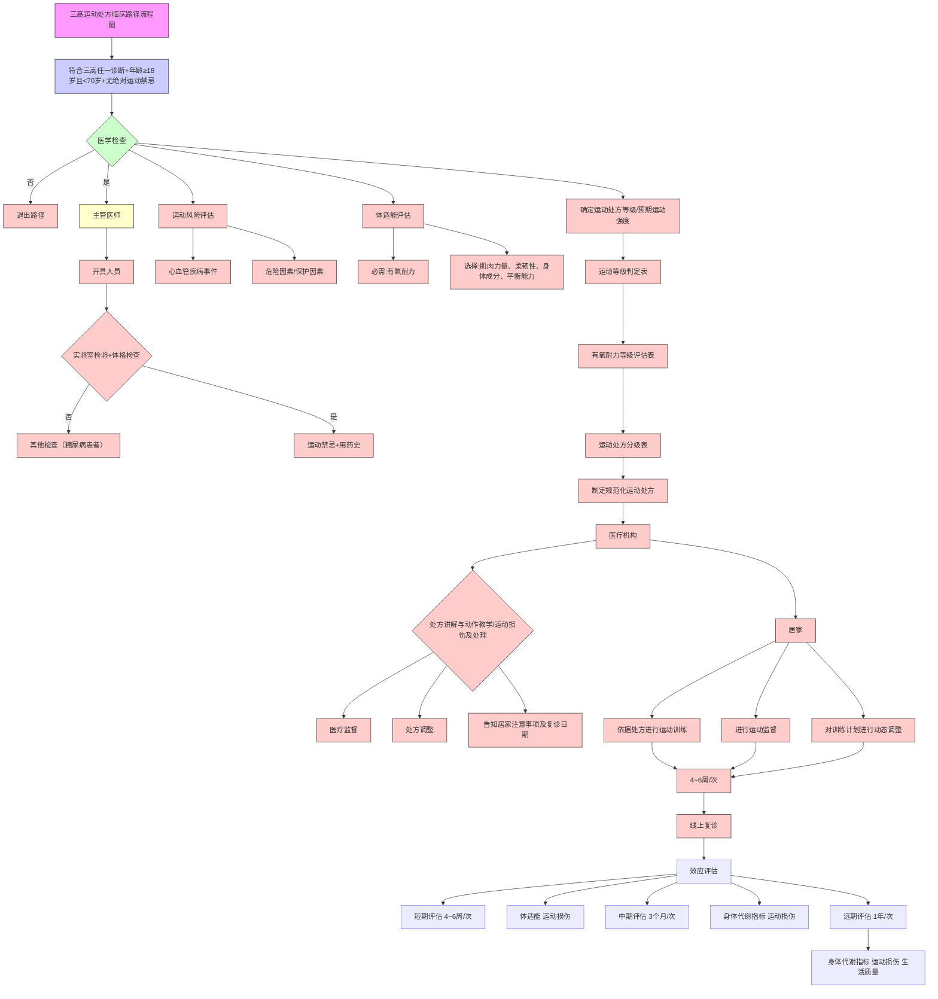

·指南与共识·

# 高血压、糖尿病、血脂异常人群运动处方临床路径

胡梦婕1#，的机卓玛1#，郑迪心2，邓颖3，胥馨尹3，刘小雪1，张玲1，黄果岳4，刘剑伟5， 钟永晓2，周丁子1，苏巧俐6，姚永萍2，陈龙2，樊萌语1，李佳圆1

1.四川大学华西公共卫生学院/华西第四医院（成都  610041）  
2. 四川省医学会（成都  610041）  
3.四川省疾病预防控制中心（成都  610041）  
4. 美国约翰霍普金斯大学彭博公共卫生学院（北京  100020）  
5. 四川省骨科医院（成都  610041）  
6. 四川大学华西医院（成都  610041）

【摘要】  运动处方是高血压、糖尿病、血脂异常防控的有效手段。然而全套运动处方难以在我国基层医疗机构和社区公共卫生服务中心完整实施。因此，在运动处方理论体系和标准制定规范的支撑下，根据我国国民体质特点与基层医疗机构现状制定本运动处方临床路径，旨在简化运动处方制定流程，降低专业门槛，赋能基层医疗，为运动处方在基层医疗机构的推广提供科学可行的方案。

【关键词】  运动处方；临床路径；高血压；糖尿病；血脂异常

# Clinical pathway for exercise prescription in patients with hypertension, diabetes and dyslipidemia

HU Mengjie1, DIJI Zhuoma1, ZHENG Dixin2, DENG Ying3, XU Xinyin3, LIU Xiaoxue1, ZHANG Ling1, HUANG Guoyue4, LIU Jianwei5, ZHONG Yongxiao2, ZHOU Dingzi1, SU Qiaoli6, YAO Yongping2, CHEN Long2, FAN Mengyu1, LI Jiayuan1

1. The West China School of Public Health/West China Fourth Hospital, Sichuan University, Chengdu 610041, P. R. China   
2. Sichuan Medical Association, Chengdu 610041, P. R. China   
3. Sichuan Center for Disease Control and Prevention, Chengdu 610041, P. R. China   
4. Johns Hopkins Bloomberg School of Public Health, Peking 100020, P. R. China   
5. Sichuan Province Orthopedic Hospital, Chengdu 610041, P. R. China   
6. West China Hospital, Sichuan University, Chengdu 610041, P. R. China   
Corresponding author: FAN Mengyu, Email: fanmengyu@scu.edu.cn

【Abstract】 Exercise prescription is an effective tool for the prevention and control of hypertension, diabetes and dyslipidemia. However, a full set of exercise prescription is difficult to be implemented in China's primary medical institutions and community public health service centers. Therefore, under the support of the theoretical system of exercise prescription and the standard development norms, this clinical pathway of exercise prescription is developed according to the characteristics of national physical fitness and the status quo of primary healthcare institutions in China, aiming at simplifying the process of exercise prescription development, reducing the professional threshold, empowering primary healthcare, and providing a scientific and feasible solution for the promotion of exercise prescription in primary healthcare institutions.

【Key words】 Exercise prescription; Clinical pathway; Hypertension; Diabetes mellitus; Dyslipidemia

心血管疾病是全球范围内威胁人类生命健康的首要慢性病[1]。高血压、糖尿病、血脂异常作为心血管疾病的主要危险因素，患病率持续攀升[2-4]。已有指南指出三者具有明显聚集倾向，常成对或三联发生，建议实行“三高共管”以更好地预防心血管事件[5]。运动处方作为体医融合的典范，通过制定和实施目的明确、系统性、个体化的科学运动方案，已成为高血压、糖尿病、血脂异常防控的有效手段[6,7]。然而，当前我国大部分医疗卫生机构，尤其是基层医疗机构和社区公共卫生服务中心，由于缺乏专业的运动处方师[ 8 ]，且没有配套的运动设施，导致运动处方的完整实施难以推广普及。如何快速、深入、广泛的推广应用运动处方是当前领域面临的新挑战。因此，在运动处方理论体系和标准制定规范的支撑下，根据我国国民体质特点与基层医疗机构现状制定本运动处方临床路径，旨在简化运动处方制定流程，降低专业门槛，赋能基层医疗，为运动处方在基层医疗机构的推广提供科学可行的方案。

# 1   本临床路径制定方法

本路径参考“TIMER-DO”报告规范[9]，参考英国牛津大学循证医学中心证据分级和推荐标准对证据进行分级[10]。

# 1.1   路径发起机构与专家组成员

本路径制定由四川省医学会发起，采用德尔菲法及共识会议制定方法，邀请国内慢性病、运动医学和公共卫生等领域的 15 位资深专家成立咨询组。路径制定工作于 2024 年 10 月启动，2025 年4月定稿。

# 1.2    证据检索

计算机检索 Web of Science、PubMed、Embase、CNKI、WanFang Data、CBM 数据库，检索时限均为建库至 2024 年 9 月 30 日。英文检索词包括：exercise therapy、exercise prescription、diabetes、hypertension、dyslipidemia、guideline、clinicalpractice guidelines、consensus、expert consensus、consensus document、recommendations、guidingprinciples、meta analyses、systematic review 等；中文检索词包括：运动处方、运动干预、糖尿病、高血压、血脂异常、指南、专家共识、指导原则、系统综述等。由编制组 2 名人员进行文献筛选，纳入至少与运动处方、运动干预、“三高”其一相关的指南和专家共识，以及三高人群运动干预的系统综述和 Meta 分析。然后由编制组 5 名人员仔细研读纳入文献，起草本路径草稿，再由编制组全体成员多次团队讨论形成本路径初稿，进行专家咨询。

# 1.3    路径制定方法

首轮咨询采用德尔菲专家法，共有 11 位专家进行评审，对于任一专家评分≤3 分的条目，根据专家建议再次查找证据进行修改，并进一步明确本路径关键方向。修改后，通过两次共识会议对关键条目逐一评审讨论，最终形成本临床路径。推荐意见采用专家一致性原则，通过共识会议组织多轮投票和讨论达成对推荐意见的共识。

# 1.4    共识问题

本临床路径制定组围绕三高人群运动处方应用的临床问题，基于《“三高”共管规范化诊疗中国专家共识（2023 版）》《运动处方中国专家共识（2023）》《中国心血管疾病患者居家康复专家共识》《中国高血压防治指南（2024 年修订版）》《ACSM 运动测试与运动处方指南》《临床运动处方实践专家共识（2025）》等专家共识和权威指南，结合文献查阅及我国临床实际，由编制组确定临床路径初稿，结合初稿生成共识问题专家咨询表，采用 Likert 5 分量表对咨询表条目重要性、可操作性进行评分。

# 1.5    专家回复

首轮咨询采用邮件函询方式进行，专家意见提出率 90.9%。受邀专家基于 Likert 5 分量表对各条目的重要性和可操作性进行独立评分。结果显示，各条目重要性平均分为 4～5 分，变异系数均小于0.25。可操作性平均分为 3.4～4.7 分，变异系数0.14～0.37。总结首轮专家意见、识别差异度较高的条目以及筛选出需要进一步深入讨论的关键条目。

第二轮及第三轮咨询则采用面对面的共识会议法。聚焦于首轮函询筛选出的关键条目，与会专家就条目的具体表述、适用性、潜在障碍及改进建议等核心问题展开深入讨论、论证和意见交换。路径的形成遵循一致性原则，最终就所有关键条目达成一致意见。

# 2   三高人群运动处方临床路径

本临床路径主要包含路径适宜人群筛查、运动风险评估与处方制定、运动监督与处方调整、自我管理与复诊四大板块，如图1。

# 2.1   路径适宜人群筛查

2.1.1   运动处方开具人员 运动医学背景的医师经过临床医学培训后可以开具运动处方，临床医学背景的医生、护士、康复师经过运动医学培训后可以开具运动处方[11,12]。

2.1.2    适用对象 被诊断为高血压（ICD-I10）、糖尿病（ICD-E10:E14）、血脂异常（ICD-E78）任意一种疾病。诊断依据中国高血压防治指南[ 1 3 ]、中国2型糖尿病防治指南[14,15]、中国血脂管理指南[16]。

flowchart

图 1    三高人群运动处方临床路径流程图

高血压：① 诊室血压测量（非同日 3 次测量）收缩压（SBP）≥140 mmHg 和/或舒张压（DBP）≥90 mmHg；或② 动态血压监测 24h 平均 SBP≥130 mmHg 和/或 DBP≥80 mmHg，白昼 SBP≥135 mmHg 和/或 DBP≥85 mmHg，夜间 SBP≥120 mmHg 和/或 DBP≥70 mmHg；或③ 家庭血压监测 SBP≥135 mmHg 和/或 DBP≥85 mmHg。

糖尿病：① 具有典型糖尿病症状（烦渴多饮、多尿、多食、不明原因的体质量下降）；且② 随机血糖≥11.1 mmol/L，或空腹血糖（FPG）≥7.0 mmol/L，或口服葡萄糖耐量试验（OGTT）2 h 血浆葡萄糖≥11.1 mmol/L，或糖化血红蛋白（HbA1c）≥6.5%；无糖尿病典型症状者，需改日复查确认。

血脂异常：① 总胆固醇（TC）≥5.2 mmol/L（200 mg/dL），或② 甘油三酯（TG）≥1.7 mmol/L（150 mg/dL），或③ 低密度脂蛋白胆固醇（LDL-C）≥3.4 mmol/L（130 mg/dL），或④ 高密度脂蛋白胆固醇（HDL-C）<1.0 mmol/L（40 mg/dL）。

2.1.3    进入路径标准 必须符合高血压、糖尿病、血脂异常诊断标准，年龄≥18 岁且<70 岁，无绝对 运 动 禁 忌 症 [ 1 4 , 1 7 , 1 8 ]： ① 严 重 心 血 管 疾 病 （ 血糖>16.7 mmol/L、血糖<4.0 mmol/L、血压>180/120 mmHg）；② 严重精神障碍；③ 处于高危状态不适合进行运动训练的恶性肿瘤患者；④ 妊娠期[19]；⑤ 其他运动禁忌症。进入路径前，谨慎评估运动禁忌，如果运动风险大于运动获益，则不建议进行运动。

2.1.4   医学检查 进入路径患者需进行实验室检查（FPG/HbA1c、TC、TG、HDL-C、LDL-C）、体格检查（身高、体重、腰围、臀围、血压）及其他检查（眼底照相，仅糖尿病患者），了解用药史，排除运动禁忌[6,19]。

表 1    有氧耐力等级评估表

<table><tr><td rowspan="2">分性别有氧耐力等级</td><td colspan="5">年龄别最大摄氧量范围( $mL·kg^{-1}·min^{-1}$ )</td></tr><tr><td>20~29(岁)</td><td>30~39(岁)</td><td>40~49(岁)</td><td>50~59(岁)</td><td>60~69(岁)</td></tr><tr><td>有氧耐力等级评估(男性)</td><td></td><td></td><td></td><td></td><td></td></tr><tr><td>高</td><td> $\geqslant 57.1$ </td><td> $\geqslant 51.6$ </td><td> $\geqslant 46.7$ </td><td> $\geqslant 41.2$ </td><td> $\geqslant 36.1$ </td></tr><tr><td>中</td><td> $\geqslant 44.9$ 且&lt;57.1</td><td> $\geqslant 39.69$ 且&lt;51.6</td><td> $\geqslant 35.7$ 且&lt;46.7</td><td> $\geqslant 30.7$ 且&lt;41.2</td><td> $\geqslant 26.6$ 且&lt;36.1</td></tr><tr><td>低</td><td>&lt;44.9</td><td>&lt;39.6</td><td>&lt;35.7</td><td>&lt;30.7</td><td>&lt;26.6</td></tr><tr><td>有氧耐力等级评估(女性)</td><td></td><td></td><td></td><td></td><td></td></tr><tr><td>高</td><td> $\geqslant 46.5$ </td><td> $\geqslant 37.5$ </td><td> $\geqslant 34.0$ </td><td> $\geqslant 28.6$ </td><td> $\geqslant 24.6$ </td></tr><tr><td>中</td><td> $\geqslant 34.6$ 且&lt;46.5</td><td> $\geqslant 28.2$ 且&lt;37.5</td><td> $\geqslant 24.9$ 且&lt;34.0</td><td> $\geqslant 21.8$ 且&lt;28.6</td><td> $\geqslant 18.9$ 且&lt;24.6</td></tr><tr><td>低</td><td>&lt;34.6</td><td>&lt;28.2</td><td>&lt;24.9</td><td>&lt;21.8</td><td>&lt;18.9</td></tr></table>

注：6分钟步行试验以峰值摄氧量替代最大摄氧量进行有氧耐力评估。

# 2.2   运动风险评估与处方制定

2.2.1    运动风险评估 根据心血管疾病事件、危险因素及保护因素评估运动风险，并统计心血管疾病事件发生数及危险因素总数评估患者运动风险[19,20]。高风险定义为发生过≥2 次心血管疾病事件，或一次心血管疾病事件且合并2个危险因素[16]。中风险定义为未发生过心血管疾病事件且存在2 个以上危险因素。低风险定义为未发生过心血管疾病事件且存在2个及以下危险因素。

（1）心血管疾病事件：① 一年内急性冠脉综合征病史；② 既往心肌梗死病史；③ 缺血性脑卒中病史；④ 有症状的周围血管病变，既往接受血运重建或者截肢。  
（2）危险因素：①年龄：男性≥45 岁，女性≥55 岁；②家族史：父亲或其他男性一级亲属 55 岁前猝死、母亲或其他女性一级亲属 65 岁前猝死；③ 吸烟：吸烟或戒烟不足 6 个月或暴露于二手烟环境；④体力活动不足：至少3个月未达到3次/周，每次至少 30 分钟的中等强度体力活动（40%～60% 储备摄氧量）；⑤ 肥胖；⑥ 高血压；⑦ 糖尿病；⑧血脂异常。  
（3）保护因素：HDL-C≥60 mg/dL（1.55mmol/L），可以从危险因素总数中减去1。

2.2.2    体适能评估 根据现有设备、患者年龄和运动习惯，选择适合的评估方式，根据评估结果计算最大摄氧量并评估有氧耐力等级（表 1）。必需项目为有氧耐力测试[18,19,21-24]，年龄≥60 岁和/或没有运动习惯的人群推荐采用 6 分钟步行试验（首选）、或 Rockport 步行试验测试。年龄<60 岁推荐采用台阶试验（首选）、或库珀 12 分钟跑步测试或库珀 2.4 千米跑测试。非必需项目包括肌肉力量

表 2    运动处方等级判定表

<table><tr><td rowspan="2" colspan="2">处方级别</td><td colspan="3">运动风险</td></tr><tr><td>低</td><td>中</td><td>高</td></tr><tr><td rowspan="3">有氧耐力</td><td>高</td><td>5</td><td>4</td><td>3</td></tr><tr><td>中</td><td>4</td><td>3</td><td>2</td></tr><tr><td>低</td><td>3</td><td>2</td><td>1</td></tr></table>

注：无法进行有氧耐力测试者，预期运动强度定为1级。

与耐力测试、柔韧性、身体成分测试、平衡能力测试[18,19,25,26]。 。

2.2.3    确定运动处方等级/预期运动强度 根据运动风险和有氧耐力等级判定运动处方等级（表 2）。  
2.2.4   制定规范化运动处方 根据患者运动处方分级，参考运动处方分级表（表 3）选择适宜运动量，制定规范化运动处方[18,19]。处方遵循美国运动医学会（ACSM）推荐的 FITT-VP 原则[27]，同时在处方中需明确运动目的，结合患者个人兴趣爱好推荐运动方式。

# 2.3   运动监督与处方调整

2.3.1   处方讲解与动作教学 在医疗机构指导患者根据运动处方进行运动，至患者正确掌握运动方式、频率、时间及强度，能在运动处方等级范围内自行调整运动训练强度，可以长期居家运动。推荐指导训练时长≥1周（≥3次指导）。  
2.3.2   专业监督下运动训练 运动一般注意事项适用于所有人群；高血压、糖尿病、高血脂人群在一般人群注意事项基础上需单独关注对应人群的附加风险[7,18-20,28-33]。

（1）一般注意事项：① 注意运动前热身、运动后拉伸、膝关节及腰背部保护；② 关注身体状态，急性疾病期间暂停运动，待缓解后再继续；③ 抗阻训练注意负荷和组数变化，每次力量训练间隔至少 24 小时，避免屏气，必要时提供适当的保护；④ 建议初学者在专业人员指导下进行训练，抗阻训练注意控制动作速率和关节活动范围，有氧运动注意动作规范性；⑤ 药物使用按照医嘱建议执行；⑥ 饮食上按膳食建议执行；⑦ 预防低血糖发生，运动最好在餐后1小时左右进行。

表 3    运动处方分级表

<table><tr><td>处方分级</td><td>1(最低运动量)</td><td>2(基础运动量)</td><td>3(中等运动量)</td><td>4(较大运动量)</td><td>5(最大运动量)</td></tr><tr><td>热身运动</td><td>6~9个动作,4个8拍</td><td>6~9个动作,4个8拍</td><td>6~9个动作,4个8拍</td><td>6~9个动作,4个8拍</td><td>6~9个动作,4个8拍</td></tr><tr><td>有氧运动</td><td></td><td></td><td></td><td></td><td></td></tr><tr><td>强度</td><td>30%~40%HRR</td><td>35%~45%HRR</td><td>45%~60%HRR</td><td>55%~65%HRR</td><td>60%~70%HRR</td></tr><tr><td>时间</td><td>20~30 min</td><td>25~35 min</td><td>30~40 min</td><td>35~45 min</td><td>40~50 min</td></tr><tr><td>频率</td><td>3~6次/周</td><td>3~6次/周</td><td>3~6次/周</td><td>3~6次/周</td><td>3~6次/周</td></tr><tr><td>抗阻运动</td><td></td><td></td><td></td><td></td><td></td></tr><tr><td>动作难度</td><td>1</td><td>1~2</td><td>2~3</td><td>2~3</td><td>3</td></tr><tr><td>动作个数</td><td>下肢任选4~6个</td><td>上肢、核心、下肢任选6~8个</td><td>下肢、核心任选4~6个</td><td>上肢、核心、下肢任选4~6个</td><td>上肢、核心、下肢任选6~8个</td></tr><tr><td>时间</td><td>10~15个或20~30秒</td><td>10~15个或20~30秒</td><td>15~20个或30~40秒</td><td>15~20个或30~40秒</td><td>20~30个或40~60秒</td></tr><tr><td>间歇时间</td><td>30秒</td><td>30秒</td><td>30秒</td><td>30秒</td><td>20秒</td></tr><tr><td>组数</td><td>2组</td><td>2组</td><td>2组</td><td>3组</td><td>3组</td></tr><tr><td>组间歇时间</td><td>2~3分钟</td><td>2~3分钟</td><td>1~2分钟</td><td>1~2分钟</td><td>1~2分钟</td></tr><tr><td>频率</td><td>2~3次/周,逐渐增加至4次/周</td><td>2~3次/周,逐渐增加至4次/周</td><td>2~3次/周,逐渐增加至4次/周</td><td>2~3次/周,逐渐增加至4次/周</td><td>2~3次/周,逐渐增加至4次/周</td></tr><tr><td>柔韧性运动</td><td>2~3个动作,每个动作20~30秒,2~4组</td><td>2~3个动作,每个动作20~30秒,2~4组</td><td>2~3个动作,每个动作20~30秒,2~4组</td><td>2~3个动作,每个动作20~30秒,2~4组</td><td>2~3个动作,每个动作20~30秒,2~4组</td></tr></table>

注意事项：当运动处方实施对象在运动中出现心率波动过大、血氧下降、休息状态下心率无法达到心率强度60%以下时，再根据当时患者运动状态考虑停止运动或降低运动强度。  
HRR：储备心率；min：分钟。

（2）高血压人群：①运动中单纯高血压患者维持血压≤180/110 mmHg；② 合并糖尿病：运动中维持血压≤160/100 mmHg，避免高强度（摄氧量储备≥60%）运动；③ 合并心脏并发症：医疗监护下进行运动耐量试验和高强度运动训练，直到确定运动处方安全性；④运动过程密切监测血压、心率。  
（3）糖尿病人群：① 利用运动的急性降糖作用，在餐后 1 小时左右择时进行运动。对于使用胰岛素及胰岛素促泌剂（如磺脲类和格列奈类药物）的患者，避免在药物作用高峰时段进行剧烈运动，运动前后需加强血糖监测；② 合并周围神经病变人群：选择低冲击运动，“走-休息-走”交替进行，避免过度伸展，不负重；③ 合并视网膜病变：不举重、不潜水、头不低于腰；④ 合并冠心病：警惕运动期间胸闷、胸痛、心悸、异常乏力等可疑心肌缺血症状或临床表现，需通过运动心肺试验评估运动中的心血管疾病风险及缺血阈，运动时心率应至少低于缺血阈10次/分钟。  
（4）血脂异常人群：① 避免高强度有氧、高负荷运动、不举重屏气；②使用降脂药物患者运动时出现持续性肌痛应停止运动。

# 2.3.3    运动损伤及处理 出现重大运动损伤或事

故，立即停止训练计划。急性损伤应用 PRICE 原则进行治疗，即 Protection（保护）、Rest（休息）、Ice（冰敷）、Compression（加压包扎）和 Elevation（抬高患肢）。

# 2.3.4   实施医疗监督 实施运动过程医疗监督并记录，监督内容包括主观感觉及客观检查，依据监督结果对运动处方做调整[7,34,35]。

（1）主观感觉：① 一般感觉（良好/一般/不好）；② 食欲情况（良好/一般/不好）；③ 睡眠情况（良好/一般/不好）；④ 运动心情（渴望训练/愿意训练/厌烦训练）；⑤ 出汗情况（无汗/适量/大汗淋漓/盗汗）；⑥ 不良感觉（头晕/恶心/心慌/气短/胸闷/腹痛/其他）。  
（2）客观检查：① 脉搏（运动前/中/后）；②运动中心心率；③血氧饱和度（运动前/中/后）；④呼吸频率（运动前/中/后）；⑤ 血压（运动前/中/后）；⑥血糖值（仅糖尿病患者，运动前/后）。

# 2.3.5   运动处方调整 通常先调节运动的频率和每日运动的时间，最后调整运动处方等级，在进阶过程中，持续监测患者的身体状况，并根据实际情况调整运动计划[6,36]。

（1）训练强度下调情况：① 锻炼后经过一夜的休息，基础心率比平时增加 5～10 次/分；② 完成上次训练相同强度负荷，运动中心率增加；③ 脉搏在运动结束 20 分钟后未恢复到正常水平；

④ 安静状态 DBP 增加超过平时水平 10 mmHg；安静状态下脉压减少超过平时水平 20 mmHg；⑤ 运动后大汗淋漓、头晕眼花、胸闷气喘、疲惫不堪、食欲减退、睡眠不佳，次日周身无力、肌肉酸软，对继续锻炼产生厌恶和抵触情绪。

（2）训练强度上调情况：运动后身体无发热感，无出汗，其他生理（血压、血氧等）指标保持正常或稳定状态，心率没有明显增加，且在 2 分钟内恢复正常水平。

（3）运动训练中止情况：① 运动中出现心绞痛或其他明显症状或发生运动实施中不良事件；② 活动时血压升高过度（运动中 S BP 男性≥210 mmHg，女性≥190 mmHg）；③ 运动强度>95%的峰值心率。

2.3.6   告知居家运动注意事项及复诊日期，推荐自行运动训练时长 告知患者居家运动注意事项及下一次复诊日期，对患者进行自我运动管理培训，推荐自行运动训练时长≥12 周，建议形成长期运动习惯。

# 2.4   自我管理与复诊

患者依据运动处方，自行进行居家运动。运动过程中实行自我管理并自行动态调整。运动后记录运动类型、运动时间、处方完成度自我评价、主观用力感觉量表（RPE）得分、脉搏（运动前/中/后）、是否自行调整运动处方以及如何调整。

2.4.1    居家运动的监督指标 ① 必要性指标：RPE 量表（6～20 分制）[34-37]；② 选择性指标：可根据患者情况和实际条件选择酌情选择适合的监督指标，包括脉搏、运动中心率、血氧饱和度、呼吸频率、血压、血糖。

2.4.2   运动训练调整 通常先调节运动的频率和每日运动的时间，必要时寻求医师帮助，重新对预期运动处方等级进行评估。（1）训练强度下调情况：每周运动后 RPE 评分达到 15 分及以上超过 3 次。应缩短训练时间，减少运动频率；（2）训练强度上调情况：在同一运动强度下，在连续运动 3 天或3 次后 RPE 量表评分≤11 分。应每 1～2 周将每次训练时间延长 5～10 分钟。当运动者规律锻炼至少 1 个月之后，在接下来的 4～8 个月里，逐渐增加运动频率、时间和强度；（3）训练中止情况：运动中出现心绞痛或其他明显症状或发生运动实施中不良事件；或 RPE 评分≥17；或运动强度>峰值心率 95%；或活动时血压升高过度（运动中 SBP 男性≥210 mmHg，女性≥190 mmHg）。

2.4.3    定期复诊 线上每 2～4 周向主管医师线上

报告运动情况，提交运动记录表。线下每 4～6 周线下进行复诊。重新安排基础医学检查、体格检查；再次询问病史，排除运动禁忌患者；重新评估运动风险和有氧耐力；结合疾病及用药情况调整预期运动强度等级。

2.4.4    效果评估 建议每 4～6 周对体适能、运动损伤情况进行评估。每 3 个月对身体代谢指标（血脂、血糖、血压）进行评估[12]。每 1 年对生活质量（推荐生活质量量表SF-36）进行评估。

# 2.5    路径完成标准

患者身体代谢指标恢复到正常水平，未出现运动损伤或损伤康复后，生活质量处于良好水平。

# 2.6   变异及原因分析

运动中出现严重运动相关不良事件，则退出路径，并对不良事件进行相应处理。

# 2.7    高血压、糖尿病、血脂异常人群运动处方临床路径表单（图 2）

适用对象：满足高血压、糖尿病、血脂异常任一诊断标准，包括单病患者及共病患者。

# 3    讨论

运动处方将健康关口前移，突出了“以人民健康为中心，主动健康为导向”的健康服务模式[8]。但作为“体医融合”的重要抓手，其在医疗保健中的应用和推广仍然有限[38]。本路径首次将运动、医学和临床路径有机结合，在减少运动风险的同时消除冗杂的门槛，形成了系统性、科学性、可操作性的应用指导方案，提升了运动处方的应用范围，进一步完善运动处方应用体系，为健康促进和慢病康复开辟新途径。

本路径制定专家团队涵盖运动领域、医学领域、公共卫生领域，通过开展多轮专家咨询，针对路径安全性、应用性、科学性、有效性 4 个关键问题，整合最佳证据、运动医学专业技能、患者价值，明确处方制定与实施流程，形成规范的实践框架，以确保科学证据支持和实践应用价值。同时，本路径修订完成后进行了 60 余人的小规模推广培训，路径的可操作性得到各级医疗机构的医务工作者的一致认可。

随着运动处方理论体系的丰富，我们期待能有更多的标准运动处方面向全民，促进“体医融合”，加速实现健康中国行动目标。

声明 本研究不存在任何利益冲突。

<table><tr><td>姓名:</td><td>性别:</td><td>年龄:</td><td>日期:</td><td>年</td><td>月</td><td>日</td></tr><tr><td colspan="2">阶段</td><td colspan="4">路径适宜人群筛查</td><td>处方评级与制定</td></tr><tr><td rowspan="4" colspan="2">主要工作</td><td colspan="4">□医学检查</td><td>□运动风险评估</td></tr><tr><td colspan="4">□用药史问询</td><td>□体适能评估</td></tr><tr><td colspan="4">□排除运动禁忌</td><td>□确定运动处方等级/预期运动强度</td></tr><tr><td colspan="4"></td><td>□制定规范化运动处方</td></tr><tr><td rowspan="3" colspan="2">重点医嘱</td><td colspan="4">□血液检查</td><td>□运动风险评估</td></tr><tr><td colspan="4">□体格测量</td><td>□有氧耐力评估</td></tr><tr><td colspan="4">□必要时眼底照相</td><td>□运动处方</td></tr><tr><td colspan="2">备注</td><td colspan="4">□患者建档</td><td></td></tr><tr><td rowspan="3" colspan="2">病情变异记录</td><td colspan="4">□无□有,原因:</td><td>□无□有,原因:</td></tr><tr><td colspan="4">1.</td><td>1.</td></tr><tr><td colspan="4">2.</td><td>2.</td></tr><tr><td colspan="2">阶段</td><td colspan="4">运动监督与处方调整</td><td>自我管理与复诊</td></tr><tr><td rowspan="5" colspan="2">主要工作</td><td colspan="4">□处方讲解与动作教学</td><td>□复诊(线上2~4周/次,线下4~6周/次)</td></tr><tr><td colspan="4">□运动损伤及处理</td><td>□效果评估</td></tr><tr><td colspan="4">□实施医疗监督</td><td></td></tr><tr><td colspan="4">□运动处方调整</td><td></td></tr><tr><td colspan="4">□告知居家运动注意事项及复诊日期,推荐自行运动训练时长</td><td></td></tr><tr><td rowspan="2" colspan="2">重点医嘱</td><td colspan="4">□医疗监督及记录</td><td>□注意事项</td></tr><tr><td colspan="4">□运动处方调整</td><td></td></tr><tr><td rowspan="2" colspan="2">备注</td><td colspan="4">□告知患者注意事项</td><td>□提醒患者复诊</td></tr><tr><td colspan="4">□培训患者自我监督、训练调整</td><td></td></tr><tr><td rowspan="3" colspan="2">病情变异记录</td><td colspan="4">□无□有,原因:</td><td>□无□有,原因:</td></tr><tr><td colspan="4">1.</td><td>1.</td></tr><tr><td colspan="4">2.</td><td>2.</td></tr><tr><td colspan="2">医师签名</td><td colspan="4"></td><td></td></tr></table>

图 2    高血压、糖尿病、血脂异常人群运动处方临床路径表单

# 咨询组首席专家

王正珍（北京体育大学，运动医学）

# 咨询组专家（按姓氏拼音排序）

陈晓荣（中国疾病预防控制中心慢性非传染性疾病预防控制中心，疾病预防与控制）、何仲涛（四川省体育科学研究所，群众体育）、李舍予（四川大学华西医院，慢病诊疗）、梁辰（国家体育总局运动医学研究所，慢病运动干预）、罗小兵（四川省骨科医院，运动损伤预防与康复）、潘化平（南京医科大学附属江宁医院，健康促进与康复医疗）、彭莉君（四川大学华西医院，慢病诊疗）、万绍平（四川省医学会，健康促进）、汪敏加（成都体育学院，运动康复）、王维民（中国人民解放军总医院，健康管理理论与实践研究）、王友发（西安交通大学，营养流行病）、王卓群（中国疾病预防控制中心慢性非传染性疾病预防控制中心，疾病预防与控制）、赵文华（中国疾病预防控制中心营养与健康所，疾病预防与控制）、张梅（中国疾病预防控制中心慢性非传染性疾病预防控制中心，疾病预防与控制）

# 参考文献

Roth GA, Mensah GA, Johnson CO, et al. Global burden of1 cardiovascular diseases and risk factors, 1990-2019: update from the GBD 2019 study. J Am Coll Cardiol, 2020, 76(25): 2982-3021.   
2 NCD Risk Factor Collaboration (NCD-RisC). Worldwide trends in

hypertension prevalence and progress in treatment and control from 1990 to 2019: a pooled analysis of 1201 populationrepresentative studies with 104 million participants. Lancet, 2021, 398(10304): 957-980.   
Guariguata L, Sobers N. Rising diabetes, lagging treatment, and the3 need for better systems. Lancet, 2024, 404(10467): 2026-2028.   
NCD Risk Factor Collaboration (NCD-RisC). Repositioning of the4 global epicentre of non-optimal cholesterol. Nature, 2020, 582(7810): 73-77.   
"三高"共管规范化诊疗中国专家共识 (2023 版) 专家组. "三5高"共管规范化诊疗中国专家共识 (2023 版). 中华心血管病杂志 (网络版), 2023, 6(1): 1-11.  
《运动处方中国专家共识 (2023)》专家组. 运动处方中国专家6共识 (2023). 中国运动医学杂志, 2023, 42(1): 3-13.  
中国心血管疾病患者居家康复专家共识编写组. 中国心血管疾7病患者居家康复专家共识. 中国循环杂志, 2022, 37(2): 108-121.  
祝莉 王正珍 朱为模 健康中国视域中的运动处方库构建 体育科学, 2020, 40(1): 4-15.  
范沁琳, 袁驰, 靳英辉, 等. 基于 RIGHT 和 ACCORD 清单的专家9共识规范化报告.中国胸心血管外科临床杂志,2025,32(7):930-939.  
Centre for Evidence-Based Medicine. Oxford Centre for Evidence-10 Based Medicine: levels of evidence. 2009.   
朱为模. 谁有资格开运动处方, 医生、运动健康博士、健身教练11还是 ChatGPT. 体育科研, 2024, 45(1): 1-9.  
国家体育总局运动医学研究所, 中国女医师协会医学体育专委12会, 中国体育科学学会运动医学分会, 等. 临床运动处方实践专家共识 (2025). 中国运动医学杂志, 2025, 44(5): 341-357.

中国高血压防治指南修订委员会, 中国高血压联盟, 中国医疗保13健国际交流促进会高血压分会, 等. 中国高血压防治指南(2024 年修订版). 中华高血压杂志, 2024, 32(7): 603-700.  
中华医学会糖尿病学分会. 中国 2 型糖尿病防治指南 (2020 年14版)(下). 中国实用内科杂志, 2021, 41(9): 757-784.  
中华医学会糖尿病学分会. 中国 2 型糖尿病防治指南 (2020 年15版)(上). 中国实用内科杂志, 2021, 41(8): 668-695.  
中国血脂管理指南修订联合专家委员会, 王增武, 李建军, 等.中16国血脂管理指南 (基层版 2024 年). 中国循环杂志, 2024, 39(4):313-321.  
国家卫生健康委. 国家卫生健康委办公厅关于印发高血压等慢17性病营养和运动指导原则(2024 年版)的通知. 2024.  
王正珍, 徐峻华. 运动处方 (第三版). 北京: 高等教育出版社,182021.  
王正珍. ACSM 运动测试与运动处方指南 (第 11 版). 北京: 北京19体育大学出版社, 2021.  
北京高血压防治协会, 中国老年学和老年医学学会, 北京市社区20卫生协会, 等.成人高血压合并 2 型糖尿病和血脂异常基层防治中国专家共识 (2024 年版). 中国全科医学, 2024, 27(28): 3453-3475, 3482.  
Riebe D, Franklin BA, Thompson PD, et al. Updating ACSM's21 recommendations for exercise preparticipation health screening. Med Sci Sports Exerc, 2015, 47(11): 2473-2479.   
王雄, 闫琪, 周爱国, 等. NSCA-CSCS 美国国家体能协会体能教22练认证指南 (第 4 版). 北京: 人民邮电出版社, 2021.  
中华医学会老年医学分会. 老年患者 6 分钟步行试验临床应用23中国专家共识. 中华老年医学杂志, 2020, 39(11): 1241-1250.  
中华医学会心血管病学分会, 中国康复医学会心肺预防与康复24专业委员会, 中华心血管病杂志编辑委员会.六分钟步行试验临床规范应用中国专家共识.中华心血管病杂志,2022,50(5):432-442.  
国家国民体质监测中心, 国家体育总局. 国民体质测定标准25(2023 年修订). 2023.  
中国疾病预防控制中心营养与食品安全所, 湖北省疾病预防控26制中心, 首都儿科研究所, 等. 人群健康监测人体测量方法. 2015.  
27 American College of Sports Medicine. ACSM's resources for the

personal trainer. sixth edition. Philadelphia: Wolters Kluwer, 2021.   
Hansen D, Niebauer J, Cornelissen V, et al. Exercise prescription in28 patients with different combinations of cardiovascular disease risk factors: a consensus statement from the EXPERT Working Group. Sports Med, 2018, 48(8): 1781-1797.   
Kanaley JA, Colberg SR, Corcoran MH, et al. Exercise/physical29 activity in individuals with type 2 diabetes: a consensus statement from the American College of Sports Medicine. Med Sci Sports Exerc, 2022, 54(2): 353-368.   
国家老年医学中心, 中华医学会糖尿病学分会, 中国体育科学学30会. 中国 2 型糖尿病运动治疗指南 (2024 版). 中华糖尿病杂志,2024, 16(6): 616-647.  
中国微循环学会糖尿病与微循环专业委员会, 中华医学会糖尿31病学分会教育与管理学组, 中华医学会内分泌学分会基层内分泌代谢病学组, 等. 体医融合糖尿病运动干预专家共识. 中华糖尿病杂志, 2022, 14(10): 1035-1043.  
Pelliccia A, Sharma S, Gati S, et al. 2020 ESC Guidelines on sports32 cardiology and exercise in patients with cardiovascular disease. Eur Heart J, 2021, 42(1): 17-96.   
Sakamoto S. Prescription of exercise training for hypertensives.33 Hypertens Res, 2020, 43(3): 155-161.   
Borresen J, Lambert MI. The quantification of training load, the34 training response and the effect on performance. Sports Med, 2009, 39(9): 779-795.   
易铭裕.主观体力感觉在体育锻炼领域中的应用.军事体育进修35学院学报, 2012, 31(4): 115-118.  
王拥军, 潘华山. 运动医学 (第 2 版). 北京: 人民卫生出版社,362018.  
中国医药卫生文化协会心血管健康与科学运动分会. 运动相关37心血管事件风险的评估与监测中国专家共识. 中国循环杂志,2022, 37(7): 659-668.  
王帝之, 李省天, 李鑫铭, 等.健康中国战略下运动处方的临床实38践. 体育科学, 2023, 43(11): 89-96.

收稿日期：2025-04-08    修回日期：2025-10-14

本文编辑：张洋