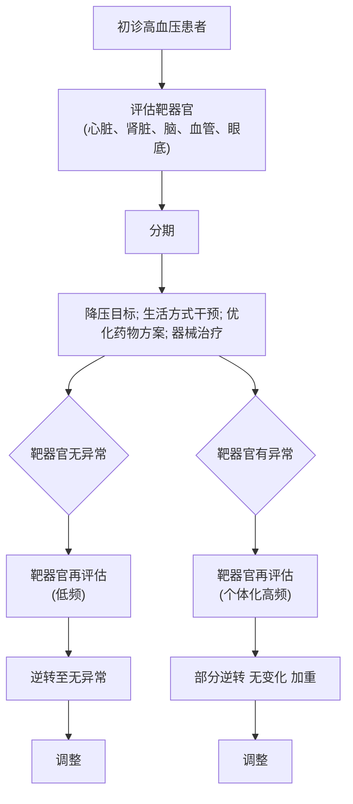

·指南与共识·

# 高血压患者靶器官动态评估与长程管理专家共识

高血压联盟 (中国)，中国医疗保健国际交流促进会高血压病学分会，中国医药教育协会临床肾脏病学专业委员会，《高血压患者靶器官动态评估与长程管理专家共识》委员会

# 1 前 言

高血压靶器官损害是指由血压升高引起的大动脉、小动脉或靶器官（心脏、肾脏、脑和眼）的结构和功能改变，包括亚临床和临床心血管疾病或肾脏疾病[1] 。高血压患者的靶器官通常经历无靶器官损害、代偿性损害和失代偿性损害逐渐进展的三期[2] 。靶器官损害通常指的是代偿性损害阶段，高血压患者发展到这一阶段，也预示着心血管风险逐步增加。

对初诊高血压患者进行靶器官损害评估，评估结果可用于高血压分期以及心血管危险分层,从而指导药物治疗策略的决定和选择。在高血压患者随访期间进行靶器官损害评估可以帮助判断治疗效果，靶器官损害的改善可能表明治疗成功，相反，靶器官损害的出现、持续或加重提示需要重新审查治疗方案以及药物依从性。早期检出并及时基于靶器官损害指导治疗，某些类型靶器官损害是可以逆转的。对于长期的高血压，靶器官损害可能不可逆转，但有针对性的优化降压治疗仍然可以延缓靶器官损害的进展并逆转心血管风险进行性增高的趋势[3] 。

随着诊疗水平和诊疗技术可及性的提高，开展高血压靶器官损害的筛查和防治成为可能。本共识以高血压靶器官的相关检验、检查为核心，为临床提供评估时机和频率的建议，基于当前已有的循证医学证据和真实世界的医学证据，为临床提供动态评估、长程管理靶器官损害的临床路径，根据靶器官损害的进展和逆转的情况优化高血压治疗管理方案。

本共识中，对于高血压靶器官的评估项目和检测方法的推荐级别分为“基本推荐”和“优化推荐”。这种推荐级别的区分主要是考虑相关检查的可及性、检查指标的成熟程度。“基本推荐”为可及性好、指标成熟程度高、在常规医疗环境下可进行的项目。“优化推荐”是在资源优越的医疗环境下可以进行评估的项目，通常为可及性差或指标虽已有一定临床应用的共识，但尚在研究中的项目。当然，一些“基本推荐”在资源匮乏的环境中可能仍为不可行的。尽管实施起来具有挑战性，但这些指导方针可能有助于推动当地政策变革，并成为推动当地提高高血压诊疗标准和水平的工具 ， 以降低高血压引起的心血管疾病发病率和死亡率。

# 2 高血压的靶器官损害

# 2.1 心脏

2.1.1 临床意义 高血压的心脏靶器官损害主要包括心脏结构和功能的改变，冠状动脉粥样硬化病变和心脏节律的异常等。高血压导致的心脏损害可依据相关临床症状及检查结果来判断，同时可用于指导治疗策略的制定，有助于逆转早期心脏靶器官损害，降低心血管疾病发生率和死亡风险。本章节主要针对高血压相关心脏损害的内容进行阐述。

2.1.2 评估方法与诊断标准 血压长期升高可引起心脏结构和功能的异常[4] ，促进冠状动脉粥样硬化进展和微循环功能障碍[5] ，增加房颤风险[6] 。针对这些损害的评估项目、检测方法、推荐级别和诊断标准见表 1\~3及附表 1。虽然常规心电图的使用比较普遍且检测费用便宜，但与彩超等影像学检查相比，常规心电图对于心脏结构改变（房室腔扩大或肥厚）诊断的灵敏度和特异度均很差，因此，临床上考虑可采用多模态评估策略，有助于早期识别心脏靶器官损害、评估心血管风险、指导治疗。

近年来，动态心电图已被用于房颤等心律失常的早期诊断，同时左心室和左心房应变、血管内皮细胞功能、动脉粥样硬化易损斑块、冠脉微循环功能等被越来越多用于高血压相关靶器官损害的评估，随着各项技术的不断成熟和可及性的提高，这些方法未来可能成为评估高血压靶器官损害的重要手段。

# 2.2 肾脏

2.2.1 临床意义 长期高血压可引起肾小动脉硬化，导致肾脏病变。在中国约 1.4 亿慢性肾脏病（chronic kidneydisease, CKD）患者中，高血压相关肾损害占 18%～25%[8] ； 高 血 压 患 者 发 生 终 末 期 肾 病 （end stage renaldisease，ESRD）的风险是正常血压者的 10～15 倍[9] 。严格控制收缩压＜130 mmHg（1 mmHg=0.133 kPa）1 年可使 CKD进展风险降低 42%[10] 。收缩压干预试验（systolic blood pressure intervention trial, SPRINT） 结 果显示，在 CKD 患者中，收缩压目标＜120 mmHg 相比于＜140 mmHg可降低心血管事件风险 25%和全因死亡风险 27%[11] 。

表 1 高血压导致心脏结构改变的评估项目、检测方法、推荐级别和诊断标准

<table><tr><td>评估项目</td><td>检测方法</td><td>推荐级别</td><td>诊断标准</td></tr><tr><td rowspan="2">左心房扩大</td><td>12导联心电图</td><td>基本推荐</td><td>常用3种诊断标准:·P波持续时间 $\geqslant 120$  ms·在II导联上出现双峰P波,两个峰之间间隔 $\geqslant 40$  ms·V1导联P波终末电势(PTF-V1) $\geqslant 0.04$  mm·s(V1导联P波振幅×时限)</td></tr><tr><td>心脏超声</td><td>基本推荐</td><td>·前后径法:男性左心房前后径 $>40$  mm;女性左心房前后径 $>38$  mm·左心房容积法a:左心房容积 $>34$  mL/m2</td></tr><tr><td rowspan="2">左心室肥厚</td><td>12导联心电图</td><td>基本推荐</td><td>·Sokolow-Lyon电压 $>3.8$  mV或Cornell乘积 $>244$  mV·ms</td></tr><tr><td>心脏超声</td><td>基本推荐</td><td>·左心室壁厚度测量标准b:室间隔厚度 $\geqslant 11$  mm;左心室后壁厚度 $\geqslant 11$  mm·左心室质量指数(LVMI)c:男性LVMI $>109$  g/m2;女性LVMI $>105$  g/m2</td></tr><tr><td>左心室扩大</td><td>心脏超声</td><td>基本推荐</td><td>·左心室舒张末期内径d:男性, $\geqslant 55$  mm;女性, $\geqslant 50$  mm·左心室舒张末期容积e:男性, $>74$  mL/m2;女性, $>61$  mL/m2</td></tr></table>

注： a左心房容积测量采用双平面Simpson法（心尖四腔心、两腔心切面），收缩末期测量。b当室壁厚度≥15 mm时，可通过心脏核磁进行病因学鉴别（如肥厚性心肌病、心肌淀粉样变、Fabry病）。c舒张末期测量，二维测量，基于中国人群数据的诊断标准。d胸骨旁长轴舒张末期测量。e采用双平面Simpson法（心尖四腔心和两腔心切面）。

表 2 高血压导致心脏功能改变的评估项目、检测方法、推荐级别和诊断标准

<table><tr><td>评估项目</td><td>检测方法</td><td>推荐级别</td><td>诊断标准</td></tr><tr><td>左心室舒张功能</td><td>心脏超声</td><td>基本推荐</td><td>满足 $\geqslant 3$ 项异常确诊舒张功能障碍;满足2项为“可疑”状态;异常指标 $\leqslant 1$ 项提示舒张功能正常平均 $E/e' \geqslant 14^{a}$ 间隔壁 $e' < 7$ cm/s或侧壁 $e' < 10$ cm/ $s^{b}$ 左心房容积指数 $>34$ mL/ $m^{2c}$ 三尖瓣反流速度 $>2.8$ m/ $s^{d}$ </td></tr><tr><td>左心室收缩功能</td><td>心脏超声</td><td>基本推荐</td><td>左心室射血分数下降: $<50\%^{e}$ </td></tr><tr><td>脑利尿钠肽</td><td>心脏功能实验室评估</td><td>优化推荐</td><td>提示心脏容量和压力负荷增加的标准:BNP $>35$ ng/LNT-proBNP  $\geqslant 75$ ng/L( $<50$ 岁) $^{[7]}$ NT-proBNP  $\geqslant 150$ ng/L( $50 \sim 74$ 岁) $^{[7]}$ NT-proBNP  $\geqslant 300$ ng/L( $\geqslant 75$ 岁) $^{[7]}$ </td></tr></table>

注：a提示左心室充盈压升高。b舒张速度减慢提示心肌松弛受限。c反映左心房压力负荷增加。d提示肺动脉压升高，间接反映左心室压力升高。e Simpson双平面法，基于心尖四腔心和两腔心切面测量容积；Teichholz法，基于M型超声测量，适用于心脏结构正常者。BNP为脑利尿钠肽；NT-proBNP为氨基末端脑利尿钠肽前体；E/e'为二尖瓣口早期舒张充盈速度与二尖瓣环早期舒张运动速度的比值；e'为二尖瓣环早期舒张运动速度。

表 3 高血压导致冠状动脉粥样硬化改变和心肌损伤的评估项目、检测方法、推荐级别及诊断标准

<table><tr><td>评估项目</td><td>检测方法</td><td>推荐级别</td><td>诊断标准</td></tr><tr><td>冠状动脉粥样硬化</td><td>冠状动脉CT</td><td>优化推荐</td><td>· 冠状动脉狭窄&lt;50%时提示冠状动脉粥样硬化· 冠状动脉狭窄≥50%提示冠状动脉粥样硬化性心脏病· 冠状动脉狭窄≥70%提示冠状动脉狭窄严重</td></tr><tr><td>高敏肌钙蛋白a</td><td>实验室检查</td><td>优化推荐</td><td>· 高敏肌钙蛋白T: ≥14 ng/L· 高敏肌钙蛋白I: 男≥20 ng/L; 女≥15 ng/L</td></tr></table>

注： a因检测方法、医院和试剂品牌的不同而有差异。

2.2.2 评估方法与诊断标准 高血压肾脏损害的评估诊断主要参考估算的肾小球滤过率（estimated glome-rular filtration rate，eGFR）和尿白蛋白排泄[尿白蛋白/肌 酐 比 值 （urinary  albumin-to-creatinine  ratio， UACR） ]情况。但是，临床上常用的尿常规、24 h 尿蛋白定量、肾脏影像学检查对于高血压患者仍有其必要性（表 4）。

高血压肾脏损害的诊断标准可参照改善全球肾脏病预后组织 （Kidney Disease Improving Global Out-comes， KDIGO） 指 南 的  GA  分 期 ， 即 基 于 eGFR 和UACR 的分期（表 5）[15] 。GA 分期可预测 CKD 进展风险和心血管事件风险。通常G分期越低（eGFR越低）和A分期越高（白蛋白尿越多），则预后越差。GA分期也是决定高血压治疗强度和选择治疗方案的重要依据。

表 4 高血压肾脏损害的评估项目及推荐级别

<table><tr><td>检查类别</td><td>推荐级别</td><td>评估项目</td><td>说明</td></tr><tr><td>尿液检查</td><td>基本推荐</td><td>尿常规、24 h尿蛋白定量、UACR</td><td>白蛋白尿是高血压肾损害早期和关键的标志;UACR检测首选晨尿或随机尿,需排除高热、剧烈运动、高蛋白饮食影响</td></tr><tr><td rowspan="3">肾功能检查</td><td>基本推荐</td><td>血清肌酐、eGFR</td><td>eGFR使用CKD-EPI eGFRcr公式[12]计算(基于血清肌酐、年龄、性别)</td></tr><tr><td>优化推荐</td><td>血清胱抑素C</td><td>较血清肌酐更敏感,可早期发现GFR轻度下降;eGFR可用CKD-EPI eGFRcr-cys公式[13]计算以提高准确性</td></tr><tr><td></td><td>同位素GFR</td><td>当极度肥胖或消瘦、严重肝病等可能导致eGFR不准确时,或怀疑单侧肾动脉狭窄时可采用</td></tr><tr><td rowspan="4">影像学检查</td><td>基本推荐</td><td>肾脏超声</td><td>观察肾脏大小、形态、皮质厚度</td></tr><tr><td></td><td>肾动脉多普勒超声</td><td>需排查肾动脉狭窄者(尤其难治性高血压或肾功能恶化者)</td></tr><tr><td>优化推荐</td><td>肾脏CT或MRI</td><td>进一步明确肾脏病变性质和程度</td></tr><tr><td></td><td>肾动脉非增强MRI或肾动脉造影</td><td>考虑肾动脉狭窄时[14]</td></tr></table>

注：UACR为尿白蛋白/肌酐比值；eGFR为估算的肾小球滤过率；CKD-EPI eGFRcr公式为慢性肾脏病流行病学协作组肌酐公式；CKD-EPIeGFRcr-cys公式为慢性肾脏病流行病学协作组肌酐-胱抑素C公式；GFR为肾小球滤过率；MRI为磁共振成像。

表 5 高血压肾脏损害诊断标准

<table><tr><td>分期类型</td><td>分期</td><td>定义标准</td><td>临床意义</td></tr><tr><td rowspan="6">G分期(基于eGFR)</td><td>G1</td><td> $eGFR \geqslant 90\ mL/(min·1.73m^{2})$ </td><td>肾功能正常或增高。即使eGFR正常,若有肾脏损伤标志(如白蛋白尿、结构异常等)仍可诊断为CKD</td></tr><tr><td>G2</td><td> $eGFR\ 60 \sim <90\ mL/(min·1.73m^{2})$ </td><td>肾功能轻度下降。常提示轻度肾脏损伤,需关注风险因素</td></tr><tr><td>G3a</td><td> $eGFR\ 45 \sim <60\ mL/(min·1.73m^{2})$ </td><td>肾功能轻-中度下降。开始需要更密切地监测和管理并发症</td></tr><tr><td>G3b</td><td> $eGFR\ 30 \sim <45\ mL/(min·1.73m^{2})$ </td><td>肾功能中-重度下降。显著增加心血管事件和进展至肾衰竭风险,需积极干预</td></tr><tr><td>G4</td><td> $eGFR\ 15 \sim <30\ mL/(min·1.73m^{2})$ </td><td>肾功能重度下降。为肾衰竭高风险期,需准备肾脏替代治疗(透析或移植)计划</td></tr><tr><td>G5</td><td> $eGFR<15\ mL/(min·1.73m^{2})$ </td><td>肾衰竭。通常需要肾脏替代治疗(透析或移植)以维持生命</td></tr><tr><td rowspan="3">A分期(基于UACR)</td><td>A1</td><td> $UACR<30\ mg/g (<3\ mg/mmol)$ </td><td>正常至轻度白蛋白尿。提示肾小球损伤风险较低</td></tr><tr><td>A2</td><td> $UACR\ 30 \sim 300\ mg/g (3 \sim 30\ mg/mmol)$ </td><td>中度白蛋白尿。是早期肾脏损伤(尤其是肾小球损伤)的标志,也是心血管疾病的强力预测因子</td></tr><tr><td>A3</td><td> $UACR>300\ mg/g (>30\ mg/mmol)$ </td><td>重度白蛋白尿。表明显著的肾小球损伤,是CKD进展和心血管事件的极高危因素</td></tr></table>

注：eGFR为估算的肾小球滤过率；UACR为尿白蛋白/肌酐比值。完整 CKD 分期表述为GXAY，例如G2A2：eGFR 75 mL/（min·1.73 m2 ），UACR 150 mg/g，表示肾功能轻度下降，伴有中度白蛋白尿（提示存在早期但明确的肾脏损害）。

# 2.3 脑

2.3.1 临床意义 高血压是多种神经系统疾病的危险因素，尤其是脑血管病。高血压与 50%以上的缺血性脑卒中和 70% 的出血性脑卒中相关[16] 。在导致神经系统疾病之前，高血压患者可能已经出现脑血管病变、神经功能改变，甚至脑组织结构的变化，如脑动脉硬化、认知功能改变、脑白质病变、脑微出血、无症状的腔隙性脑梗死等[17] 。

脑血管系统是高血压对脑影响的主要方面，高血压具有广泛的血管效应，一方面内皮剪切应力增加促进颅内外动脉的粥样硬化和狭窄，发生结构重塑甚至闭塞[16,18] ；另一方面，高血压对脑血管的损伤也使其成为颅内动脉瘤的主要危险因素之一[19] 。

研究已证实高血压与认知功能的变化存在着显著相关性，包括认知功能减退、轻度认知障碍（mildcognitive impairment，MCI）和痴呆。国内外多个研究证实高血压是多种认知障碍的重要危险因素，加速了认知下降的进程，增加了 MCI 和痴呆的发病风险，影响了从 MCI 到痴呆的进展速度，尤其中年期高血压更易增加认知障碍的风险[20-21] 。

同时，高血压患者脑组织结构改变也在发生。多个研究显示高血压与脑白质病变（white mater lesion，WML）的发生相关，是其重要的危险因素[22-23] 。高血压性血管病变是老年人群脑微出血（cerebral microbleeds，

CMBs）的主要原因之一，尤其慢性高血压导致并加剧了 CMBs的发生[24-25] 。此外高血压也是腔隙性脑梗死的主要危险因素，常见于腔隙性脑梗死人群中[26] 。

2.3.2 评估方法与诊断标准 高血压脑损害的评估内容主要包括颅外和颅内动脉的血管结构性评估、认知功能的评估以及脑组织结构的影像评估。需要指出的是，认知功能障碍与脑组织改变（脑白质病变、脑微出

血、腔隙性脑梗死）并非相互独立的类别，相互之间存在交集以及密切关联。比如脑微出血、腔隙性病灶、白质病变可共同见于脑小血管病患者，而存在认知障碍的患者也往往表现为具有较高发病率的白质病变、微出血、腔隙病。

2.3.2.1 脑血管评估方法与诊断标准 脑血管的评估方法、推荐级别及临床意义见表6和附表2。

表 6 高血压脑血管损害的评估方法、推荐级别、临床意义

<table><tr><td>评估方法</td><td>推荐级别</td><td>临床意义</td><td>说明</td></tr><tr><td>颈部血管超声</td><td>基本推荐</td><td>评估颈动脉是否存在动脉粥样硬化,粥样硬化斑块性质,是否存在颈动脉狭窄及闭塞</td><td>见2.4部分。建议评估范围:双侧颈总动脉、颈内动脉、椎动脉、锁骨下动脉</td></tr><tr><td>经颅多普勒超声(TCD)</td><td>基本推荐</td><td>评估颅内外大动脉血流情况,间接反映颅内外动脉狭窄情况a</td><td>40岁以上我国人群TCD血流速度参考值见附表2</td></tr><tr><td>磁共振血管成像(MRA)</td><td>优化推荐</td><td>评估颅内动脉情况,是否存在动脉狭窄、闭塞、动脉瘤、动静脉畸形等</td><td></td></tr><tr><td>CT增强血管成像(CTA)</td><td>优化推荐</td><td>评估颅内及颈部动脉情况,是否存在动脉狭窄、闭塞、动脉瘤、动静脉畸形等</td><td></td></tr><tr><td>磁共振/CT脑灌注成像(PWI/CTP)</td><td>优化推荐</td><td>评估脑组织血流灌注情况b</td><td>包括脑血流量(CBF)、脑血容量(CBV)、达峰时间(TTP)、最大达峰时间(Tmax)等</td></tr></table>

注：aTCD还可进行TCD栓子监测和TCD发泡试验，TCD栓子监测用于评估是否存在脱落到大脑中动脉的微栓子，TCD发泡试验用于评估体循环中是否存在右向左的异常分流途径。b多用于急性缺血性脑卒中缺血半暗带区域的评估。

2.3.2.2 认知障碍的评估方法与诊断标准 认知障碍的评估要通过询问病史、体格检查及必要的神经心理学评估工具进行。神经心理学评估包括认知功能、日

常和社会能力、精神行为症状 3个方面[27] ，具体方法见表 7及附表 3，另外，对于怀疑血管性认知功能障碍的患者采用 Hachiski 量表评估可能有提示价值[28-29] 。

表 7 高血压神经心理学损害的评估项目、推荐级别、评估内容及评估方法

<table><tr><td>评估项目</td><td>推荐级别</td><td>评估内容</td><td>评估方法</td></tr><tr><td>认知功能</td><td>基本推荐</td><td>记忆力、执行功能、语言能力、视空间结构能力等 $^{a[30]}$ </td><td>神经内科专业:简易精神状态检查表(MMSE),蒙特利尔认知评估量表(MoCA/MoCA中国版),长谷痴呆量表等 $^b$ 非神经内科专业:可采用认知障碍自评量表(p-AD8),简易智力状态评估量表(Mini-cog),画钟测试等 $^c$ MMSE及MoCA标准见附表3</td></tr><tr><td>日常和社会能力</td><td>基本推荐</td><td>包括基本日常能力如穿衣、吃饭、如厕等和社会生活能力如工作、社交等</td><td>阿尔茨海默病协作组日常活动量表(ADCS-ADL)、轻度认知障碍(MCI)日常活动量表(ADCS-MCI-ADL),以及Lawton工作性日常活动量表、社会功能问卷(FAQ)等</td></tr><tr><td>精神行为症状 $^d$ </td><td>优化推荐</td><td>精神行为症状评估</td><td>神经精神问卷(NPI),汉密尔顿焦虑/抑郁量表等</td></tr></table>

注：a记忆损害是最常见的认知障碍表现。b MMSE、画钟测试对于MCI可能不敏感，MCI推荐采用MoCA等评估方法。c对于怀疑存在认知障碍的患者可先进行p-AD8等量表筛查，若存在问题再请神经专科医师评估[31]。d超过75%的痴呆患者存在痴呆的精神行为症状[32]，MCI患者最常见的精神行为症状是淡漠、抑郁、焦虑和夜间睡眠行为异常[33]。应注意是精神行为症状造成的认知障碍假象还是认知障碍伴发的精神行为异常。

MCI标准[27] ：（1）患者或知情者报告或临床医师发现存在认知损害；（2）存在一个或多个认知域损害的客观证据；（3）复杂的工作性日常能力有轻微损害但保留独立生活能力；（4）未达到痴呆的诊断标准。

痴呆标准[34] ： 出现获得性认知功能下降或精神行为异常，影响工作能力或日常生活，且无法用瞻望或其他精神疾病解释。认知功能下降或精神行为异常可通过病史采集或精神心理评估证实，且至少具备以下

5项中的 2项：（1）记忆及学习能力受损；（2）推理、判断、处理复杂任务等执行能力受损；（3）视空间能力受损；（4）语言能力受损；（5）人格、行为或举止改变。

2.3.2.3 脑白质病变、脑微出血、腔隙性脑梗死等影像评估方法（表8） 脑白质病变、脑微出血、腔隙性脑梗死是脑组织慢性病变的重要影像指标，也往往伴随认知障碍出现[35] ，对于存在高血压的患者，需警惕发生脑白质病变、脑微出血或腔隙性脑梗死的可能，另外部分研究发现高血压也与脑部尤其基底节区血管周围间隙（perivascular space，PVS）增多相关[36] 。建议高血压患者定期进行脑磁共振平扫[含磁敏感加权成像（susce-ptibility-weighted imaging，SWI）或 T2\*序列 ] 影像评估。

表 8 高血压脑白质病变、脑微出血、腔隙性脑梗死的评估方法、推荐级别

<table><tr><td>评估项目</td><td>影像检查</td><td>推荐级别</td><td>影像表现</td><td>说明</td></tr><tr><td>脑白质病变</td><td>磁共振平扫(含SWI或T2*序列)</td><td>基本推荐</td><td>FLAIR序列上呈现高信号,而在T1序列上呈等信号或低信号的病变区域,主要分布于脑室周围区、深部白质、基底节(深部灰质)、脑桥,偶见于脑干及小脑白质等其他部位[37]</td><td>高血压人群常见前额叶区域 $白质^{[22]}$ 对于脑白质病变严重程度,可采用Fazekas脑白质高信号分量表进行评估[38]</td></tr><tr><td>脑微出血</td><td>磁共振平扫(含SWI或T2*序列)</td><td>基本推荐</td><td>T2*序列或SWI上检测到的通常小于5 mm的圆形低信号灶,最大不超过10  $mm^{[24]}$ </td><td>高血压人群常见于深部脑结构如基底神经节、丘脑和脑干等[39]</td></tr><tr><td>腔隙性脑梗死</td><td>磁共振平扫(含SWI或T2*序列)</td><td>基本推荐</td><td>FLAIR序列上检测到的5~15 mm的高信号病灶,累及深部灰质和皮质下白质,往往存在T2高信号边缘[40]</td><td>当梗死直径达到15~20 mm时,可能源于豆状核-内囊-尾状核区域多支穿支血管受累,这类病灶被部分学者称为“巨腔隙”[40]</td></tr></table>

注：SWI为磁敏感加权成像；FLAIR为T2加权或液体衰减反转恢复。

# 2.4 血管

2.4.1 临床意义 长期血压升高可导致血管正性或负性重构，表现为动脉斑块、狭窄、扩张或动脉瘤形成。高血压介导的血管重构及血管硬化对心血管事件的发生和死亡有着显著预测价值。此外，对于高血压合并主动脉瘤患者，更低的降压目标（如 130/80 mmHg，甚至收缩压低于 120 mmHg）可能更为合适[41] 。 对于高

血压合并颈动脉中-重度狭窄的患者，降压目标应兼顾患者脑供血、耐受程度等情况进行个体化设定。因此尽早发现及干预对延缓甚至逆转血管损伤进展，从而预防心血管事件发生具有重要意义。

2.4.2 评估方法与诊断标准 高血压血管损害的评估项目主要包含两类：血管结构评估和血管功能评估，具体的评估项目、推荐级别及诊断标准见表9。

表 9 高血压血管损害的评估项目、推荐级别与诊断标准

<table><tr><td>评估项目</td><td>检测方法</td><td>推荐等级</td><td>诊断标准</td><td>说明</td></tr><tr><td>颈动脉内膜中层厚度(IMT)</td><td>血管超声CTA或MRA</td><td>基本推荐优化推荐</td><td>颈动脉IMT增厚: IMT≥0.9 mm;颈动脉斑块: IMT≥1.5 mm, 或大于周围颈动脉IMT至少0.5 mm或50%, 可分为低回声、等回声及高回声斑块, 一般认为低回声及低回声为主混合回声斑块为易损斑块[42]</td><td>颈动脉、主动脉血管影像评估: 心脏超声胸骨上凹切面降主动脉测量易受探头频率、声窗条件影响清晰度; CTA成像分辨率高, 但需造影剂注射; MRA无需造影剂注射, 但耗时长</td></tr><tr><td>主动脉内径</td><td>心脏超声、血管超声CTA或MRA</td><td>基本推荐优化推荐</td><td>主动脉根部: 窦部内径男性正常值≤36 mm,女性≤34 mm(基于国内Eminca研究)[43];升主动脉: 男性正常值≤35 mm, 女性≤33 mm(基于国内Eminca研究)[43];升主动脉扩张[41]: 升主动脉内径&gt;40 mm;升主动脉瘤[41]: 升主动脉内径&gt;45 mm;腹主动脉瘤: 肾下主动脉内径&gt;30 mm</td><td></td></tr><tr><td>踝臂指数(ABI)</td><td>双侧四肢ABI测定</td><td>基本推荐</td><td>ABI&lt;0.9考虑存在外周动脉疾病</td><td>ABI过高(如&gt;1.4)则提示动脉钙化, 且结果无法排除外周动脉疾病</td></tr><tr><td>脉搏波传导速度(PWV)</td><td>cfPWV、baPWV</td><td>基本推荐</td><td>动脉硬化: cfPWV&gt;10 m/s、baPWV&gt;18 m/s</td><td>计算公式为D/Δt, D为两个测量点之间动脉路径长度, Δt为脉搏波在两个测量点之间传播的时间差。cfPWV是测量大动脉僵硬度的金标准, baPWV在亚洲广泛使用,重复性好, 操作简单, 与cfPWV相关性良好</td></tr><tr><td>血流介导的血管舒张功能(FMD)</td><td>肱动脉FMD</td><td>优化推荐</td><td>目前尚无统一标准, 不同研究显示正常人群肱动脉FMD通常在6.5%~7%以上[44-45]</td><td>FMD降低提示内皮功能障碍, 与心血管风险独立相关</td></tr><tr><td>动态动脉硬化指数(AASI)</td><td>动态血压监测</td><td>优化推荐</td><td>目前尚无统一标准, 既往研究推荐年轻人群(20岁)正常值&lt;0.5至老年人群(80岁)&lt;0.7[46-47]</td><td>24 h动态血压衍生参数, 可用于评价动脉硬化程度</td></tr></table>

注：CTA为CT血管成像；MRA为磁共振血管成像；IMT为内膜中层厚度；ABI为踝臂指数；PWV为脉搏波传导速度；cfPWV为颈-股脉搏波传导速度； baPWV为肱-踝脉搏波传导速度；FMD为血流介导的血管舒张功能；AASI为动态动脉硬化指数。

# 2.5 视网膜

2.5.1 临床意义 高血压的视网膜病变是高血压靶器官损害中微血管病变的一个表现。高血压患者的轻中度视网膜病变与心血管事件风险增加有关[48] 。高血压、高血压合并糖尿病、高血压急症、疑似恶性高血压均建议进行眼底检查[49-50] 。  
2.5.2 评估方法与诊断标准 眼底镜检查可检测高血压导致的视网膜病变，如出血、微动脉瘤、硬性渗出物和棉絮斑、视乳头水肿和/或黄斑水肿。目前眼底镜检查包括传统的人工眼底镜检查、可视化眼底镜检查、基于人工智能分析的可视化眼底镜检查。可视化等眼底检查新技术可能有助于对大量高血压患者筛查和随访评估视网膜病变[51-52] ，为基本推荐。高 血 压 的 视 网 膜 病 变 以 Keith-Wagener-Barker 标 准评价：

1级：视网膜小动脉轻度普遍变细，小动脉管径均匀，无局部缩窄。  
2级：明显小动脉狭窄及局部管径不规则。  
3级：弥漫小动脉明显狭窄及管径不规则，合并视网膜出血、渗出和棉絮状斑。  
4级：在3级基础上合并视盘水肿和视网膜水肿。

# 3 基于靶器官评估指导的高血压管理

高血压的本质是心血管综合征。高血压的危害既取决于血压升高的本身，也与患者所合并的其他心血管危险因素、靶器官损害和/或心、脑、肾和血管并发症等有关。因此，高血压的治疗包含以下内容:①针对血压升高本身的降压治疗（分级）；②针对合并的危险因素、靶器官损害和临床并发症的治疗（分期）；③针对高血压的病因的纠正和治疗（分型） [53] 。 根据高血压患者的血压水平和心血管风险水平，决定给予改善生活方式、降压药、器械干预治疗的时机与强度，同时干预检出的其他危险因素、靶器官损害和并存的临床疾病。

对于初诊和随访过程中的高血压患者，建议遵循以下长程的、循环管理路径（图 1），兼顾血压水平的控制和靶器官损害的管理。

flowchart

图 1 基于高血压靶器官评估的长程的、循环管理路径

# 3.1 降压治疗目标

3.1.1 诊室血压目标 根据《中国高血压防治指南（2024 年修订版）》，心血管风险高危/很高危的高血压患者，在可耐受的条件下，推荐诊室血压目标为＜130/80 mmHg。在可耐受的条件下，对于合并了靶器官损害的高血压患者，均应将＜130/80 mmHg 作为降压目标；65～79岁老年人或合并认知障碍的高血压患者，降压目标设定为＜140/90 mmHg，如能耐受，可进步降至＜130/80 mmHg；≥80 岁高龄老人或存在严重认知功能减退甚至痴呆的高血压患者，可将血压＜150/90 mmHg作为初步控制目标，如可耐受，可降至血压＜140/90 mmHg。  
3.1.2 诊室外血压目标 基于诊室外血压（家庭血压监测和动态血压监测）能够鉴别白大衣性高血压、隐匿性高血压、清晨高血压、夜间高血压和评估血压的变异性，并与靶器官损害、心血管风险相关[54-55] ，参考《中国高血压防治指南（2024年修订版）》，制定了诊室外血压目标值，见表 10。

表 10 诊室血压与诊室外血压目标值对照　（mmHg）

<table><tr><td>目标</td><td>诊室血压</td><td>家庭血压</td><td>24 h动态血压</td><td>日间动态血压</td><td>夜间动态血压</td><td>清晨血压</td></tr><tr><td>推荐目标</td><td>140/90</td><td>135/85</td><td>130/80</td><td>135/85</td><td>120/70</td><td>135/85</td></tr><tr><td>可耐受时推荐目标</td><td>130/80</td><td>130/80</td><td>125/75</td><td>130/80</td><td>110/65</td><td>130/80</td></tr></table>

注：参考《中国高血压防治指南（2024年修订版）》修订。

3.2 优化降压治疗 生活方式干预是高血压治疗的基石。而启动降压药治疗的时机主要取决于心血管风险,而非仅依据血压水平[56-57] 。依据《中国高血压防治指南（2024 年修订版）》，高血压患者合并靶器官损害后为高危-极高危，应立即启动降压药治疗。降压药的

选择应优选具有相应靶器官保护证据的药物。在高血压患者的随访过程中，应定期评估高血压靶器官损害，并根据靶器官损害的变化，动态调整药物治疗方案。

3.2.1 生活方式干预 所有高血压患者均应进行治疗性生活方式干预，包括低钠饮食、合理膳食、减重、戒烟、限酒、运动、心理平衡、保证睡眠。这些干预措施主要针对各种可纠正的高血压发生、发展的危险因素，因此，生活方式干预应贯穿高血压管理的全过程。多数生活方式干预已被证实具有明确的降压作用[58] ，其中，降压效果可能因生活方式改善的强度和持续时间而有所不同，多种生活方式改善的联合可能强化降压效果。基础及临床研究证实，各项生活方式干预措施分别针对了高血压的不同发病机制，包括水钠潴留、交感神经激活、肾素-血管紧张素-醛固酮系统（renin-angiotensin-aldosterone system，RAAS）的激活、血管内皮细胞/炎症反应等机制[59-60] 。生活方式干预是以靶器官保护为指导的管理策略的重要组成部分。鼓励通过应用数字疗法等新技术提高生活方式干预的依从性[61-63] 。 。

3.2.2 优化常用降压药治疗 高血压可导致心、脑、肾、动脉以及眼底等器官结构和功能异常，增加心脑血管疾病、肾衰竭及视力丧失的风险。研究证明长期有效控制血压不仅可以有效预防靶器官损害的发生，还能延缓其进展，在部分患者甚至可实现一定程度的逆转[64-65] 。《中国高血压防治指南（2024 年修订版）》推荐 6类常用降压药[66] ，包括血管紧张素转换酶抑制药 （angiotensin-converting  enzyme  inhibitors， ACEI）

血 管 紧 张 素 受 体 阻 滞 药 （angiotensin receptor blockers，ARB）、钙通道阻滞药（calcium channel blocker，CCB）、噻嗪类利尿剂、β受体阻滞剂，以及血管紧张素受体脑啡 肽 酶 抑 制 剂 （angiotensin receptor-neprilysin inhibitor，ARNI）。这些药物在降压方面均具有明确证据，但由于作用机制不同，不同降压药对靶器官的保护可能存在一定程度差异。如二氢吡啶类 CCB可显著改善动脉弹性，降低颈动脉内膜中层厚度，延缓冠状动脉或颈动脉粥样硬化及周围血管病进展[67-69] 。ACEI、ARB和 ARNI具有多重靶器官保护作用，在改善左心室肥厚和蛋白尿方面作用尤其显著。药理机制及基础研究提示 ARNI 的保护作用与 ARB相似甚至更优，有临床研究证实 ARNI 在改善左心室肥厚[70-71] ，降低动脉僵硬度[72] ，延缓肾功能恶化，以及改善 CKD患者血压控制方面疗效较 ARB 更好[73-74] 。多种降压药均具有认知功能保护作用，CCB、ACEI、ARB在高血压人群中降低认知障碍和脑白质高信号进展风险的研究相对更多，ARNI 的认知功能保护作用的证据主要来自于心力衰竭患者，尚无证据表明在降低认知障碍风险方面某一类降压药显著优于其他类别。常用降压药对靶器官保护作用的强度总结见表 11，供临床实践参考以及今后研究进一步验证。

表 11 常用降压药对靶器官作用的强度

<table><tr><td rowspan="2">靶器官</td><td rowspan="2">主要的靶器官损害</td><td colspan="6">常用降压药对靶器官保护作用的强度</td></tr><tr><td>ACEI</td><td>ARB</td><td>ARNI</td><td>二氢吡啶类CCB</td><td>噻嗪类利尿剂</td><td>β受体阻滞剂</td></tr><tr><td rowspan="2">心脏</td><td>左心室肥厚[70-71,75-76]</td><td>++</td><td>++</td><td>+++</td><td>+</td><td>+</td><td>+</td></tr><tr><td>冠状动脉粥样硬化[77-81]</td><td>++</td><td>++</td><td>++</td><td>++</td><td>+</td><td>+</td></tr><tr><td>肾脏[73-74,82-87]</td><td>蛋白尿GFR下降</td><td>++</td><td>++</td><td>++</td><td>+</td><td>-</td><td>-</td></tr><tr><td>脑[88-99]</td><td>认知功能(和/或白质高信号等)</td><td>+</td><td>+</td><td>+</td><td>+</td><td>+</td><td>+</td></tr><tr><td rowspan="2">动脉血管</td><td>颈动脉IMT增厚、动脉粥样斑块[100-104]</td><td rowspan="2">++</td><td rowspan="2">++</td><td rowspan="2">++</td><td rowspan="2">+++</td><td rowspan="2">+</td><td rowspan="2">+</td></tr><tr><td>动脉僵硬度增加/弹性下降[72,105-111]</td></tr></table>

注：–为无保护作用，+ /++/+++为有保护作用（强度逐渐增强）。ACEI为血管紧张素转换酶抑制药；ARB为血管紧张素受体阻滞药；ARNI为血管紧张素受体脑啡肽酶抑制剂；CCB为钙通道阻滞药；GFR为肾小球滤过率；IMT为内膜中层厚度。

高血压患者合并多个靶器官损害时，在没有禁忌证情况下，优先选择具有多重靶器官保护作用的药物如 ACEI、ARB或 ARNI 作为基础治疗。在此基础上，根据血压情况和患者临床特征合理加用其他降压药或增加药物剂量。有证据支持大剂量 ACEI、ARB、ARNI具有更好的靶器官保护作用，建议对于具有明确靶器官保护作用的此类药物，应考虑使用最大耐受剂量。

3.2.3 其他降压药与其他具有降压作用的药物 盐皮质激素受体拮抗剂（mineralocorticoid receptor antagonist，MRA）中，传统 MRA 螺内酯可通过阻断醛固酮作用，显著对抗心肌纤维化，降低难治性高血压患者心力衰

竭住院率[112] ；依普利酮作为选择性 MRA，减少了性激素相关副作用，可用于难治性高血压和心力衰竭（特别是心肌梗死后）的治疗[113-114] ；新型非甾体 MRA（nonste-roidal mineralocorticoid receptor antagonist，nsMRA）非奈利酮可显著降低 2型糖尿病相关 CKD患者心血管复合终点事件风险和新发心力衰竭风险，同时显著改善肾脏结局、降低 UACR水平，核心机制为抑制盐皮质激素受体过度激活介导的炎症纤维化通路，尤其适用于合并糖尿病肾病的高血压患者[115-116] 。使用 MRA时应注意监测肾功能和血钾水平。

醛固酮合酶抑制剂的靶点是醛固酮合酶[细胞色 素 P450 家 族 11 亚 家 族 B 成 员 2（cytochrome  P450family 11 subfamily B member 2，CYP11B2）]，直接从源头上阻断肾上腺皮质中醛固酮的生成，可避免受体逃逸现象，有望为难治性高血压患者提供新的治疗策略[117] 。 。

钠-葡萄糖协同转运蛋白 2 抑制剂（sodium-glucosecotransporter 2 inhibitor， SGLT2i） 通 过 促 进 尿 糖 /尿 钠排泄，减轻心脏前后负荷、改善肾小球内高压及代谢调节 ， 显著降低心力衰竭住院风险 、 延 缓 eGFR下降 [118-121] 。

胰高血糖素样肽-1（glucagon like peptide-1，GLP-1）受体激动剂（GLP-1 receptor agonist，GLP-1RA）改善胰岛素敏感性、减轻体重，可同时控制血糖、血压、减轻体重，对于合并 2型糖尿病（或即使无糖尿病但肥胖且有心肾高风险）的高血压患者，可降低主要心血管事件（如心肌梗死、脑卒中等）和肾功能恶化的风险，机制涉及抗动脉粥样硬化、抑制炎症及改善内皮功能[122-123] 。

葡 萄 糖 依 赖 性 促 胰 岛 素 多 肽 （glucose-dependentinsulinotropic polypeptide，GIP）/ GLP-1 双受体激动剂在糖尿病、肥胖的高血压人群中具有降低体重、改善血糖和血压的综合作用，体现了具有器官保护的特点。

3.2.4 器械治疗 经导管肾动脉交感神经射频消融术（renal denervation, RDN）通过介入导管释放射频能量，选择性破坏肾动脉外膜的交感神经纤维，降低全身交感神经过度激活，从而改善血压调节。现有研究结果已证明 RDN 治疗高血压的有效性与安全性[124] 。并且研究显示 RDN在显著降低血压的同时，对高血压靶器官损害也可能有潜在获益。一项纳入 17项观察性研究 698例受试者的荟萃分析显示，RDN能够显著改善左心室质量指数以及左心室舒张功能指标二尖瓣口早期舒张充盈速度与二尖瓣环早期舒张运动速度的比值（E/e’） ， 血 管 损 伤 指 标 脉 搏 波 传 导 速 度 （pulse  wavevelocity，PWV）亦有所下降，并且其作用独立于基础血压以及血压下降程度[125] 。另有研究显示难治性高血压患者在 RDN术后 6个月白蛋白尿显著减少，微量以及大量白蛋白尿患病率有所下降，术后 12个月视网膜微循环指标显著改善[126-127] 。然而目前有关 RDN的研究随访时间均较短，且样本量较小，因此其对靶器官损害的长期作用尚有待进一步研究。

# 4 其他危险因素的管理

积极血压控制虽至关重要，但综合管理所有可改变的心血管危险因素，如血脂、血糖、血尿酸等对最大化靶器官保护、改善患者长期预后具有决定性意义。

降脂药如他汀类药物、前蛋白转化酶枯草溶菌 素 9（preprotein  converting  enzyme  subtilisin  kexin  9，PCSK9）单克隆抗体、英克司兰等可通过强力降低（降幅＞50%）低密度脂蛋白胆固醇（low-density lipoprotei-ncholesterol，LDL-C），稳定/逆转动脉粥样硬化斑块，降低冠心病事件及缺血性脑卒中风险，是高血压合并动脉粥样硬化性心血管疾病（atherosclerotic cardiovasculardisease，ASCVD）患者的基石治疗[128] ；可改善肾小球内皮功能、减轻肾小球硬化，延缓高血压患者的肾功能下降速度、减少蛋白尿[129] ；改善全身血管顺应性和弹性，延缓主动脉等大动脉僵硬度增加，对预防主动脉瘤/夹层等也有潜在益处[130] 。

糖尿病（尤其是 2型糖尿病）与高血压常合并存在，两者对血管和肾脏的损害具有强烈的协同放大效应。严格的血糖控制能显著降低微血管并发症（肾病、视网膜病变、神经病变）风险，对大血管事件的益处在长期随访中显现[131-132] 。糖化血红蛋白（hemoglobinA1c， HbA1c）目标需个体化，通常建议 HbA1c＜7.0%。可选择具有心肾获益的降糖药，SGLT2i、GLP-1RA 等。

对于合并高尿酸血症的高血压患者，降尿酸治疗在理论上能通过改善血管内皮功能、抑制 RAAS以及减轻氧化应激和炎症等多重途径，为高血压靶器官（特别是肾脏和心脏）带来潜在的有益保护作用。部分研究显示，其可辅助降低血压、延缓肾病进展，并对逆转左心室肥厚和改善血管功能有积极趋势 [15,133] 。然而关于无症状性高尿酸血症进行降尿酸治疗仍存在争议，因其确切的器官保护获益尚未获得一致证实，临床需依据患者具体情况（如是否伴发痛风、存在其他危险因素、血尿酸水平等）作个体化决策。

老年人血管硬化显著，应平衡降压获益与跌倒及低灌注风险。女性绝经后盐敏感性增高，限盐、利尿剂及 RAAS 抑制剂可降低女性脑卒中及心力衰竭[尤其射血分数保留的心力衰竭（heart failure with preservedejection fraction, HFpEF）] 风险；妊娠期高血压需特殊管理。中年男性心血管风险更高，强化戒烟及生活方式干预可能预防男性早发冠心病。高血压合并高同型半胱氨酸血症的患者也应从饮食和叶酸补充方面给予管理，以降低脑卒中的发病率。

影响靶器官保护的其他因素的管理见表 12。

降压治疗协同这些危险因素的多靶点干预（血流动力学、代谢、抗纤维化、抗炎等），可实现心、肾、脑、血管的整合保护，重塑高血压管理格局。建议根据患者的具体情况（年龄、性别、合并疾病、危险因素谱、靶器官损害程度、药物耐受性、社会经济因素等）进行个体化选择，使器官保护效益最大化。

# 5 高血压患者靶器官动态评估与长程管理推荐

在临床实践中，应根据患者的具体情况，如年龄、病程、血压控制情况、是否合并其他疾病等，对高血压靶器官的检测时机和频率进行个体化调整，以实现对高血压患者靶器官损害的全程、动态评估，为制定精准的治疗方案和设定合理的降压目标提供依据，从而更好地控制血压，延缓或阻止靶器官损害的进展，降低心血管疾病风险。

表 12 影响靶器官保护的其他因素的管理

<table><tr><td>危险因素</td><td>影响机制</td><td>管理策略</td><td>靶器官保护意义</td></tr><tr><td>血脂异常</td><td>高血压促进内皮损伤, LDL-C加速动脉粥样硬化斑块形成</td><td>他汀类药物(基石), 必要时联用胆固醇吸收抑制剂, 仍不达标时可加用PCSK9单克隆抗体或英克司兰等;目标: 高危者LDL-C &lt;1.8 mmol/L且较基线下降≥50%;超高危者LDL-C &lt;1.4 mmol/L且较基线下降≥50%</td><td>延缓动脉粥样硬化, 降低心脑血管事件风险;延缓肾功能下降速度、减少蛋白尿; 改善全身血管顺应性和弹性</td></tr><tr><td>糖尿病/血糖异常</td><td>高血糖与高血压协同损伤血管内皮, 加速动脉粥样硬化及糖尿病肾病进展</td><td>优选具心肾保护的降糖药: SGLT2i、GLP-1RA。血糖控制: HbA1c个体化目标(通常&lt;7%)</td><td>减少微血管病变(肾病、视网膜病变)及大血管事件(心肌梗死、脑卒中)</td></tr><tr><td>高尿酸血症</td><td>高尿酸激活RAAS、损伤内皮功能、促进氧化应激及炎症,导致心肾损伤</td><td>高血压合并CKD 3期及以上或蛋白尿者, 血尿酸靶目标&lt;360 μmol/L</td><td>减轻肾小球硬化/间质纤维化、延缓eGFR下降速率; 逆转左心室肥厚、改善心肌纤维化</td></tr></table>

注：LDL-C为低密度脂蛋白胆固醇；PCSK9为前蛋白转化酶枯草溶菌素9；SGLT2i为钠-葡萄糖协同转运蛋白2抑制剂；GLP-1RA为胰高血糖素样肽-1受体激动剂； HbA1c为糖化血红蛋白；RAAS为肾素-血管紧张素-醛固酮系统；CKD为慢性肾脏病；eGFR为估算的肾小球滤过率。

在制定高血压靶器官动态评估策略时，应综合考虑靶器官损害逆转的可能性、检测的可重复性以及复查频率的必要性、可及性。对于已有的靶器官损害，可以考虑个体化提高检测频率；而对于初诊筛查靶器官损害指标尚在正常范围者或经过规范高血压降压管理后靶器官损害指标逆转为正常者，可以考虑适当降低检测频率。

不同的靶器官损害对治疗的反应速度是不同的。例如，UACR与 PWV可以在数周至数月中发生变化，左心室肥厚、eGFR、眼底改变则可能需要 6个月以上，而颈动脉内膜中层厚度、踝臂指数、肾动脉阻力指数等则可能需要 1 年以上。因此，推荐对于高血压靶器官损害指标尚无异常者，可以 1年左右复查一次；对于已有异常者，可以个体化提高复查频率，通常可以半年左右复查一次，对于可能变化较快的项目，可以考

虑 3～6 个月复查。

同一靶器官损害的不同检测方法之间也存在一定差别。例如，左心室肥厚可以通过心电图、心脏超声、心脏核磁进行评估，这三种方法对于损害变化的敏感性是逐步升高的。因此，左心室肥厚动态评估时既要考虑前后参数的可比性，也要兼顾检测手段在设定的复查频率下对变化的敏感性。

高血压靶器官损害动态评估的目的是评估当前治疗的有效性，是为了进一步指导高血压管理策略的调整。高血压对不同靶器官的影响可以同步推进，不同靶器官的异常程度可能有所不同。在靶器官动态评估后，优化高血压治疗时，治疗方案也应当在降压、保护已有异常靶器官的前提下，兼顾其他靶器官的保护，优选具有多重靶器官保护作用的治疗措施，并在长程管理过程中动态调整。

附表 1 高血压心脏损害的其他评估项目、检测方法、推荐级别和诊断标准

<table><tr><td>评估项目</td><td>检测方法</td><td>推荐级别</td><td>诊断标准</td></tr><tr><td>左心房功能</td><td>心脏超声</td><td>基本推荐</td><td>通过二维斑点追踪技术获得的应变指标用于评估左心房功能·储存功能: &lt; 35% 提示左心房储存功能受损; &lt; 25% 为明显受损·传导功能: 传导应变为负值, 正常值范围-20% ~ -30%·收缩功能: 同样为负值, 正常值范围-12% ~ -20%</td></tr><tr><td>冠状动脉钙化</td><td>冠状动脉CT</td><td>优化推荐</td><td>·0分, 无钙化, 冠心病风险极低·1~10分, 极轻度钙化, 冠心病风险较低·11~100分, 轻度钙化, 早期动脉粥样硬化, 风险中等·101~400 分, 中度钙化, 明确动脉粥样硬化, 风险较高, 应考虑强化干预 &gt; 400 分, 重度钙化, 冠心病高风险, 心血管事件风险显著升高</td></tr><tr><td>冠状动脉微循环功能</td><td>心脏 PET</td><td>优化推荐</td><td>无创“金标准”: 冠状动脉血流储备&lt; 2.0 提示异常</td></tr></table>

注：PET为正电子发射体层成像。

附表 2 40 岁以上我国人群经颅多普勒超声（TCD）血流速度正常参考值[134]

<table><tr><td>血管部位</td><td>峰值流速(cm/s)</td><td>舒张期末期流速(cm/s)</td></tr><tr><td>大脑中动脉M1段</td><td>140~160</td><td>80~100</td></tr><tr><td>大脑前动脉A1段</td><td>100~120</td><td>60~80</td></tr><tr><td>大脑后动脉</td><td>80~100</td><td>50~70</td></tr><tr><td>颈内动脉虹吸段</td><td>100~120</td><td>60~80</td></tr><tr><td>椎动脉及基底动脉</td><td>80~100</td><td>50~70</td></tr></table>

注：颅内动脉搏动指数正常范围0.65～1.10。

附表 3 认知功能评估工具及标准[135]

<table><tr><td>评估工具</td><td>常用标准</td><td>说明</td></tr><tr><td>简易精神状态检查表(MMSE)</td><td>认知功能障碍: &lt;26分</td><td>总分30分, 评估用时7~10 min</td></tr><tr><td>蒙特利尔认知评估量表(MoCA)</td><td>认知功能障碍: &lt;26分</td><td>总分30分, 评估用时10~15min, 如果受教育年限≤12年, 总分增加1分</td></tr></table>

注：上述评估工具在不同研究中的最优阈值存在差异[136]，患者的年龄、文化背景、受教育程度等因素均可能对评估结果产生影响。

# 《高血压患者靶器官动态评估与长程管理专家共识》 专家委员会

# 主任委员（按姓氏拼音排序）

陈楠（上海交通大学医学院附属瑞金医院）

孙宁玲（北京大学人民医院）

王继光（上海交通大学医学院附属瑞金医院）

武剑（清华大学附属北京清华长庚医院，清华大学医疗管理学院）

# 写作组（按姓氏拼音排序）

蔡安平（广东省人民医院）

陈怡琳（上海交通大学医学院附属瑞金医院）

李晓（上海交通大学医学院附属瑞金医院）

马志毅（清华大学附属北京清华长庚医院，清华大学临床医学院）

魏宸铭（清华大学附属北京清华长庚医院）

张宇清（中国医学科学院阜外医院）

# 专家委员会（按姓氏拼音排序）

卜培莉（山东大学齐鲁医院）

蔡安平（广东省人民医院）

陈鲁原（广东省人民医院）

陈楠（上海交通大学医学院附属瑞金医院）

陈怡琳（上海交通大学医学院附属瑞金医院）

程文立（首都医科大学附属北京安贞医院）

胡立群（安徽省立医院）

蒋卫红（中南大学湘雅三医院）

孔祥清（江苏省人民医院）

李南方（新疆维吾尔自治区人民医院）

李晓（上海交通大学医学院附属瑞金医院）

李燕（上海交通大学医学院附属瑞金医院）

林洪丽（大连医科大学附属第一医院）

林金秀（福建医学院附属第一医院）

刘靖（北京大学人民医院）

刘敏（河南省人民医院）

马志毅（清华大学附属北京清华长庚医院，清华大学临床医学院）

牟建军（西安交通大学第一附属医院）

任明（青海大学附属医院）

孙宁玲（北京大学人民医院）

陶军（中山大学附属第一医院）

王继光（上海交通大学医学院附属瑞金医院）

王荣（山东省立医院）

王胜煌（宁波大学附属第一医院）

魏宸铭（清华大学附属北京清华长庚医院）

武剑（清华大学附属北京清华长庚医院，清华大学医疗管理学院）

谢建洪（浙江省人民医院）

谢良地（福建医科大学附属第一医院）

徐瑞[山东第一医科大学附属中心医院（济南市中心医院）]

叶智明（广东省人民医院）

余静（兰州大学第二医院）

张存泰（华中科技大学同济医学院附属同济医院）

张新军（四川大学华西医院）

张宇清（中国医学科学院阜外医院）

赵占正（郑州大学第一附属医院）

# 参考文献

Mancia  G,  Kreutz  R,  Brunström  M,  et  al. 2023  ESH  guidelines  for[1]the  management  of  arterial  hypertension:  the  task  force  for  themanagement  of  arterial  hypertension  of  the  European  Society  ofHypertension: endorsed by the International Society of Hypertension(ISH)  and  the  European  Renal  Association  (ERA)[J]. J  Hypertens，2023，41（12）：1874-2071.  
王继光. 高血压分级、分期、分型管理的理念与实践[J]. 中华高血[2]压杂志，2024，32（7）：601-602.  
Lønnebakken  MT,  Izzo  R,  Mancusi  C,  et  al. Left  ventricular[3] hypertrophy  regression  during  antihypertensive  treatment  in  an outpatient  clinic  (the  Campania  Salute  network)[J]. J  Am  Heart Assoc，2017，6（3）：e004152.   
Hendriks  T,  Said  MA,  Janssen  L,  et  al. Effect  of  systolic  blood[4]pressure  on  left  ventricular  structure  and  function:  a  Mendelianrandomization study[J]. Hypertension，2019，74（4）：826-832.  
Poznyak AV, Sadykhov NK, Kartuesov AG, et al. Hypertension as a[5]risk  factor  for  atherosclerosis:  cardiovascular  risk  assessment[J].Front Cardiovasc Med，2022，9：959285.  
Dzeshka  MS,  Shantsila  A,  Shantsila  E,  et  al. Atrial  fibrillation  and[6]hypertension[J]. Hypertension，2017，70（5）：854-861.

Bayes-Genis A, Docherty KF, Petrie MC, et al. Practical algorithms[7] for early diagnosis of heart failure and heart stress using NT-proBNP: a clinical consensus statement from the Heart Failure Association of the ESC[J]. Eur J Heart Fail，2023，25（11）：1891-1898.   
Yang C, Gao B, Zhao X, et al. Executive summary for China Kidney[8]Disease Network (CK-NET) 2016 annual data report[J]. Kidney Int，2020，98（6）：1419-1423.  
Coresh J, Selvin E, Stevens LA, et al. Prevalence of chronic kidney[9]disease in the United States[J]. JAMA，2007，298（17）：2038-2047.  
Habas  E  Sr,  Habas  E,  Khan  FY,  et  al. Blood  pressure  and  chronic[10]kidney  disease  progression:  an  updated  review[J]. Cureus， 2022，14（4）：e24244.  
SPRINT  Research  Group,  Wright  JT,  Jr,  Williamson  JD,  et  al. A[11]randomized  trial  of  intensive  versus  standard  blood-pressurecontrol[J]. N Engl J Med，2015，373（22）：2103-2116.  
Levey  AS,  Stevens  LA. Estimating  GFR  using  the  CKD[12]Epidemiology  Collaboration  (CKD-EPI)  creatinine  equation:  moreaccurate GFR estimates, lower CKD prevalence estimates, and betterrisk predictions[J]. Am J Kidney Dis，2010，55（4）：622-627.  
Inker LA, Eneanya ND, Coresh J, et al. New creatinine- and cystatin[13] C-based equations to estimate GFR without race[J]. N Engl J Med， 2021，385（19）：1737-1749.   
Carey  RM,  Wright  JT,  Jr,  Taler  SJ,  et  al. Guideline-driven[14]management  of  hypertension:  an  evidence-based  update[J]. CircRes，2021，128（7）：827-846.  
Kidney Disease: Improving Global Outcomes (KDIGO) CKD Work[15] Group.  KDIGO  2024  clinical  practice  guideline  for  the  evaluation and  management  of  chronic  kidney  disease[J].  Kidney  Int,  2024, 105(4S): S117-S314.   
Webb  AJS,  Werring  DJ. New  insights  into  cerebrovascular  patho-[16]physiology and hypertension[J]. Stroke，2022，53（4）：1054-1064.  
Vasan  RS,  Song  RJ,  Xanthakis  V,  et  al. Hypertension-mediated[17]organ  damage:  prevalence,  correlates,  and  prognosis  in  thecommunity[J]. Hypertension，2022，79（3）：505-515.  
Iadecola C, Gottesman RF. Neurovascular and cognitive dysfunction[18]in hypertension[J]. Circ Res，2019，124（7）：1025-1044.  
Claassen  J,  Park  S. Spontaneous  subarachnoid  haemorrhage[J].[19]Lancet，2022，400（10355）：846-862.  
Ou  YN,  Tan  CC,  Shen  XN,  et  al. Blood  pressure  and  risks  of[20]cognitive  impairment  and  dementia:  a  systematic  review  and  meta-analysis  of  209  prospective  studies[J]. Hypertension， 2020， 76（1） ：217-225.  
Jia L, Du Y, Chu L, et al. Prevalence, risk factors, and management[21] of dementia and mild cognitive impairment in adults aged 60 years or older  in  China:  a  cross-sectional  study[J]. Lancet  Public  Health， 2020，5（12）：e661-e671.   
Lam B, Yiu B, Ampil E, et al. High burden of cerebral white matter[22]lesion in 9 Asian cities[J]. Sci Rep，2021，11（1）：11587.  
Kim  BJ,  Kwon  SU,  Park  JM,  et  al. Blood  pressure  variability  is[23]associated  with  white  matter  lesion  growth  in  intracranialatherosclerosis[J]. Am J Hypertens，2019，32（9）：918-924.  
Agarwal A, Ajmera P, Sharma P, et al. Cerebral microbleeds: causes,[24]clinical  relevance,  and  imaging  approach:  a  narrative  review[J]. JNeurosci Rural Pract，2024，15（2）：169-181.  
Csiszar  A,  Ungvari  A,  Patai  R,  et  al. Atherosclerotic  burden  and[25]cerebral  small  vessel  disease:  exploring  the  link  through  micro-vascular  aging  and  cerebral  microhemorrhages[J]. Geroscience，2024，46（5）：5103-5132.

Woo D, Gebel J, Miller R, et al. Incidence rates of first-ever ischemic[26] stroke subtypes among blacks: a population-based study[J]. Stroke， 1999，30（12）：2517-2522.   
中国痴呆与认知障碍诊治指南写作组, 中国医师协会神经内科医[27]师分会认知障碍疾病专业委员会. 2018中国痴呆与认知障碍诊治指南 (五): 轻度认知障碍的诊断与治疗[J]. 中华医学杂志，2018，98（17）：1294-1301.  
Román  G. Diagnosis  of  vascular  dementia  and  Alzheimer's[28]disease[J]. Int J Clin Pract Suppl，2001（120）：9-13.  
Johnson LA, Cushing B, Rohlfing G, et al. The Hachinski ischemic[29]scale  and  cognition:  the  influence  of  ethnicity[J]. Age  Ageing，2014，43（3）：364-369.  
Albert  MS,  DeKosky  ST,  Dickson  D,  et  al. The  diagnosis  of  mild[30]cognitive  impairment  due  to  Alzheimer's  disease:  recommendationsfrom  the  National  Institute  on  Aging-Alzheimer's  Associationworkgroups  on  diagnostic  guidelines  for  Alzheimer's  disease[J].Alzheimers Dement，2011，7（3）：270-279.  
Zhuang  L,  Yang  Y,  Gao  J. Cognitive  assessment  tools  for  mild[31]cognitive  impairment  screening[J]. J  Neurol， 2021， 268（5） ： 1615-1622.  
Watt JA, Porter J, Tavilsup P, et al. Guideline recommendations on[32] behavioral  and  psychological  symptoms  of  dementia:  a  systematic review[J]. J Am Med Dir Assoc, 2024, 25(5): 837-846. e21.   
中华医学会神经病学分会痴呆与认知障碍学组. 阿尔茨海默病源[33]性轻度认知障碍诊疗中国专家共识 2024[J]. 中华神经科杂志，2024，57（7）：715-737.  
国痴呆与认知障碍指南写作组, 中国医师协会神经内科医师分会[34]认知障碍疾病专业委员会. 2018 中国痴呆与认知障碍诊治指南(一): 痴呆及其分类诊断标准[J]. 中华医学杂志，2018，98（13）：965-970.  
Markus  HS,  de  Leeuw  FE. Cerebral  small  vessel  disease:  Recent[35]advances and future directions[J]. Int J Stroke，2023，18（1）：4-14.  
Yamasaki T, Ikawa F, Ichihara N, et al. Factors associated with the[36] location  of  perivascular  space  enlargement  in  middle-aged individuals  undergoing  brain  screening  in  Japan[J]. Clin  Neurol Neurosurg，2022，223：107497.   
Zheng K, Wang Z, Chen X, et al. Analysis of risk factors for white[37]matter  hyperintensity  in  older  adults  without  stroke[J]. Brain  Sci，2023，13（5）：835.  
Fazekas  F,  Chawluk  JB,  Alavi A,  et al. MR signal abnormalities  at[38]1.5  T  in  Alzheimer's  dementia  and  normal  aging[J]. AJR  Am  JRoentgenol，1987，149（2）：351-356.  
Blitstein  MK,  Tung  GA. MRI  of  cerebral  microhemorrhages[J].[39]AJR Am J Roentgenol，2007，189（3）：720-725.  
Regenhardt  RW,  Das  AS,  Ohtomo  R,  et  al. Pathophysiology  of[40]lacunar  stroke:  history's  mysteries  and  modern  interpretations[J]. JStroke Cerebrovasc Dis，2019，28（8）：2079-2097.  
Isselbacher  EM,  Preventza  O,  Hamilton  Black  J,  3rd,  et  al. 2022[41]ACC/AHA  guideline  for  the  diagnosis  and  management  of  aorticdisease:  a  report  of  the  American  Heart  Association/AmericanCollege  of  Cardiology  Joint  Committee  on  clinical  practiceguidelines[J]. Circulation，2022，146（24）：e334-e482.  
中华心血管病杂志 (网络版) 编辑委员会. 动脉粥样硬化斑块的筛[42]查与临床管理专家共识 [J].  中华心血管病杂 志 (网络版 ),2022,5(1):1-13.  
中华医学会超声医学分会超声心动图学组. 中国成年人超声心动[43]图检查测量指南[J]. 中华超声影像学杂志, 2016,25(8):645-666.  
[44] Ghiadoni L, Salvetti M, Muiesan ML, et al. Evaluation of endothelial

function  by  flow  mediated  dilation:  methodological  issues  andclinical  importance[J]. High  Blood  Press  Cardiovasc  Prev， 2015，22（1）：17-22.  
Maruhashi T, Kajikawa M, Kishimoto S, et al. Diagnostic criteria of[45] flow-mediated  vasodilation  for  normal  endothelial  function  and nitroglycerin-induced  vasodilation  for  normal  vascular  smooth muscle function of the brachial artery[J]. J Am Heart Assoc，2020， 9（2）：e013915.   
Dolan E, Thijs L, Li Y, et al. Ambulatory arterial stiffness index as a[46] predictor  of  cardiovascular  mortality  in  the  Dublin  outcome study[J]. Hypertension，2006，47（3）：365-370.   
Li  Y,  Wang  JG,  Dolan  E,  et  al. Ambulatory  arterial  stiffness  index[47]derived  from  24-hour  ambulatory  blood  pressure  monitoring[J].Hypertension，2006，47（3）：359-364.  
Downie LE, Hodgson LA, Dsylva C, et al. Hypertensive retinopathy:[48]comparing  the  Keith-Wagener-Barker  to  a  simplified  classification[J]. J Hypertens，2013，31（5）：960-965.  
Liew  G,  Xie  J,  Nguyen  H,  et  al. Hypertensive  retinopathy  and[49]cardiovascular  disease  risk:  6  population-based  cohorts  meta-analysis[J]. Int J Cardiol Cardiovasc Risk Prev，2023，17：200180.  
Cheung  CY,  Biousse  V,  Keane  PA,  et  al. Hypertensive  eye[50]disease[J]. Nat Rev Dis Primers，2022，8（1）：14.  
Muiesan ML, Salvetti M, Paini A, et al. Ocular fundus photography[51]with  a  smartphone  device  in  acute  hypertension[J]. J  Hypertens，2017，35（8）：1660-1665.  
中华预防医学会健康风险评估与控制专业委员会, 中华医学会心[52]血管病学分会, 中国健康管理协会健康体检分会. 基于眼底图像应用人工智能技术评估心血管病发病风险的专家共识[J]. 中华内科杂志，2024，63（1）：28-34.  
中国高血压防治指南修订委员会, 高血压联盟 (中国), 中国医疗[53]保健国际交流促进会高血压病学分会, 等. 中国高血压防治指南(2024 年修订版)[J]. 中华高血压杂志 (中英文)，2024，32（7）：603-700.  
Stergiou  G,  Brunström  M,  MacDonald  T,  et  al. Bedtime  dosing  of[54] antihypertensive  medications:  systematic  review  and  consensus statement:  International  Society  of  Hypertension  position  paper endorsed  by  World  Hypertension  League  and  European  Society  of Hypertension[J]. J Hypertens，2022，40（10）：1847-1858.   
Schutte  AE,  Jafar  TH,  Poulter  NR,  et  al. Addressing  global[55]disparities in blood pressure control: perspectives of the InternationalSociety of Hypertension[J]. Cardiovasc Res，2023，119（2）：381-409.  
Unger T, Borghi C, Charchar F, et al. 2020 International Society of[56]Hypertension  global  hypertension  practice  guidelines[J]. JHypertens，2020，38（6）：982-1004.  
刘靖. 高血压治疗: 基于血压水平, 还是基于风险?[J]. 中华高血压[57]杂志，2017，25（2）：108-110.  
Lenz  TL,  Monaghan  MS.  Lifestyle  modifications  for  patients  with[58] hypertension[J].  J  Am  Pharm  Assoc,  2008,  48(4):  e92-e99,  quiz e100-e102.   
Nista F, Gatto F, Albertelli M, et al. Sodium intake and target organ[59] damage in hypertension-an update about the role of a real villain[J]. Int J Environ Res Public Health, 2020,17(8):2811.   
Hall  ME,  Cohen  JB,  Ard  JD,  et  al. Weight-loss  strategies  for[60] prevention and treatment of hypertension: a scientific statement from the American Heart Association[J]. Hypertension，2021，78（5）：e38- e50.   
McManus RJ, Little P, Stuart B, et al. Home and online management[61] and  evaluation  of  blood  pressure  (HOME  BP)  using  a  digital

intervention  in  poorly  controlled  hypertension:  randomised controlled trial[J]. BMJ，2021，372：m4858.   
Boima V, Doku A, Agyekum F, et al. Effectiveness of digital health[62] interventions  on  blood  pressure  control,  lifestyle  behaviours  and adherence to medication in patients with hypertension in low-income and middle-income countries: a systematic review and meta-analysis of  randomised  controlled  trials[J]. EClinicalMedicine， 2024， 69： 102432.   
Kario  K,  Harada  N,  Okura  A. Digital  therapeutics  in  hypertension:[63]evidence  and  perspectives[J]. Hypertension， 2022， 79（10） ： 2148-2158.  
Solomon SD, Janardhanan R, Verma A, et al. Effect of angiotensin[64] receptor blockade and antihypertensive drugs on diastolic function in patients  with  hypertension  and  diastolic  dysfunction:  a  randomised trial[J]. Lancet，2007，369（9579）：2079-2087.   
Soliman EZ, Ambrosius WT, Cushman WC, et al. Effect of intensive[65]blood  pressure  lowering  on  left  ventricular  hypertrophy  in  patientswith  hypertension:  SPRINT(systolic  blood  pressure  interventiontrial)[J]. Circulation，2017，136（5）：440-450.  
Wang  JG. Chinese  guidelines  for  the  prevention  and  treatment  of[66]hypertension (2024 revision)[J]. J Geriatr Cardiol，2025，22（1）：1-149.  
Wang  JG,  Staessen  JA,  Li  Y,  et  al. Carotid  intima-media  thickness[67]and  antihypertensive  treatment:  a  meta-analysis  of  randomizedcontrolled trials[J]. Stroke，2006，37（7）：1933-1940.  
[68] Shetty  S,  Malik  AH,  Feringa  H,  et  al. Meta-analysis  evaluatingcalcium channel blockers and the risk of peripheral arterial disease inpatients with hypertension[J]. Am J Cardiol，2020，125（6）：907-915.  
Nissen  SE,  Tuzcu  EM,  Libby  P,  et  al. Effect  of  antihypertensive[69] agents on cardiovascular events in patients with coronary disease and normal  blood  pressure:  the  CAMELOT  study:  a  randomized controlled trial[J]. JAMA，2004，292（18）：2217-2225.   
Schmieder  RE,  Wagner  F,  Mayr  M,  et  al. The  effect  of[70] sacubitril/valsartan  compared  to  olmesartan  on  cardiovascular remodelling  in  subjects  with  essential  hypertension:  the  results  of  a randomized,  double-blind,  active-controlled  study[J]. Eur  Heart  J， 2017，38（44）：3308-3317.   
Lee V, Dalakoti M, Zheng Q, et al. Effects of sacubitril/valsartan on[71] hypertensive heart disease: the REVERSE-LVH randomized phase 2 trial[J]. Nat Commun，2025，16（1）：6981.   
Williams  B,  Cockcroft  JR,  Kario  K,  et  al. Effects  of[72]sacubitril/valsartan  versus  olmesartan  on  central  hemodynamics  inthe  elderly  with  systolic  hypertension:  the  PARAMETER  study[J].Hypertension，2017，69（3）：411-420.  
Zhou  W,  Yang  X,  Jin  J,  et  al. The  efficacy  and  safety  of[73]sacubitril/valsartan  in  chronic  kidney  disease:  a  systematic  reviewand meta-analysis[J]. Int Urol Nephrol，2024，56（1）：181-190.  
Haynes R, Judge PK, Staplin N, et al. Effects of sacubitril/valsartan[74]versus  irbesartan  in  patients  with  chronic  kidney  disease[J].Circulation，2018，138（15）：1505-1514.  
Dahlöf  B,  Pennert  K,  Hansson  L. Reversal  of  left  ventricular[75] hypertrophy  in  hypertensive  patients.  A  metaanalysis  of  109 treatment studies[J]. Am J Hypertens，1992，5（2）：95-110.   
Schmieder  RE,  Schlaich  MP. Comparison  of  therapeutic  studies  on[76]regression  of  left  ventricular  hypertrophy[J]. Adv  Exp  Med  Biol，1997，432：191-198.  
Rodriguez-Granillo GA, Vos J, Bruining N, et al. Long-term effect of[77] perindopril  on  coronary  atherosclerosis  progression  (from  the

perindopril's prospective effect on coronary atherosclerosis by angiography  and  intravascular  ultrasound  evaluation [PERSPECTIVE] study)[J]. Am J Cardiol, 2007, 100(2): 159-163.   
Hirohata A, Yamamoto K, Miyoshi T, et al. Impact of olmesartan on[78] progression  of  coronary  atherosclerosis  a  serial  volumetric intravascular  ultrasound  analysis  from  the  OLIVUS  (impact  of olmesarten on progression of coronary atherosclerosis: evaluation by intravascular ultrasound) trial[J]. J Am Coll Cardiol，2010，55（10）： 976-982.   
Zhang  H,  Liu  G,  Zhou  W,  et  al. Neprilysin  inhibitor-angiotensin[79]Ⅱreceptor  blocker  combination  therapy  (sacubitril/valsartan)suppresses  atherosclerotic  plaque  formation  and  inhibits  inflamma-tion  in  apolipoprotein  e- deficient  mice[J]. Sci  Rep， 2019， 9（1） ：6509.  
Jukema  JW,  Zwinderman  AH,  van  Boven  AJ,  et  al. Evidence  for  a[80] synergistic  effect  of  calcium  channel  blockers  with  lipid-lowering therapy  in  retarding  progression  of  coronary  atherosclerosis  in symptomatic  patients  with  normal  to  moderately  raised  cholesterol levels.  The  REGRESS  study  group[J]. Arterioscler  Thromb  Vasc Biol，1996，16（3）：425-430.   
Sipahi I, Tuzcu EM, Wolski KE, et al. Beta-blockers and progression[81]of  coronary  atherosclerosis:  pooled  analysis  of  4  intravascularultrasonography trials[J]. Ann Intern Med，2007，147（1）：10-18.  
Lewis EJ, Hunsicker LG, Bain RP, et al. The effect of angiotensin-[82] converting-enzyme  inhibition  on  diabetic  nephropathy.  The collaborative study group[J]. N Engl J Med，1993，329（20）：1456- 1462.   
Ruggenenti P, Perna A, Gherardi G, et al. Renoprotective properties[83]of ACE-inhibition in non-diabetic nephropathies with non-nephroticproteinuria[J]. Lancet，1999，354（9176）：359-364.  
Lewis EJ, Hunsicker LG, Clarke WR, et al. Renoprotective effect of[84] the  angiotensin-receptor  antagonist  irbesartan  in  patients  with nephropathy  due  to  type  2  diabetes[J]. N  Engl  J  Med， 2001， 345（12）：851-860.   
B Brenner BM, Cooper ME, de Zeeuw D, et al. Effects of losartan on[85] renal  and  cardiovascular  outcomes  in  patients  with  type  2  diabetes and nephropathy[J]. N Engl J Med，2001，345（12）：861-869.   
Damman K, Gori M, Claggett B, et al. Renal effects and associated[86]outcomes during angiotensin-neprilysin inhibition in heart failure[J].JACC Heart Fail，2018，6（6）：489-498.  
Whelton  PK,  Barzilay  J,  Cushman  WC,  et  al. Clinical  outcomes  in[87]antihypertensive  treatment  of  type  2  diabetes,  impaired  fastingglucose  concentration,  and  normoglycemia:  antihypertensive  andlipid-lowering treatment to prevent heart attack trial (ALLHAT)[J].Arch Intern Med，2005，165（12）：1401-1409.  
Levi  Marpillat  N,  Macquin-Mavier  I,  Tropeano  AI,  et  al.[88]Antihypertensive  classes,  cognitive  decline  and  incidence  ofdementia:  a  network  meta-analysis[J]. J  Hypertens， 2013， 31（6） ：1073-1082.  
Goldstein ED, Wolcott Z, Garg G, et al. Effect of antihypertensives[89]by  class  on  cerebral  small  vessel  disease:  a  post  hoc  analysis  ofSPRINT-MIND[J]. Stroke，2022，53（8）：2435-2440.  
Deng  Z,  Jiang  J,  Wang  J,  et  al. Angiotensin  receptor  blockers  are[90]associated  with  a  lower  risk  of  progression  from  mild  cognitiveimpairment to dementia[J]. Hypertension，2022，79（10）：2159-2169.  
Peters R, Collerton J, Granic A, et al. Antihypertensive drug use and[91] risk of cognitive decline in the very old: an observational study - the Newcastle 85+ study[J]. J Hypertens，2015，33（10）：2156-2164.

Yang  W,  Luo  H,  Ma  Y,  et  al. Effects  of  antihypertensive  drugs  on[92]cognitive function in elderly patients with hypertension: a review[J].Aging Dis，2021，12（3）：841-851.  
Ma  Y,  Wang  M,  Chen  X,  et  al. Effect  of  the  blood  pressure  and[93]antihypertensive drugs on cerebral small vessel disease: a Mendelianrandomization study[J]. Stroke，2024，55（7）：1838-1846.  
Su  C,  Wu  H,  Yang  X,  et  al. The  relation  between  antihypertensive[94]treatment  and  progression  of  cerebral  small  vessel  disease:  asystematic  review  and  meta-analysis  of  randomized  controlledtrials[J]. Medicine (Baltimore)，2021，100（30）：e26749.  
Elahi  FM,  Alladi  S,  Black  SE,  et  al. Clinical  trials  in  vascular[95]cognitive  impairment  following  SPRINT-MIND:  an  internationalperspective[J]. Cell Rep Med，2023，4（6）：101089.  
Dufouil  C,  Chalmers  J,  Coskun  O,  et  al. Effects  of  blood  pressure[96]lowering  on  cerebral  white  matter  hyperintensities  in  patients  withstroke:  the  PROGRESS  (perindopril  protection  against  recurrentstroke study) magnetic resonance imaging substudy[J]. Circulation，2005，112（11）：1644-1650.  
Forette  F,  Seux  ML,  Staessen  JA,  et  al. Prevention  of  dementia  in[97]randomised double-blind placebo-controlled systolic hypertension inEurope (Syst-Eur) trial[J]. Lancet，1998，352（9137）：1347-1351.  
Dewan  P,  Shen  L,  Pedro  Ferreira  J,  et  al. Effect  of[98]sacubitril/valsartan  on  cognitive  function  in  patients  with  heartfailure  with  preserved  ejection  fraction:  a  prespecified  analysis  ofPARAGON-HF[J]. Circulation，2024，150（4）：272-282.  
Grewal  PK,  Abboud  A,  Myserlis  EP,  et  al. Sacubitril/valsartan  and[99]cognitive outcomes in heart failure with reduced ejection fraction[J].JACC Adv，2023，2（4）：100372.  
Lonn E, Yusuf S, Dzavik V, et al. Effects of ramipril and vitamin E[100]on  atherosclerosis:  the  study  to  evaluate  carotid  ultrasound  changesin  patients  treated  with  ramipril  and  vitamin  E  (SECURE)[J].Circulation，2001，103（7）：919-925.  
Stumpe KO, Agabiti-Rosei E, Zielinski T, et al. Carotid intima-media[101]thickness  and  plaque  volume  changes  following  2-year  angiotensinII-receptor  blockade.  The  multicentre  olmesartan  atherosclerosisregression evaluation (MORE) study[J]. Ther Adv Cardiovasc Dis，2007，1（2）：97-106.  
Zanchetti  A,  Bond  MG,  Hennig  M,  et  al. Calcium  antagonist[102]lacidipine  slows  down  progression  of  asymptomatic  carotidatherosclerosis: principal results of the European lacidipine study onatherosclerosis  (ELSA),  a  randomized,  double-blind,  long-termtrial[J]. Circulation，2002，106（19）：2422-2427.  
Zanchetti  A,  Crepaldi  G,  Bond  MG,  et  al.  Different  effects  of[103] antihypertensive regimens based on fosinopril or hydrochlorothiazide with  or  without  lipid  lowering  by  pravastatin  on  progression  of asymptomatic carotid atherosclerosis: principal results of PHYLLIS-- a  randomized  double-blind  trial[J].  Stroke,  2004,  35(12):  2807- 2812.   
Hedblad  B,  Wikstrand  J,  Janzon  L,  et  al. Low-dose  metoprolol[104]CR/XL  and  fluvastatin  slow  progression  of  carotid  intima-mediathickness:  main  results  from  the  beta-blocker  cholesterol-loweringasymptomatic plaque study (BCAPS)[J]. Circulation，2001，103（13）：1721-1726.  
Rajzer  M,  Klocek  M,  Kawecka-Jaszcz  K. Effect  of  amlodipine,[105]quinapril,  and  losartan  on  pulse  wave  velocity  and  plasma  collagenmarkers  in  patients  with  mild-to-moderate  arterial  hypertension[J].Am J Hypertens，2003，16（6）：439-444.  
[106] Karalliedde  J,  Smith  A,  DeAngelis  L,  et  al. Valsartan  improves

arterial  stiffness  in  type  2  diabetes  independently  of  blood  pressurelowering[J]. Hypertension，2008，51（6）：1617-1623.  
Shimizu  K,  Tabata  T,  Iwakawa  M,  et  al. Potential  effects  of[107]sacubitril/valsartan  on  the  cardio-ankle  vascular  index  inhypertensive patients[J]. Intern Med，2025，64（10）：1470-1475.  
Wang  Y,  Li  Y,  Huo  Y,  et  al. Treatment  effect  of  lacidipine  and[108] amlodipine  on  clinic  and  ambulatory  blood  pressure  and  arteria stiffness  in  a  randomised  double-blind  trial[J]. Blood  Press， 2021， 30（2）：108-117.   
Kaneshiro  Y,  Ichihara  A,  Sakoda  M,  et  al. Add-on  benefits  of[109] amlodipine and thiazide in nondiabetic chronic kidney disease stage 1/2  patients  treated  with  valsartan[J]. Kidney  Blood  Press  Res， 2009，32（1）：51-58.   
Kim EJ, Song WH, Lee JU, et al. Efficacy of losartan and carvedilol[110]on  central  hemodynamics  in  hypertensives:  a  prospective,randomized,  open,  blinded  end  point,  multicenter  study[J].Hypertens Res，2014，37（1）：50-56.  
McNally  RJ,  Boguslavskyi  A,  Malek  R,  et  al. Influence  of  blood[111] pressure reduction on pulse wave velocity in primary hypertension: a meta-analysis  and  comparison  with  an  acute  modulation  of transmural pressure[J]. Hypertension，2024，81（7）：1619-1627.   
Williams B, MacDonald TM, Morant S, et al. Spironolactone versus[112]placebo,  bisoprolol,  and  doxazosin  to  determine  the  optimaltreatment  for  drug-resistant  hypertension  (PATHWAY-2): arandomised,  double-blind,  crossover  trial[J]. Lancet， 2015，386（10008）：2059-2068.  
Williams GH, Burgess E, Kolloch RE, et al. Efficacy of eplerenone[113] versus enalapril as monotherapy in systemic hypertension[J]. Am J Cardiol，2004，93（8）：990-996.   
Pitt  B,  Remme  W,  Zannad  F,  et  al. Eplerenone,  a  selective[114] aldosterone blocker, in patients with left ventricular dysfunction after myocardial infarction[J]. N Engl J Med，2003，348（14）：1309-1321.   
Solomon SD, McMurray JJV, Vaduganathan M, et al. Finerenone in[115]heart failure with mildly reduced or preserved ejection fraction[J]. NEngl J Med，2024，391（16）：1475-1485.  
Agarwal  R,  Filippatos  G,  Pitt  B,  et  al. Cardiovascular  and  kidney[116] outcomes  with  finerenone  in  patients  with  type  2  diabetes  and chronic kidney disease: the FIDELITY pooled analysis[J]. Eur Heart J，2022，43（6）：474-484.   
Freeman  MW,  Halvorsen  YD,  Marshall  W,  et  al. Phase  2  trial  of[117]baxdrostat  for  treatment-resistant  hypertension[J]. N  Engl  J  Med，2023，388（5）：395-405.  
Heerspink HJL, Stefánsson BV, Correa-Rotter R, et al. Dapagliflozin[118]in  patients  with  chronic  kidney  disease[J]. N  Engl  J  Med， 2020，383（15）：1436-1446.  
Zannad F, Ferreira JP, Pocock SJ, et al. SGLT2 inhibitors in patients[119] with  heart  failure  with  reduced  ejection  fraction:  a  meta-analysis  of the  EMPEROR-Reduced  and  DAPA-HF  trials[J]. Lancet， 2020， 396（10254）：819-829.   
The EMPA-KIDNEY Collaborative Group, Herrington WG, Staplin[120] N, et al. Empagliflozin in patients with chronic kidney disease[J]. N Engl J Med，2023，388（2）：117-127.   
Perkovic  V,  Jardine  MJ,  Neal  B,  et  al. Canagliflozin  and  renal[121]outcomes  in  type  2  diabetes  and  nephropathy[J]. N  Engl  J  Med，2019，380（24）：2295-2306.  
Webb J, Mount J, von Arx LB, et al. Cardiovascular risk profiles: a[122] cross-sectional study evaluating the generalizability of the glucagon-

like  peptide-1  receptor  agonist  cardiovascular  outcome  trialsREWIND,  LEADER  and  SUSTAIN-6  to  the  real-world  type  2diabetes  population  in  the  United  Kingdom[J]. Diabetes  ObesMetab，2022，24（2）：289-295.  
Lee  M,  Sattar  N,  Pop-Busui  R,  et  al. Cardiovascular  and  kidney[123] outcomes  and  mortality  with  long-acting  injectable  and  oral glucagon-like peptide 1 receptor agonists in individuals with type 2 diabetes:  a  systematic  review  and  meta-analysis  of  randomized trials[J]. Diabetes Care，2025，48（5）：846-859.   
Barbato  E,  Azizi  M,  Schmieder  RE,  et  al. A  clinical  consensus[124]statement  of  the  ESC  Council  on  Hypertension  and  the  EuropeanAssociation  of  Percutaneous  Cardiovascular  Interventions  (EAPCI)[J].Eur Heart J，2023，44（15）：1313-1330.  
Kordalis A, Tsiachris D, Pietri P, et al. Regression of organ damage[125]following  renal  denervation  in  resistant  hypertension:  a  meta-analysis[J]. J Hypertens，2018，36（8）：1614-1621.  
Ott  C,  Mahfoud  F,  Schmid  A,  et  al. Improvement  of  albuminuria[126]after renal denervation[J]. Int J Cardiol，2014，173（2）：311-315.  
Ott  C,  Harazny  JM,  Schmid  A,  et  al. Retinal  microperfusion  after[127]renal  denervation  in  treatment-resistant  hypertensive  patients[J].Clin Res Cardiol，2015，104（9）：782-789.  
Sever  PS,  Dahlöf  B,  Poulter  NR,  et  al.  Prevention  of  coronary  and[128] stroke  events  with  atorvastatin  in  hypertensive  patients  who  have average  or  lower-than-average  cholesterol  concentrations,  in  the Anglo-Scandinavian  cardiac  outcomes  trial-lipid  lowering  arm (ASCOT-LLA):  a  multicentre  randomised  controlled  trial[J]. Lancet, 2003, 361(9364): 1149-1158.   
Athyros  VG,  Katsiki  N,  Karagiannis  A,  et  al. Statins  can  improve[129]proteinuria  and  glomerular  filtration  rate  loss  in  chronic  kidneydisease  patients,  further  reducing  cardiovascular  risk.  Fact  orfiction?[J]. Expert Opin Pharmacother，2015，16（10）：1449-1461.  
Kanaki  AI,  Sarafidis  PA,  Georgianos  PI,  et  al. Effects  of  low-dose[130]atorvastatin  on  arterial  stiffness  and  central  aortic  pressureaugmentation  in  patients  with  hypertension  and  hyperchole-sterolemia[J]. Am J Hypertens，2013，26（5）：608-616.  
Zhou  JJ,  Koska  J,  Bahn  G,  et  al. Fasting  glucose  variation  predicts[131]microvascular  risk  in  ACCORD  and  VADT[J]. J  Clin  EndocrinolMetab，2021，106（4）：1150-1162.  
Adler  AI,  Coleman  RL,  Leal  J,  et  al. Post-trial  monitoring  of  a[132]randomised controlled trial of intensive glycaemic control in type 2diabetes  extended  from  10  years  to  24  years  (UKPDS  91)[J].Lancet，2024，404（10448）：145-155.  
Goicoechea  M,  de  Vinuesa  SG,  Verdalles  U,  et  al. Effect  of[133]allopurinol in chronic kidney disease progression and cardiovascularrisk[J]. Clin J Am Soc Nephrol，2010，5（8）：1388-1393.  
华扬, 高山, 吴钢, 等. 经颅多普勒超声操作规范及诊断标准指南[134][J]. 中华医学超声杂志 (电子版)，2008，5（2）：197-222.  
Atri  A,  Dickerson  BC,  Clevenger  C,  et  al. The  Alzheimer's[135]Association clinical practice guideline for the diagnostic evaluation,testing,  counseling,  and  disclosure  of  suspected  Alzheimer's  diseaseand  related  disorders  (DETeCD-ADRD):  Validated  clinicalassessment  instruments[J]. Alzheimers  Dement， 2025， 21（1） ：e14335.  
田金洲, 解恒革, 王鲁宁, 等. 中国阿尔茨海默病痴呆诊疗指南[136](2020 年版)[J]. 中华老年医学杂志，2021，40（3）：269-283.

收稿日期：2025-10-16 责任编辑：张刘锋